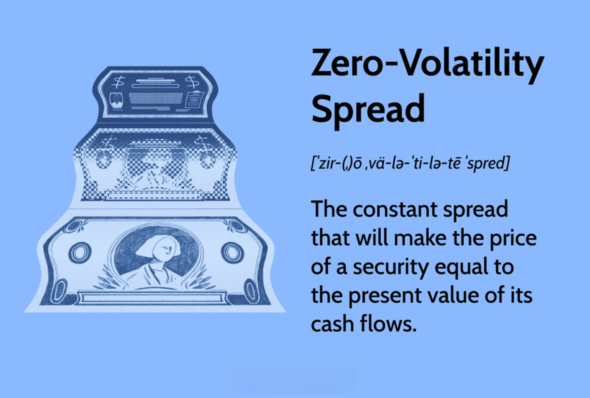

## Table of Contents

## What is the Zero-Volatility Spread (Z-spread)?

The Zero-Volatility Spread, or Z-spread, is a measure used in the bond market to help investors understand the value of a bond. It shows the extra yield, or return, that an investor can expect from a bond compared to a set of risk-free government bonds. The Z-spread takes into account the bond's cash flows over its entire life, and it's calculated by finding the constant spread that makes the present value of these cash flows equal to the bond's price.

In simpler terms, the Z-spread helps investors see how much more they are being paid to take on the risk of a particular bond. For example, if a bond has a Z-spread of 1%, it means that the bond's yield is 1% higher than the yield of a similar government bond at every point in time. This spread is useful because it gives a clearer picture of the bond's risk and potential return, especially when comparing different bonds.

## How does the Z-spread differ from the nominal spread?

The Z-spread and the nominal spread are both ways to measure the extra return you get from a bond compared to a risk-free government bond, but they do it differently. The nominal spread is simple: it's just the difference between the bond's yield and the yield of a government bond with the same time until it matures. It's easy to calculate and understand, but it doesn't consider when the bond pays its interest or returns the principal.

On the other hand, the Z-spread is more detailed. It looks at all the future cash flows from the bond—like interest payments and the final repayment of the principal—and figures out what extra return you need at every point in time to make the bond's price make sense. This means the Z-spread takes into account the timing of the bond's payments, making it a more accurate measure of the bond's risk and return, especially for bonds with complex payment schedules.

## Why is the Z-spread important in bond valuation?

The Z-spread is important in bond valuation because it gives investors a better way to understand the risk and return of a bond. Unlike the nominal spread, which only looks at the difference in yields at one point in time, the Z-spread considers all the future payments the bond will make. This means it can tell you what extra return you need to make the bond's price fair, taking into account when you get your money back.

This detailed view is especially useful for bonds that have complicated payment schedules or for comparing different bonds. By using the Z-spread, investors can see how much more they are being paid to take on the risk of a particular bond compared to a risk-free government bond at every point in time. This helps them make smarter choices about which bonds to buy and how much to pay for them.

## What are the components required to calculate the Z-spread?

To calculate the Z-spread, you need to know the bond's price, its cash flows, and the yields of a set of risk-free government bonds that match the timing of the bond's payments. The bond's price is what you would pay to buy it, and the cash flows are all the money you will get back from the bond, including interest payments and the final repayment of the principal. The yields of the government bonds are used as a benchmark because they are considered to be almost risk-free.

The calculation involves finding a constant spread that, when added to each of the government bond yields at the times of the bond's cash flows, makes the present value of those cash flows equal to the bond's price. This spread is the Z-spread. It's like figuring out what extra return you need at every point in time to make the bond's price make sense, considering all the future payments you'll get.

## Can you explain the basic formula for calculating the Z-spread?

The basic formula for calculating the Z-spread involves finding a constant spread that, when added to the yields of risk-free government bonds, makes the present value of the bond's cash flows equal to its price. The bond's cash flows include all the interest payments and the final repayment of the principal. You need to know the bond's price, its cash flows, and the yields of government bonds that match the timing of those cash flows.

To do the calculation, you start with the bond's cash flows and the yields of the government bonds at the same times. Then, you add a constant spread to each of those government bond yields. You keep adjusting this spread until the sum of the present values of all the bond's cash flows, discounted at the new rates (government bond yield plus the spread), equals the bond's price. This spread is the Z-spread, showing the extra return you need at every point in time to make the bond's price fair.

## How does the Z-spread relate to the yield curve?

The Z-spread is closely tied to the yield curve, which is a graph that shows the yields of government bonds at different times until they mature. The yield curve gives us a baseline of what investors can earn from risk-free investments at different times in the future. The Z-spread uses this baseline by adding a constant extra return to each point on the yield curve. This extra return, or spread, shows how much more you need to earn from a bond compared to government bonds at each point in time to make the bond's price fair.

When you calculate the Z-spread, you look at all the future payments from the bond and figure out what extra return you need at every point on the yield curve to make the bond's price make sense. This means the Z-spread is sensitive to changes in the yield curve. If the yield curve shifts, like when short-term rates go up or down compared to long-term rates, the Z-spread will change too. This helps investors understand how the bond's value might change with movements in the overall interest rate environment.

## What role does the spot rate curve play in Z-spread calculation?

The spot rate curve is a big part of figuring out the Z-spread. It's a list of interest rates for different times in the future, and it helps us see what investors can earn from risk-free government bonds at those times. When we calculate the Z-spread, we use the spot rates from this curve to find the present value of all the bond's future payments. The Z-spread is the extra return we add to each spot rate so that the total present value of the bond's payments equals its price.

In simple terms, the spot rate curve gives us the base rates we need to work out the Z-spread. By adding the Z-spread to each spot rate, we can see how much more we need to earn from the bond compared to government bonds at every point in time. This helps us understand the bond's risk and return better, especially when the interest rates change.

## How can the Z-spread be used to compare bonds with different maturities?

The Z-spread is a great tool for comparing bonds that have different times until they mature. When you want to see which bond is a better deal, you can't just look at their prices or their simple yield differences. The Z-spread helps by showing you the extra return you get from each bond compared to risk-free government bonds at every point in time. This means you can compare bonds with different maturities on a fair basis, because the Z-spread takes into account how long you have to wait for your money back.

For example, if you're looking at a short-term bond and a long-term bond, the Z-spread will show you how much more you're being paid for the risk of each bond, no matter how long they take to mature. This makes it easier to decide which bond is a better investment. By using the Z-spread, you get a clearer picture of the bond's risk and return, helping you make smarter choices about which bonds to buy.

## What are the limitations of using the Z-spread for bond analysis?

The Z-spread is a useful tool for understanding bonds, but it has some limitations. One big problem is that it assumes the same extra return for all future payments from the bond. This might not be true in real life, because the risk of the bond can change over time. For example, if there's a chance the company that issued the bond might have trouble paying it back in the future, the Z-spread might not show this risk properly.

Another limitation is that the Z-spread doesn't take into account how the bond might be traded or sold before it matures. If you plan to sell the bond before it reaches its full term, the Z-spread won't give you a good idea of what you might get for it in the market. Also, the Z-spread relies on the yield curve of government bonds, which can change. If the yield curve moves a lot, the Z-spread might not be as helpful in comparing bonds over time.

## How do market conditions affect the Z-spread?

Market conditions can change the Z-spread a lot. When the economy is doing well and people feel confident, they might be okay with taking more risks. This means they might not need as much extra return from a bond, so the Z-spread could go down. But if the economy is doing badly or there's a lot of uncertainty, people want more return for the risk they're taking. This can make the Z-spread go up because they need more to feel comfortable investing in bonds.

Changes in interest rates also affect the Z-spread. If interest rates go up, the prices of existing bonds usually go down. This can make the Z-spread go up because the bond's yield needs to be higher to attract buyers. On the other hand, if interest rates go down, bond prices go up, and the Z-spread might go down because the bond's yield doesn't need to be as high to be attractive. So, the Z-spread is sensitive to what's happening in the market and can help show how investors feel about risk at any given time.

## What advanced techniques can be used to refine Z-spread calculations?

To make Z-spread calculations more accurate, you can use something called the option-adjusted spread (OAS). This is helpful for bonds that have options, like the ability to be paid back early. The OAS takes into account how these options might affect the bond's value, which the Z-spread doesn't do. By using OAS, you get a better idea of the bond's risk and return, especially if there's a chance the bond could be called back before it matures.

Another way to refine Z-spread calculations is by using a more detailed model of the yield curve, like the [arbitrage](/wiki/arbitrage)-free Nelson-Siegel model. This model gives a better picture of how interest rates might change in the future, which can make your Z-spread calculations more accurate. By using a more advanced model, you can see how changes in the market might affect the bond's value and adjust your Z-spread accordingly.

## How can the Z-spread be integrated into a broader investment strategy?

The Z-spread can help you make smarter choices when you're building your investment strategy. It shows you the extra return you get from a bond compared to a safe government bond at every point in time. This means you can see how much more you're being paid to take on the risk of a particular bond. By looking at the Z-spread, you can compare different bonds and decide which ones fit best with your goals. For example, if you want to balance risk and return, you might choose bonds with a higher Z-spread for more return, but you'll need to be okay with the extra risk.

You can also use the Z-spread to keep an eye on your investments as market conditions change. If the Z-spread goes up, it might mean that the bond's risk has increased, and you might want to think about selling it or buying a different bond. On the other hand, if the Z-spread goes down, it could be a good time to buy the bond because it's less risky. By watching the Z-spread, you can adjust your investment strategy to make sure it still fits with your goals, even when the market changes.

## What is the Zero-Volatility Spread (Z-Spread) and how is it understood?

The Zero-Volatility Spread (Z-Spread) is a financial metric used to evaluate the price of bonds more accurately. It represents the constant spread that, when added to the Treasury yield curve, makes the present value of a bond's cash flows equivalent to its market price. Unlike other spreads, the Z-Spread accounts for different points along the yield curve, adjusting for the time value of money over the bond's life. 

Mathematically, the Z-Spread can be defined as follows: for a bond with cash flows $CF_t$ at various time periods $t$, the Z-Spread $Z$ is determined such that:

$$
\sum_{t=1}^{T} \frac{CF_t}{(1 + r_t + Z)^t} = P
$$

where:
- $T$ is the final maturity period of the bond,
- $r_t$ is the risk-free Treasury rate for period $t$,
- $P$ is the current market price of the bond.

The importance of the Z-Spread lies in its ability to provide a more comprehensive measure of both risk and reward when compared against risk-free bonds. While traditional measures like the yield spread or nominal spread offer a simplified view based on flat rate differences, the Z-Spread considers the entire yield curve, incorporating the temporal distribution of risk. 

This approach allows investors to obtain better insights into the compensation required over the risk-free rate at every point of the bond's tenure. This leads to more precise bond pricing, as it reflects current market dynamics and adjusts for [interest rate](/wiki/interest-rate-trading-strategies) changes affecting cash flows over time. Moreover, the Z-Spread can highlight potential discrepancies in pricing between sectors, issuers, and individual bonds by demonstrating how specific bond cash flows compare with the benchmark risk-free rate curve.

In summary, the Z-Spread is not only a tool for pricing bonds accurately but also offers investors and analysts a detailed framework for assessing risk and potential returns. By integrating the entire yield curve into its calculation, it provides insights that are critical for setting fair valuations and making informed investment decisions.

## How does the Z-Spread influence bond pricing?

The Zero-Volatility Spread (z-spread) significantly enhances bond pricing compared to traditional methods like the nominal spread. The nominal spread, which is the difference between the bond yield and a benchmark interest rate, offers a simplistic view and doesn't account for variations in the term structure of interest rates. This can lead to an incomplete analysis of bond risk, particularly when dealing with complex securities whose cash flows vary significantly over time.

In contrast, the z-spread provides a more nuanced measure by adding a constant spread over the entire Treasury yield curve. This approach incorporates the entire risk-free yield curve, thereby reflecting the time-dependent characteristic of cash flows more accurately. This spread helps in determining the true yield of a bond after accounting for the risk associated with yield curve fluctuations, thus offering a complete image of bond risks.

To better understand the differences in bond valuation using these methods, consider a case where a corporate bond is assessed using both the nominal spread and the z-spread. Using the nominal spread approach, a fixed reference rate might be selected, such as the yield of a Treasury bond with a similar maturity. The yield difference provides a snapshot of relative value but falls short because it assumes constant interest rate spreads over time.

Using the z-spread method, each cash flow of the bond is discounted at a rate that includes a constant spread over the corresponding zero-coupon Treasury rate at each point in time. This allows for a more accurate valuation because it considers the yield curve's shape, impacting cash flows at different maturity points. For example, in a steep yield curve scenario, early cash flows might be discounted at a lower rate compared to later ones, which introduces a marked difference in present value calculations compared to the nominal spread method.

Consider a hypothetical bond with cash flows as follows: $C_1, C_2, ..., C_n$ at times $T_1, T_2, ..., T_n$. The z-spread approach entails solving for $z$ in the equation:

$$
P = \sum_{i=1}^n \frac{C_i}{(1 + r_i + z)^{T_i}}
$$

where $P$ is the bond's current market price, $r_i$ is the Treasury spot rate for period $T_i$, and $z$ is the z-spread.

Implementing this in Python might involve iterating over different values of $z$ to find the one that equalizes the bond's computed present value with its market price. This might involve techniques like numerical methods or optimization functions to efficiently determine the z-spread.

In conclusion, the z-spread offers a more comprehensive pricing mechanism, especially for bonds with complex or long-term cash flow structures. It enables analysts and investors to grasp a fuller picture of interest rate risk, beyond what the nominal spread can reveal. As markets and securities become more sophisticated, approaches like the z-spread are indispensable tools for precise bond valuation and risk assessment.

## How do you calculate the Zero-Volatility Spread?

The Zero-Volatility Spread (z-spread) is a crucial metric for evaluating the value of a bond relative to benchmark Treasury securities. Calculating the z-spread involves understanding several components, including Treasury spot rates, the cash flows associated with the bond, and discounting processes. Here's a step-by-step guide on how to calculate the z-spread, along with examples and potential challenges.

### Step-by-Step Guide

#### Step 1: Gather Necessary Data
To calculate the z-spread, begin by collecting the following information:
- **Bond specifics**: Face value, coupon rate, and maturity date.
- **Market price of the bond**: The current trading price of the bond.
- **Treasury yield curve**: Spot rates corresponding to various maturities.

#### Step 2: Calculate Bond Cash Flows
Determine the cash flows of the bond, which includes periodic coupon payments and the final principal repayment at maturity. For a bond with a coupon rate $C$, face value $F$, and maturity $n$, the cash flows $CF_t$ at each time point $t$ are calculated as:

$$
CF_t = 
  \begin{cases} 
   C \times F & \text{for } t = 1 \text{ to } n-1\\
   (C \times F) + F & \text{for } t = n
  \end{cases}
$$

#### Step 3: Use Treasury Spot Rates for Discounting
Utilize the Treasury spot rates for each corresponding future cash flow period to discount to the present value. The spot rate at time $t$, $R_t$, is essential for calculating the present value $PV_t$ of each cash flow:

$$
PV_t = \frac{CF_t}{(1 + R_t)^t}
$$

#### Step 4: Calculate Total Present Value
Sum the present values of all future cash flows to obtain the total present value $PV_{\text{total}}$ of the bond's cash flows using the Treasury spot rates:

$$
PV_{\text{total}} = \sum_{t=1}^{n} \frac{CF_t}{(1 + R_t)^t}
$$

#### Step 5: Estimate the Z-Spread
To find the z-spread, $Z$, adjust the spot rates by adding a constant spread such that the discounted present value equals the bond's market price $P$:

$$
P = \sum_{t=1}^{n} \frac{CF_t}{(1 + R_t + Z)^t}
$$

This equation must be solved iteratively to find the z-spread that equates the bond's market price with the present value of its future cash flows at adjusted rates. 

### Example Calculation
Suppose a bond with a face value of $1,000, a coupon rate of 5%, market price of $950, and a maturity of 3 years. Treasury spot rates are 2%, 2.5%, and 3% for years 1, 2, and 3, respectively.

1. Cash flows: Year 1 and 2 - $50; Year 3: $1,050.
2. Calculate present values with spot rates and iterate to find $Z$ that matches discounted total to $950.

### Common Challenges and Solutions

**Complex Iterative Calculations**: Determining the exact z-spread involves iterative processes, often requiring computational tools. Solvers such as Python's SciPy library can be utilized to automate this task.

```python
from scipy.optimize import root_scalar

def bond_price(z_spread):
    bond_cash_flows = [50, 50, 1050]
    treasury_spot_rates = [0.02, 0.025, 0.03]
    market_price = 950
    present_values = sum(cf / ((1 + r + z_spread) ** (i + 1)) for i, (cf, r) in enumerate(zip(bond_cash_flows, treasury_spot_rates)))
    return present_values - market_price

result = root_scalar(bond_price, bracket=[0.0, 0.1], method='brentq')
z_spread_calculated = result.root
```

**Data Sensitivity**: Accurate data is crucial. Use reliable sources for spot rates and bond prices to ensure precision in calculations.

**Market Volatility**: Given that spot rates and market prices fluctuate, dynamic adjustments in the z-spread calculation may be necessary to maintain relevancy.

By adhering to these practices, analysts and traders can effectively use the z-spread to assess the price and risk of bonds, providing richer insights than traditional valuation measures.

## References & Further Reading

[1]: Jessen, C., & Nielsen, S. (2010). ["Bond Option Pricing: A Simple Approach."](https://bpb-us-w2.wpmucdn.com/u.osu.edu/dist/7/36891/files/2017/07/CRR79-1yy8av8.pdf) Journal of Derivatives & Hedge Funds, 16(2), 103-117.

[2]: Fabozzi, F. J. (2007). ["Fixed Income Analysis."](https://www.amazon.com/Fixed-Income-Analysis-Frank-Fabozzi/dp/047005221X) John Wiley & Sons.

[3]: Ince, H., & Porter, T. (2006). ["Individual Equity Return Data from Thomson Datastream: Handle with Care!"](https://onlinelibrary.wiley.com/doi/abs/10.1111/j.1475-6803.2006.00189.x) Journal of Business Finance & Accounting, 33(5-6), 843-857.

[4]: Hull, J. (2012). ["Options, Futures, and Other Derivatives."](https://www.semanticscholar.org/paper/Options%2C-Futures%2C-and-Other-Derivatives-Hull/89bdee500c8623864fc9eb7a471546aa713acc44) Pearson Education.

[5]: Tuckman, B., & Serrat, A. (2011). ["Fixed Income Securities: Tools for Today's Markets."](https://www.amazon.com/Fixed-Income-Securities-Todays-Markets/dp/0470891696) John Wiley & Sons.