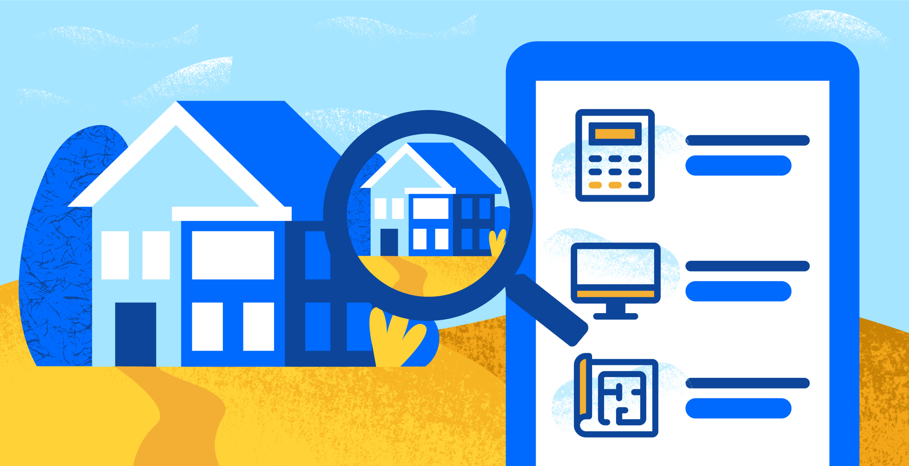

## Table of Contents

## What is a Zestimate?

A Zestimate is a tool used by Zillow, a real estate website, to estimate the value of a home. It uses data like the home's location, size, and recent sales of similar homes nearby to come up with a number. This number is meant to give people an idea of what a home might be worth, but it's not always exact.

People often use Zestimates when they are thinking about buying or selling a home. It can be a helpful starting point, but it's important to remember that it's just an estimate. For a more accurate value, it's best to talk to a real estate agent or get an official appraisal.

## Who created the Zestimate and why was it developed?

The Zestimate was created by Zillow, a company started by Rich Barton and Lloyd Frink in 2006. They wanted to make it easier for people to find out how much homes were worth without having to go through a lot of trouble. Before Zillow, figuring out a home's value usually meant hiring an appraiser or asking a real estate agent, which could be slow and costly.

Zillow developed the Zestimate to give people a quick and free way to get an idea of a home's value. They used a lot of data, like home details and recent sales of similar homes, to make these estimates. The goal was to help people make better decisions about buying or selling homes by giving them more information right at their fingertips.

## How accurate is a Zestimate?

A Zestimate is not always very accurate. It's just a guess based on a lot of information like the size of the home, where it is, and what similar homes have sold for recently. Zillow says that, on average, Zestimates are within about 2% to 7% of the actual sale price of a home. But this can be different depending on where the home is. In some places, the Zestimate might be pretty close, but in others, it might be way off.

It's important to remember that a Zestimate is just a starting point. If you're thinking about buying or selling a home, it's a good idea to talk to a real estate agent or get an official appraisal. These people can give you a more exact idea of what a home is worth because they look at more details and know the local market better. So, while a Zestimate can be helpful, it's not the final word on a home's value.

## What data sources are used to calculate a Zestimate?

Zillow uses a lot of different information to figure out a Zestimate. They look at things like how big the home is, how many bedrooms and bathrooms it has, and what kind of shape it's in. They also use information about where the home is located, like what neighborhood it's in and how close it is to schools or stores. This helps them understand how much people might want to pay to live there.

Another big part of the Zestimate is looking at what similar homes nearby have sold for recently. Zillow calls these "comps," which is short for "comparables." By seeing what other homes in the area have sold for, Zillow can guess what a home might be worth. They also use public records, like tax assessments, and data from real estate agents to make their estimates as accurate as possible.

## Can you explain the basic algorithm behind Zestimate calculations?

The basic idea behind a Zestimate is to use a lot of information to guess how much a home might be worth. Zillow starts by looking at the home itself. They think about things like how big it is, how many bedrooms and bathrooms it has, and what kind of shape it's in. They also consider where the home is located. Is it in a nice neighborhood? How close is it to schools or stores? All these details help Zillow understand how much people might want to pay to live there.

Next, Zillow looks at what similar homes nearby have sold for recently. They call these "comps," which is short for "comparables." By seeing what other homes in the area have sold for, Zillow can make a better guess about the home's value. They also use public records, like tax assessments, and data from real estate agents to help with their estimate. While the Zestimate is just a guess, it uses a lot of different information to try to be as accurate as possible.

## How often are Zestimates updated?

Zestimates are updated every day. This means that every day, Zillow looks at new information and changes their guesses about how much homes are worth. They do this to make sure their estimates stay as up-to-date as possible.

The reason Zillow updates Zestimates so often is because the real estate market can change quickly. New homes might sell, or the prices of homes in the area might go up or down. By updating every day, Zillow tries to keep their guesses as accurate as they can be.

## What factors can affect the accuracy of a Zestimate?

Several things can make a Zestimate less accurate. One big reason is if the home is really different from other homes nearby. If a home has special features like a pool or a big garage, and other homes in the area don't have those things, it can be hard for Zillow to guess the right price. Also, if the home is in a neighborhood where not many homes are sold, there might not be enough information for Zillow to make a good guess.

Another factor is how up-to-date the information is. If the details about the home or the recent sales in the area are old, the Zestimate might not be right. Zillow tries to update their information every day, but sometimes they might miss something. Also, if the home's condition is not what Zillow thinks it is, like if it needs a lot of repairs, the Zestimate could be off.

Lastly, the real estate market can change quickly. If home prices in the area are going up or down fast, the Zestimate might not keep up. Zillow uses a lot of data to make their guesses, but the market can be hard to predict. So, while Zestimates can be helpful, they are just estimates and might not always be spot on.

## How can homeowners or buyers challenge or improve a Zestimate?

Homeowners or buyers can challenge or improve a Zestimate by making sure the information Zillow has about their home is correct. If the home's size, number of bedrooms, or other details are wrong, they can update this information on Zillow's website. They can also add recent home improvements or renovations, which can help make the Zestimate more accurate. If they think the Zestimate is too low or too high, they can ask Zillow to look at it again by using the "Report a Problem" feature on the home's Zillow page.

Another way to improve a Zestimate is by giving Zillow more information about recent sales in the area. If there have been sales of similar homes nearby that Zillow might not know about, sharing this information can help. Homeowners can also talk to a real estate agent who knows the local market well. The agent can give Zillow more details about the home and the neighborhood, which can help make the Zestimate better. Remember, while Zestimates are helpful, they are just guesses, and getting more information can make them more accurate.

## Are there different Zestimate models for different types of properties?

Yes, Zillow uses different Zestimate models for different types of properties. They have separate models for single-family homes, condos, and multi-family homes. Each type of property has its own special features and things that affect its value, so Zillow uses different information and ways of figuring out the value for each one.

For example, the model for single-family homes looks at things like the size of the home, how many bedrooms and bathrooms it has, and what similar homes nearby have sold for. The model for condos might focus more on things like the building's amenities and the condo's location within the building. By using different models, Zillow tries to make their guesses about home values as accurate as possible for each type of property.

## How does Zillow incorporate machine learning into Zestimate calculations?

Zillow uses machine learning to make Zestimates better. Machine learning is a way for computers to learn from a lot of information and get better at guessing things over time. Zillow feeds the computer a lot of data about homes, like how big they are, where they are, and what similar homes have sold for. The computer looks at all this information and figures out patterns that help it guess how much a home might be worth. As more homes are sold and more data comes in, the computer keeps learning and the Zestimates get more accurate.

This process helps Zillow keep up with changes in the real estate market. Because the market can change quickly, Zillow needs a way to update their guesses every day. Machine learning helps them do this by always looking at new data and adjusting the Zestimates. This way, Zillow can give people the most up-to-date information about what a home might be worth, even as the market changes.

## What are the limitations of Zestimates in predicting property values?

Zestimates have some problems when trying to guess how much a home is worth. One big problem is that they might not be very accurate if the home is different from other homes nearby. For example, if a home has special things like a pool or a big garage, and other homes in the area don't have those things, it can be hard for Zillow to guess the right price. Also, if not many homes are sold in the neighborhood, there might not be enough information for Zillow to make a good guess.

Another issue is that the information Zillow uses might not be up-to-date or correct. If the details about the home or the recent sales in the area are old, the Zestimate might not be right. The real estate market can also change quickly, and Zestimates might not keep up with these changes. So, while Zestimates can be helpful, they are just guesses and might not always be spot on.

## How do Zestimates compare to other automated valuation models (AVMs) in the real estate industry?

Zestimates are one type of automated valuation model (AVM) used in the real estate industry. They are made by Zillow and use a lot of information like the size of the home, where it is, and what similar homes have sold for to guess how much a home might be worth. Other AVMs, like those from companies like CoreLogic or Redfin, also use this kind of information but might have different ways of figuring out the value. Some AVMs might focus more on certain details or use different math to make their guesses. So, while Zestimates are popular, they are just one of many AVMs out there.

The accuracy of Zestimates can be different from other AVMs. Zillow says their Zestimates are usually within about 2% to 7% of the actual sale price, but this can change depending on where the home is. Other AVMs might have different levels of accuracy. For example, CoreLogic's AVM might be more accurate in some areas because they have more data or use different methods. It's important to remember that all AVMs are just guesses and might not always be right. If you want a more exact value, it's best to talk to a real estate agent or get an official appraisal.

## References & Further Reading

[1]: Chau, K.W., Leung, A.Y., Yiu, C.Y., & Wong, S.K. (2008). ["The Value of Property Price Information Within a Property Market: A Real Estate Professional Study."](https://hub.hku.hk/bitstream/10722/42250/1/84040.pdf) Journal of Property Research.

[2]: Guiggiani, G. (2011). ["An Insight into Neural Networks with Applications."](https://scholar.google.com/citations?user=GmBkTRsAAAAJ&hl=en) Walter de Gruyter.

[3]: Lo, A.W. (2017). ["Adaptive Markets: Financial Evolution at the Speed of Thought."](https://www.jstor.org/stable/j.ctvc77k3n) Princeton University Press.

[4]: Silver, N. (2012). ["The Signal and the Noise: Why So Many Predictions Fail—But Some Don't."](https://archive.org/details/signalnoisewhymo00silv) Penguin.

[5]: Zillow. (n.d.). ["How Zestimate Home Values are Computed by Zillow."](https://www.zillow.com/how-much-is-my-home-worth/) Accessed October 25, 2023.