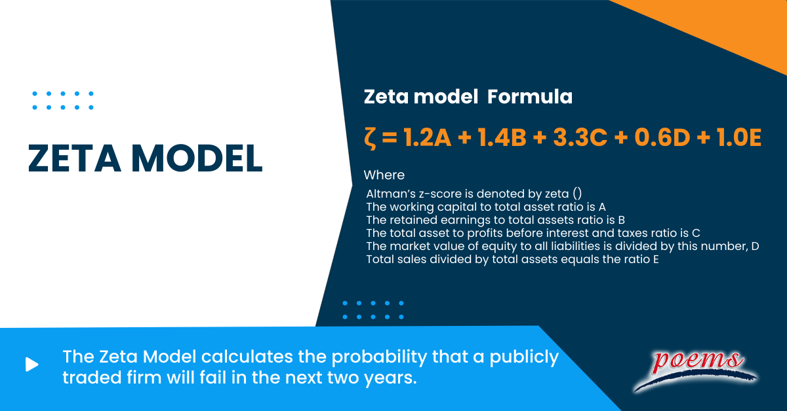

## Table of Contents

## What is the Zeta Model?

The Zeta Model is a tool used to predict if a company might go bankrupt. It was created by Edward Altman, a professor at New York University, in the late 1960s. The model uses different financial ratios from a company's financial statements to calculate a score. If the score is low, it means the company is at a higher risk of going bankrupt. If the score is high, the company is considered safer.

The Zeta Model is useful for investors, banks, and other people who lend money to companies. They use it to decide if a company is a good investment or if it's too risky. The model looks at things like how much money the company makes, how much debt it has, and how well it can pay its bills. By using the Zeta Model, people can make smarter decisions about where to put their money.

## Who developed the Zeta Model and when was it introduced?

The Zeta Model was developed by Edward Altman. He is a professor at New York University. He created the model in the late 1960s.

Edward Altman introduced the Zeta Model to help predict if a company might go bankrupt. The model uses numbers from a company's financial statements to calculate a score. This score tells people if the company is at a high risk of going bankrupt or if it is safe.

## What are the key components of the Zeta Model?

The Zeta Model uses several important pieces of information to figure out if a company might go bankrupt. These pieces are called financial ratios. The model looks at things like how much money the company is making, how much debt it has, and how well it can pay its bills. It also checks how well the company is using its money to make more money. All these pieces together help to create a score that shows how risky it is to invest in the company.

The Zeta Model is useful for people who want to invest money in a company or lend money to it. They use the score from the Zeta Model to decide if the company is a good choice or if it's too risky. If the score is low, it means the company might have trouble paying back its debts, so it's riskier. If the score is high, the company seems safer and more likely to pay back its debts. This helps people make better decisions about where to put their money.

## How does the Zeta Model differ from other financial models?

The Zeta Model is special because it was made to predict if a company might go bankrupt. It uses a mix of financial numbers from a company's reports to make a score. This score shows how risky it is to invest in the company. Other financial models might look at different things or try to predict other outcomes. For example, some models might focus on how much money a company makes or how its stock price might change. The Zeta Model, though, is all about figuring out the chance of bankruptcy.

One big difference is that the Zeta Model was made for public companies, which are companies that sell their stocks to the public. It needs a lot of detailed financial information that these companies have to share. Some other models can work with less information or are made for different kinds of businesses, like small companies or private ones. Also, the Zeta Model has been tested and changed over many years to make it better. This means it's been around a long time and people trust it more than some newer models.

## What industries or sectors is the Zeta Model most applicable to?

The Zeta Model works best for big companies that sell their stocks to the public. These are called public companies. It's good for industries like manufacturing, retail, and services. These industries have a lot of detailed financial information that the Zeta Model needs to work well. The model looks at things like how much money the company makes, how much it owes, and how well it can pay its bills. This makes it useful for people who want to invest in or lend money to these companies.

Even though the Zeta Model was made for public companies, it can also help with other kinds of businesses if they have the right financial information. But it might not be as accurate for small businesses or private companies because they don't always have all the numbers the model needs. The Zeta Model is very helpful in industries where knowing if a company might go bankrupt is important, like banking and finance. People in these sectors use the model to decide if a company is safe to invest in or lend money to.

## Can you explain how the Zeta Model predicts business failure?

The Zeta Model helps predict if a company might go bankrupt by looking at numbers from its financial reports. It uses things like how much money the company makes, how much it owes, and how well it can pay its bills. These numbers are put into a special formula to create a score. If the score is low, it means the company is at a higher risk of going bankrupt. If the score is high, the company is safer.

The model was made for big companies that sell their stocks to the public. These companies have a lot of detailed financial information, which the Zeta Model needs to work well. People like investors and banks use the Zeta Model to decide if it's safe to put money into these companies or lend them money. If the score shows the company is risky, they might choose not to invest or lend. This helps them avoid losing money if the company goes bankrupt.

## What are the steps involved in applying the Zeta Model to a company?

To apply the Zeta Model to a company, you first need to gather all the financial information from the company's reports. This includes things like how much money the company makes, how much debt it has, and how well it can pay its bills. You need these numbers because the Zeta Model uses them to figure out if the company might go bankrupt. Make sure you have the most recent financial statements because the model works best with up-to-date information.

Once you have all the financial numbers, you put them into the Zeta Model's special formula. This formula calculates a score that shows how risky it is to invest in or lend money to the company. If the score is low, it means the company is at a higher risk of going bankrupt. If the score is high, the company is safer. Investors and banks use this score to decide if they should put their money into the company or if it's too risky.

## What are the limitations of the Zeta Model?

The Zeta Model has some limits that people should know about. It was made for big companies that sell their stocks to the public, so it might not work as well for small businesses or private companies. These kinds of companies often don't have all the detailed financial information that the Zeta Model needs. Also, the model looks at numbers from the past, so it might not see new problems that could cause a company to go bankrupt. If a company's situation changes quickly, the Zeta Model might not catch it in time.

Another limit is that the Zeta Model uses a formula that was made a long time ago. Even though it has been updated over the years, it might not be as good at predicting bankruptcy for companies in new industries or those that have changed a lot. The model also doesn't think about things like the economy, new laws, or what people think about the company. These things can all affect if a company goes bankrupt, but the Zeta Model doesn't include them in its calculations.

## How has the Zeta Model been tested and validated?

The Zeta Model has been tested and checked a lot since it was made. Edward Altman, the person who made it, used information from many companies that went bankrupt and many that didn't. He looked at their financial numbers from years before they went bankrupt. This helped him see if the model could tell which companies were going to have problems. Over the years, the model has been used by many people and has been shown to be good at predicting bankruptcy. It's been tested in different countries and with different types of companies to make sure it works well.

Even though the Zeta Model has been tested a lot, people still keep checking it to make it better. They use new data and new ways of checking to see if the model is still good. This helps make sure the model stays useful for investors and banks. The Zeta Model has been around for a long time, and because it keeps being tested and updated, people trust it more than some newer models.

## What updates or modifications have been made to the Zeta Model since its inception?

Since Edward Altman created the Zeta Model in the late 1960s, it has been updated and changed to make it better. One big change was making a new version called the Z"-Score model in the 1990s. This new version works well for companies outside the United States and for companies that aren't public. The Z"-Score model uses fewer numbers to figure out the score, which makes it easier to use for different types of businesses. Over the years, Altman and other people have kept testing the model with new data to see if it still works well and to make any needed changes.

Another update to the Zeta Model includes using new ways to check its accuracy. People have used computers and new math methods to see how well the model predicts bankruptcy. This helps make the model more reliable and useful for investors and banks. The model has also been changed to fit new industries and new types of financial problems that companies face today. By keeping the Zeta Model updated, it stays a helpful tool for people who need to know if a company might go bankrupt.

## How can the Zeta Model be integrated with other financial analysis tools?

The Zeta Model can be used with other financial tools to give a better picture of a company's health. For example, people might use the Zeta Model along with tools that look at how much money a company makes or how its stock price might change. By using the Zeta Model with these other tools, investors and banks can see not just if a company might go bankrupt, but also how well it's doing in other ways. This helps them make smarter choices about where to put their money.

Another way to use the Zeta Model with other tools is by putting its scores into bigger computer programs that look at lots of different financial information. These programs can use the Zeta Model's scores to help decide if a company is a good investment. By mixing the Zeta Model with other financial data, these programs can give a full report on a company's risks and chances. This makes it easier for people to understand all the important things about a company before they decide to invest or lend money.

## What are some case studies or real-world examples where the Zeta Model was effectively used?

One real-world example where the Zeta Model was used effectively is with the airline industry. In the early 2000s, many airlines were struggling financially. Investors and banks used the Zeta Model to look at the financial health of these airlines. The model helped them see which airlines were at a high risk of going bankrupt. This information was very useful because it helped investors and banks decide which airlines to avoid. For example, the Zeta Model correctly predicted the bankruptcy of several airlines, like United Airlines in 2002, which helped people make better financial decisions.

Another example is in the manufacturing sector. A big car company was facing financial troubles, and the Zeta Model was used to assess its risk of bankruptcy. The model's low score showed that the company was in serious trouble. This warning helped the company's management take quick actions to fix their financial problems. They cut costs, sold some parts of their business, and got new loans. Thanks to the Zeta Model's early warning, the company was able to avoid bankruptcy and get back on track. This shows how the Zeta Model can be a helpful tool for companies to know when they need to make changes to stay safe.

## What is the Zeta Model Formula Explained?

The Zeta Model formula serves as a quantitative tool to gauge a company’s financial stability by consolidating various financial ratios that address multiple dimensions of corporate health. The formula is expressed as:

$$
\zeta = 1.2A + 1.4B + 3.3C + 0.6D + E
$$

where:
- $A$ is the working capital divided by total assets. This ratio measures liquidity, indicating how well a company can cover its short-term liabilities with its short-term assets.
- $B$ is the retained earnings divided by total assets, reflecting the proportion of reinvested earnings relative to the asset base, which provides insight into the company's long-term profitability and history of earnings retention.
- $C$ is the earnings before interest and taxes (EBIT) divided by total assets, which assesses a company’s operating efficiency and profitability without considering the impact of tax and financial structure.
- $D$ is the market value of equity divided by total liabilities. This ratio evaluates the leverage and overall financial risk by contrasting market expectations with outstanding debts.
- $E$ is the sales divided by total assets, serving as an indicator of asset efficiency by examining the revenue generated from the asset base.

The resulting Z-score from the Zeta Model combines these elements to provide a robust reflection of the risk profile concerning bankruptcy. Each component is thoughtfully derived to ascertain distinct facets of a company’s economic status, from immediate [liquidity](/wiki/liquidity-risk-premium) to efficiency and leverage. Collectively, they enable analysts to ascertain the likelihood of financial distress, thereby assisting in strategic decision-making and risk management.

## References & Further Reading

[1]: Altman, E. I. (1968). ["Financial Ratios, Discriminant Analysis, and the Prediction of Corporate Bankruptcy."](https://onlinelibrary.wiley.com/doi/abs/10.1111/j.1540-6261.1968.tb00843.x) The Journal of Finance, 23(4), 589-609.

[2]: Altman, E. I., & Hotchkiss, E. (2006). ["Corporate Financial Distress and Bankruptcy: Predict and Avoid Bankruptcy, Analyze and Invest in Distressed Debt."](https://onlinelibrary.wiley.com/doi/book/10.1002/9781118267806) John Wiley & Sons.

[3]: Blume, M. E., & Keim, D. B. (1991). ["Realized Returns and Volatility of Low-Grade Bonds: 1977-1989."](https://onlinelibrary.wiley.com/doi/10.1111/j.1540-6261.1991.tb03745.x) The Journal of Finance, 46(1), 49-74.

[4]: Hu, Y. T., & Ansell, J. (2007). ["A Comparison of Alternative Models for Predicting the Risk of Default."](https://www.academia.edu/25330402/Measuring_retail_company_performance_using_credit_scoring_techniques) Journal of Risk and Insurance, 74(3), 523-528.

[5]: Agarwal, V., & Taffler, R. J. (2007). ["Twenty-Five Years of the Taffler Z-Score Model: Does it Really Have Predictive Ability?"](https://www.tandfonline.com/doi/abs/10.1080/00014788.2007.9663313) Journal of Banking & Finance, 32(1), 44-62.