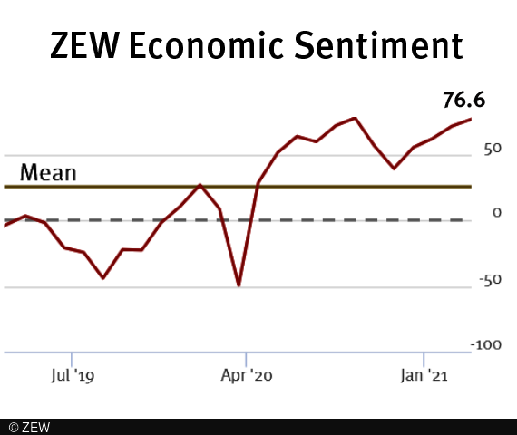

## Table of Contents

## What is the ZEW Economic Sentiment Indicator?

The ZEW Economic Sentiment Indicator is a survey that measures the economic expectations of about 300 financial experts in Germany. It asks these experts how they think the economy will do in the next six months. The results are shown as a number, which can be positive or negative. A positive number means the experts think the economy will get better, and a negative number means they think it will get worse.

This indicator is important because it helps people understand what financial experts think about the future of the economy. It is released every month, so it gives a regular update on economic expectations. Many people, like investors and policymakers, use this information to make decisions about money and business.

## Who publishes the ZEW Economic Sentiment Indicator?

The ZEW Economic Sentiment Indicator is published by the Centre for European Economic Research, which is also known as ZEW. ZEW is a research institute in Germany that focuses on economic topics. They started the survey in 1991 and have been releasing it every month since then.

The survey asks financial experts in Germany about their expectations for the economy over the next six months. These experts come from banks, insurance companies, and other financial institutions. The results of the survey help people understand what these experts think about the future of the economy, and it is used by many people, like investors and policymakers, to make decisions.

## How often is the ZEW Economic Sentiment Indicator released?

The ZEW Economic Sentiment Indicator comes out every month. This means that people can see new results every month to know what financial experts think about the economy's future.

The survey asks around 300 financial experts in Germany about their expectations for the next six months. It helps everyone from investors to policymakers understand and make decisions based on these expert opinions.

## What does the ZEW Economic Sentiment Indicator measure?

The ZEW Economic Sentiment Indicator measures what financial experts in Germany think will happen to the economy in the next six months. It asks around 300 experts from banks, insurance companies, and other financial places about their expectations. The result is a number that can be positive or negative. A positive number means the experts think the economy will get better, and a negative number means they think it will get worse.

This indicator is important because it helps people understand what financial experts think about the future of the economy. It is released every month, so it gives a regular update on these expectations. Many people, like investors and policymakers, use this information to make decisions about money and business.

## How is the ZEW Economic Sentiment Indicator calculated?

The ZEW Economic Sentiment Indicator is calculated by asking around 300 financial experts in Germany about their expectations for the economy over the next six months. These experts come from banks, insurance companies, and other financial institutions. They are asked to say if they think the economy will get better, stay the same, or get worse. Each expert's answer is given a score: +1 if they think it will get better, 0 if they think it will stay the same, and -1 if they think it will get worse.

After all the experts have answered, their scores are added up and then divided by the total number of experts. This gives the final number for the ZEW Economic Sentiment Indicator. If the number is positive, it means more experts think the economy will get better. If it's negative, it means more experts think the economy will get worse. This indicator is released every month, so people can see how the experts' views change over time.

## What is the significance of the ZEW Economic Sentiment Indicator for financial markets?

The ZEW Economic Sentiment Indicator is important for financial markets because it shows what financial experts think about the future of the economy. When the indicator is positive, it means more experts think the economy will get better. This can make investors feel more confident, and they might buy more stocks or other investments. On the other hand, if the indicator is negative, it means more experts think the economy will get worse. This can make investors worried, and they might sell their investments or be more careful with their money.

Because the ZEW Economic Sentiment Indicator comes out every month, it helps people in the financial markets keep up with what experts are thinking. This regular update can cause changes in the stock market and other financial markets. For example, if the indicator goes up a lot, it might make stock prices go up because people feel more hopeful about the economy. If it goes down a lot, it might make stock prices go down because people feel less hopeful. So, the ZEW Economic Sentiment Indicator is a big deal for anyone who works with money and investments.

## How does the ZEW Economic Sentiment Indicator differ from other economic indicators?

The ZEW Economic Sentiment Indicator is different from other economic indicators because it focuses on what financial experts think will happen to the economy in the future. Many other indicators, like the unemployment rate or GDP growth, look at what is happening right now or what has already happened. The ZEW Indicator asks around 300 financial experts in Germany about their expectations for the next six months, so it gives a forward-looking view of the economy.

Another way the ZEW Economic Sentiment Indicator is different is that it is released every month. This means people can see how the experts' views change over time, which can be helpful for making quick decisions in the financial markets. Other indicators might come out less often, like once a quarter or once a year, so they don't give as much up-to-date information. The ZEW Indicator's focus on expert opinions and its monthly release make it a unique tool for understanding economic expectations.

## What are some historical trends observed in the ZEW Economic Sentiment Indicator?

Over the years, the ZEW Economic Sentiment Indicator has shown some interesting trends. One big trend is that it often goes up and down with what's happening in the world. For example, during good times like when the economy is growing a lot, the indicator usually goes up because experts think things will keep getting better. But during bad times, like during a financial crisis or a big economic problem, the indicator often goes down because experts think things will get worse. This shows how the indicator can be a good way to see what experts think about the future of the economy.

Another trend is that the ZEW Economic Sentiment Indicator can change a lot from month to month. Sometimes, it can go up or down by a big amount in just one month. This can happen because of new news or events that make experts change their minds about the economy. For example, if there's good news about a new law that might help the economy, the indicator might go up a lot. But if there's bad news, like a big company going bankrupt, the indicator might go down a lot. These big changes show how sensitive the indicator is to what's happening in the world.

## How reliable is the ZEW Economic Sentiment Indicator as a predictor of economic performance?

The ZEW Economic Sentiment Indicator is a good tool for understanding what financial experts think about the future of the economy. It asks around 300 experts in Germany about their expectations for the next six months. Because it comes out every month, it can help people see how these expectations change over time. Many people, like investors and policymakers, use this information to make decisions about money and business. But, like any prediction, it's not perfect. Sometimes, what the experts think will happen doesn't end up happening exactly that way.

The reliability of the ZEW Economic Sentiment Indicator as a predictor of economic performance can vary. Studies have shown that it can be a good early warning sign for changes in the economy. For example, if the indicator goes down a lot, it might mean that a recession is coming. But it's not always right. Sometimes, the economy can do better or worse than what the experts predicted. So, while the ZEW Economic Sentiment Indicator is useful for getting a sense of what might happen, it's best to use it along with other economic indicators to get a fuller picture of the economy's future.

## What are the limitations of the ZEW Economic Sentiment Indicator?

The ZEW Economic Sentiment Indicator has some limitations that people should know about. One big limitation is that it only asks financial experts in Germany what they think will happen to the economy. This means it might not show what people in other countries think, or what regular people think. Also, the experts might not always be right. They can make mistakes or not see everything that's going on in the economy. So, the indicator can be wrong sometimes about what will happen.

Another limitation is that the ZEW Economic Sentiment Indicator can change a lot from month to month. This can make it hard to know if the changes are because of something important happening in the economy, or if they're just because the experts changed their minds a little bit. Also, the indicator only looks at what might happen in the next six months. It doesn't tell us anything about what might happen after that. So, while the ZEW Economic Sentiment Indicator is helpful, it's best to use it with other information to get a better idea of what might happen in the economy.

## How can investors use the ZEW Economic Sentiment Indicator in their decision-making process?

Investors can use the ZEW Economic Sentiment Indicator to help them decide what to do with their money. The indicator shows what financial experts in Germany think will happen to the economy in the next six months. If the indicator is positive, it means more experts think the economy will get better. This can make investors feel more confident, so they might buy more stocks or other investments. But if the indicator is negative, it means more experts think the economy will get worse. This can make investors worried, so they might sell their investments or be more careful with their money.

The ZEW Economic Sentiment Indicator comes out every month, so investors can see how the experts' views change over time. This can help investors make quick decisions based on the latest information. But the indicator is not perfect. Sometimes, what the experts think will happen doesn't end up happening exactly that way. So, it's a good idea for investors to use the ZEW Economic Sentiment Indicator along with other information to get a better idea of what might happen in the economy.

## What are some advanced statistical methods used to analyze the ZEW Economic Sentiment Indicator data?

Advanced statistical methods can help people understand the ZEW Economic Sentiment Indicator better. One method is called time series analysis. This method looks at how the indicator changes over time. It can help find patterns or trends in the data. For example, it can show if the indicator goes up and down in a certain way every year. Another method is regression analysis. This method looks at how the indicator is related to other things, like stock prices or unemployment rates. It can help see if changes in the indicator can predict changes in these other things.

Another useful method is called panel data analysis. This method looks at the answers from different experts over time. It can help see if some experts are better at predicting the economy than others. It can also show if the experts' opinions change in different ways depending on what's happening in the world. These advanced methods can give a deeper understanding of what the ZEW Economic Sentiment Indicator means and how it can be used to make better decisions about money and the economy.

## References & Further Reading

[1]: Leibniz Centre for European Economic Research (ZEW). ["ZEW Indicator of Economic Sentiment."](https://www.zew.de/en/) 

[2]: Altavilla, C., Giannone, D., & Lenza, M. (2014). ["The Financial and Macroeconomic Effects of OMT Announcements."](https://www.ecb.europa.eu/pub/pdf/scpwps/ecbwp1707.pdf) European Central Bank Working Paper Series No. 1707.

[3]: Lopez de Prado, M. (2018). ["Advances in Financial Machine Learning."](https://www.amazon.com/Advances-Financial-Machine-Learning-Marcos/dp/1119482089) Wiley.

[4]: Aronson, D. R. (2006). ["Evidence-Based Technical Analysis: Applying the Scientific Method and Statistical Inference to Trading Signals."](https://www.amazon.com/Evidence-Based-Technical-Analysis-Scientific-Statistical/dp/0470008741) Wiley.

[5]: Chan, E. P. (2008). ["Quantitative Trading: How to Build Your Own Algorithmic Trading Business."](https://github.com/ftvision/quant_trading_echan_book) Wiley.