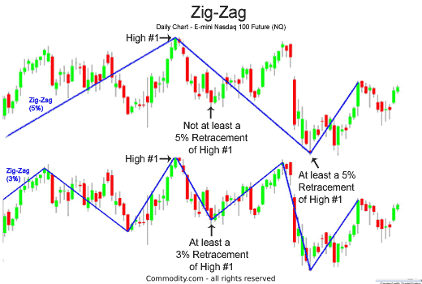

## Table of Contents

## What is the Zig Zag indicator in forex trading?

The Zig Zag indicator is a tool used in forex trading to help traders see trends and patterns more clearly. It works by filtering out small price movements and only showing significant changes in price. This makes it easier for traders to spot important highs and lows in the market. The indicator connects these significant points with straight lines, creating a zigzag pattern on the chart. This can help traders identify potential reversal points and trend directions.

Traders often use the Zig Zag indicator to analyze past price movements and understand market trends better. It is not used for predicting future price movements directly, but it can help in setting up other technical analysis tools. For example, it can be used to identify support and resistance levels or to confirm patterns like head and shoulders or double tops and bottoms. However, it's important to remember that the Zig Zag indicator is best used in combination with other indicators and analysis methods, as it does not provide trading signals on its own.

## How does the Zig Zag indicator work?

The Zig Zag indicator helps traders see big price changes on a chart by ignoring small ups and downs. It draws straight lines between important high and low points. You can set it to show changes of a certain percentage, like 5% or 10%. When the price moves more than this percentage, the Zig Zag line will change direction and connect to the new high or low point.

This tool is useful for looking back at past price movements and spotting patterns. It can help traders see trends and important turning points more clearly. However, the Zig Zag indicator doesn't predict future prices by itself. Traders often use it with other tools to make better decisions about when to buy or sell.

## What are the main settings of the Zig Zag indicator?

The main setting for the Zig Zag indicator is the percentage change. This setting decides how big a price move needs to be before the Zig Zag line changes direction. For example, if you set it to 5%, the line will only move when the price goes up or down by at least 5%. You can change this percentage to fit your trading style. A smaller percentage will show more small moves, while a bigger percentage will only show the big moves.

Another setting is the type of price data used. You can choose to use the closing price, the high and low prices, or the opening price. Most traders use the high and low prices because they show the full range of price movement in each period. These settings help the Zig Zag indicator filter out small price changes and make it easier to see the big trends and important turning points on the chart.

## How can beginners use the Zig Zag indicator to identify trends?

Beginners can use the Zig Zag indicator to identify trends by looking at the direction of the lines it draws on the chart. If the Zig Zag line is moving up, it means the price is making higher highs and higher lows, which shows an uptrend. If the line is moving down, it means the price is making lower highs and lower lows, showing a downtrend. By setting the Zig Zag indicator to a percentage that fits their trading style, beginners can see these trends more clearly without getting confused by small price changes.

It's important for beginners to remember that the Zig Zag indicator works best when used with other tools. For example, they can use it along with moving averages or trend lines to confirm the trend direction. By combining the Zig Zag indicator with these other tools, beginners can get a better understanding of the market and make more informed trading decisions.

## What are the common mistakes beginners make when using the Zig Zag indicator?

One common mistake beginners make when using the Zig Zag indicator is relying on it too much. They might think the Zig Zag line can predict future price movements, but it can't. The Zig Zag indicator only shows past price changes and helps spot trends. Beginners should use it with other tools like moving averages or trend lines to get a better picture of the market.

Another mistake is not adjusting the percentage setting correctly. If the percentage is too low, the Zig Zag line will show too many small moves, making it hard to see the big trends. If it's too high, it might miss important price changes. Beginners need to find the right balance that fits their trading style. It's also important to remember that the Zig Zag indicator works best for looking back at past data, not for making quick trading decisions.

## How can the Zig Zag indicator be used in conjunction with other technical indicators?

Beginners can use the Zig Zag indicator with other tools to get a better understanding of the market. For example, they can use it with moving averages. The Zig Zag line can help show the big trends, and the moving average can help confirm if the trend is strong. If the Zig Zag line is going up and the moving average is also going up, it's a good sign that the uptrend is strong. This can help beginners feel more confident about their trading decisions.

Another way to use the Zig Zag indicator is with trend lines. The Zig Zag line can help spot the important highs and lows, and beginners can draw trend lines to connect these points. This can help them see the overall direction of the market more clearly. By using the Zig Zag indicator with trend lines, beginners can better understand when a trend might be starting or ending. This can help them decide when to buy or sell.

## What are some advanced strategies for using the Zig Zag indicator in forex trading?

Advanced traders can use the Zig Zag indicator to spot important patterns like head and shoulders or double tops and bottoms. These patterns can help traders predict when the price might change direction. For example, if the Zig Zag line shows a head and shoulders pattern, it might mean the price will go down soon. Traders can use this information to plan their trades better. They can set up other tools like Fibonacci retracement levels to find good entry and [exit](/wiki/exit-strategy) points based on the patterns the Zig Zag indicator helps them see.

Another advanced strategy is to use the Zig Zag indicator with Elliott Wave theory. This theory says that prices move in waves, and the Zig Zag line can help traders see these waves more clearly. By looking at the Zig Zag line, traders can count the waves and predict where the price might go next. This can help them make better trading decisions. For example, if the Zig Zag line shows five waves up, it might mean the price will go down after that. Traders can use this information to plan their trades and set their stop-loss and take-profit levels.

## How does the Zig Zag indicator help in identifying support and resistance levels?

The Zig Zag indicator helps traders find support and resistance levels by showing the important highs and lows on the chart. When the Zig Zag line changes direction, it marks a significant point where the price has either gone up or down by a certain percentage. These points can be used to draw horizontal lines across the chart, which show where the price might find support or resistance in the future. Support levels are where the price might stop going down and start going up again, while resistance levels are where the price might stop going up and start going down again.

By using the Zig Zag indicator, traders can see these levels more clearly and make better trading decisions. For example, if the Zig Zag line shows a low point that the price keeps coming back to, that could be a strong support level. Traders might decide to buy when the price gets close to this level, expecting it to go up again. On the other hand, if the Zig Zag line shows a high point that the price keeps hitting but not breaking through, that could be a strong resistance level. Traders might decide to sell when the price gets close to this level, expecting it to go down again.

## Can the Zig Zag indicator be used for predicting price reversals, and if so, how?

The Zig Zag indicator can help traders spot when the price might change direction, but it doesn't predict the future by itself. It does this by showing the big ups and downs on the chart. When the Zig Zag line changes direction, it means the price has moved by a certain percentage. Traders can look at these points to see if a pattern like a head and shoulders or a double top is forming. These patterns can suggest that the price might reverse soon.

To use the Zig Zag indicator for predicting price reversals, traders need to combine it with other tools. For example, they can use it with trend lines or moving averages to confirm if a reversal is likely. If the Zig Zag line shows a pattern and other indicators agree, it can give traders more confidence that a price reversal is coming. But remember, the Zig Zag indicator is best for looking at past price movements, not for making quick trading decisions.

## What are the limitations of the Zig Zag indicator in volatile markets?

In volatile markets, the Zig Zag indicator can be tricky to use. It works by showing big price changes and ignoring small ones. But when the market is moving up and down a lot, it can be hard to set the right percentage for the Zig Zag line. If you set it too low, the line will change direction too often, making it hard to see the big trends. If you set it too high, the line might miss important price changes, and you could miss out on good trading chances.

Another problem in volatile markets is that the Zig Zag indicator can give false signals. Because it only looks at past price movements, it might show a trend or pattern that doesn't last. In a volatile market, prices can change quickly, and what looks like a trend might just be a short-term move. Traders need to be careful and use other tools along with the Zig Zag indicator to make sure they are making good trading decisions.

## How can expert traders optimize the Zig Zag indicator settings for different currency pairs?

Expert traders can optimize the Zig Zag indicator settings for different currency pairs by understanding the unique [volatility](/wiki/volatility-trading-strategies) and trends of each pair. For example, major currency pairs like EUR/USD might have less volatility compared to exotic pairs like USD/ZAR. To set the Zig Zag indicator for a less volatile pair, traders might use a smaller percentage change, like 3-5%, to capture more subtle trends. On the other hand, for a more volatile pair, a higher percentage, like 7-10%, might be better to filter out the noise and focus on significant price movements.

By adjusting the percentage setting, expert traders can tailor the Zig Zag indicator to better suit the specific characteristics of each currency pair. They can also experiment with different time frames to see how the indicator behaves over short-term and long-term periods. For instance, a shorter time frame might require a lower percentage to catch quick trends, while a longer time frame might benefit from a higher percentage to highlight major trends. This flexibility allows traders to use the Zig Zag indicator more effectively across various trading scenarios.

## What are the best practices for integrating the Zig Zag indicator into a comprehensive trading strategy?

Expert traders should use the Zig Zag indicator as part of a bigger trading plan, not by itself. The Zig Zag indicator helps show big price changes and can help spot trends and patterns. But it's best to use it with other tools like moving averages, trend lines, and other indicators. For example, if the Zig Zag line shows a trend, traders can use moving averages to see if it's strong. They can also use trend lines to connect the highs and lows the Zig Zag line shows, making it easier to see where the market might be going. By combining the Zig Zag indicator with these other tools, traders can make better trading decisions.

It's also important to set the Zig Zag indicator correctly for different currency pairs and time frames. Each pair has its own way of moving, so traders need to change the percentage setting to fit. For pairs that move a lot, a higher percentage can help filter out the noise and show the big trends. For pairs that don't move as much, a lower percentage can help catch smaller but still important trends. Traders should also try different time frames to see how the Zig Zag indicator works over short and long periods. This way, they can use the Zig Zag indicator in the best way possible and make their trading strategy stronger.

## References & Further Reading

[1]: Bulkowski, T. (2005). ["Encyclopedia of Chart Patterns"](https://www.amazon.com/Encyclopedia-Chart-Patterns-Thomas-Bulkowski/dp/0471668265). Wiley.

[2]: Pring, M. J. (2002). ["Technical Analysis Explained"](https://www.amazon.com/Technical-Analysis-Explained-Fifth-Successful/dp/0071825177). McGraw-Hill.

[3]: Frost, A. J., & Prechter, R. R. (2005). ["Elliott Wave Principle: Key to Market Behavior"](https://www.amazon.com/Elliott-Wave-Principle-Market-Behavior/dp/0932750753). New Classics Library.

[4]: Achelis, S. B. (2001). ["Technical Analysis from A to Z"](https://archive.org/details/technicalanalysi00ache). McGraw-Hill.

[5]: Murphy, J. J. (1999). ["Technical Analysis of the Financial Markets"](https://archive.org/details/technicalanalysi0000murp). New York Institute of Finance.