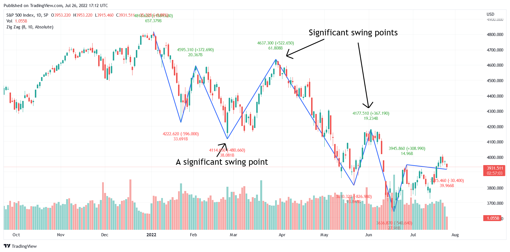

The Zig Zag indicator serves as a robust analytical tool in the domain of forex trading, primarily utilized to eliminate what is commonly referred to as 'market noise'. By accentuating significant trends and price movements, the indicator allows traders a clearer perspective on market dynamics, assisting them in effectively identifying potential trend reversals. This capability is important in the formulation of trading strategies and algorithmic trading models, as precision in capturing market shifts is key to optimizing trading decisions and outcomes.

Traditional trading often grapples with the challenge of distinguishing meaningful price changes from random market fluctuations. The Zig Zag indicator addresses this by offering a filtered view of the price chart, concentrating only on substantial price changes. This focus not only aids in delineating the larger market trends but also streamlines the decision-making process by mitigating distractions caused by insignificant price movements.



The contents of this article aim to provide an exhaustive understanding of how the Zig Zag indicator functions, its inherent benefits, the limitations that accompany its use, and practical strategies for its implementation. This knowledge is essential for traders seeking to augment their trading methodologies with enhanced analytical precision.

Harnessing this indicator can potentially transform trading approaches by furnishing traders with measurable insights, thereby refining their ability to predict market movements and make informed trading decisions. Whether integrating the Zig Zag into existing trading strategies or utilizing it as a standalone tool, the improved clarity and strategic advantage it offers make it a valuable asset in the trader's analytical arsenal. By focusing on significant movements, the Zig Zag indicator contributes to a more disciplined and data-driven trading strategy, ultimately leading to better trading outcomes.

## Table of Contents

## What is the Zig Zag Indicator?

The Zig Zag indicator is a technical analysis tool that traders and analysts use to identify significant price movements within financial markets, filtering out minor fluctuations that often contribute to market noise. By focusing on the crucial price changes, the Zig Zag indicator connects swing highs and lows on a price chart, thereby delineating the predominant market trends.

To implement the Zig Zag indicator, traders set a percentage threshold, commonly ranging between 5% to 10%, to determine what qualifies as a significant price change. This threshold acts as a filter where only those price movements meeting or exceeding the predetermined percentage are considered, thus forming a "zigzag" pattern by linking significant tops and bottoms in the market. This approach helps in highlighting true market patterns by distinguishing substantive market reversals from temporary price deviations.

The indicator provides clarity to traders by mapping these significant price reversals on a trading chart. This visual mapping is useful for recognizing long-term market patterns and trends that might not be evident in a fluctuation-filled market environment. By doing so, the Zig Zag indicator offers a refined view of the market’s price action, aiding traders in understanding and interpreting the market movements more effectively.

This sophistication in filtering market noise makes the Zig Zag indicator a valuable asset for traders aiming to enhance their comprehension of price dynamics. By identifying and focusing on substantial price movements, traders can more accurately discern genuine trends, thereby improving their decision-making processes and trading outcomes.

## How the Zig Zag Indicator Works

The Zig Zag indicator operates by identifying critical turning points on a price chart, which are typically high or low points that have undergone a significant reversal. This tool connects these pivotal points, effectively filtering out minor price fluctuations to emphasize the prominent trend movements. The determination of such points is contingent upon a predefined threshold expressed as a percentage change in price, which traders can customize according to their strategic needs. 

The retrospective analysis provided by the Zig Zag indicator is particularly valuable because it revisits historical price data to map out major trends, thereby offering traders a clearer view of past market behaviors. This time-insensitive approach allows traders to comprehend the overall directional movement of an asset over selected periods without getting distracted by insignificant price changes.

A critical feature of the Zig Zag indicator is its adaptability; traders can adjust the sensitivity by altering the percentage threshold. For instance, a smaller percentage will make the indicator more sensitive, capturing more turning points in the chart, which may be useful in short-term trading scenarios. Conversely, a larger threshold filters out more noise, potentially making it more suitable for long-term trading strategies.

Here is a basic example of how the Zig Zag indicator can be implemented in Python using a percentage threshold:

```python
def zig_zag(price_data, percentage_threshold):
    turning_points = []
    for i in range(1, len(price_data) - 1):
        change_up = (price_data[i] - price_data[i - 1]) / price_data[i - 1] * 100
        change_down = (price_data[i] - price_data[i + 1]) / price_data[i + 1] * 100

        if change_up > percentage_threshold or change_down > percentage_threshold:
            turning_points.append(price_data[i])

    return turning_points

price_data = [100, 105, 103, 110, 108, 107, 115, 113]
percentage_threshold = 5
zig_zag_points = zig_zag(price_data, percentage_threshold)
print(zig_zag_points)
```

In summary, the mechanics of the Zig Zag indicator make it a versatile tool applicable across various asset classes and trading styles. Its effectiveness largely depends on the trader's ability to set appropriate thresholds that align with their specific trading objectives and the [volatility](/wiki/volatility-trading-strategies) of the market in question. Comprehending these operations is pivotal to employing the Zig Zag indicator effectively within a trading strategy.

## Benefits of the Zig Zag Indicator in Algo Trading

The Zig Zag indicator is a valuable asset in [algorithmic trading](/wiki/algorithmic-trading), primarily due to its ability to filter out market noise and emphasize significant price movements. By focusing on substantial changes in price, the indicator allows algorithms to prioritize genuine trend signals over minor fluctuations. This capability is particularly beneficial when crafting automated trading systems, as it helps in maintaining precision without being distracted by irrelevant price changes.

One of the primary advantages of the Zig Zag indicator in algorithmic trading lies in its precise depiction of historical market trends. By highlighting significant reversals and trends, it provides a clearer viewpoint for [backtesting](/wiki/backtesting). Traders can employ the indicator to simulate strategies on historical data, enabling them to fine-tune their algorithms for optimal performance. The historical accuracy offered by the Zig Zag indicator ensures that the strategies being developed have a solid foundation, minimizing potential errors when applied to live trading environments.

Furthermore, the integration of the Zig Zag indicator with other technical tools, such as Fibonacci retracement levels, creates a robust market analysis framework. For instance, incorporating Fibonacci with Zig Zag can help identify potential support and resistance levels, crucial for setting accurate entry and [exit](/wiki/exit-strategy) points. This integration allows trading algorithms to have a multi-faceted approach, combining trend analysis with chart patterns and mathematical retracement techniques to gain a comprehensive understanding of market dynamics.

Enhancing algorithmic models with the Zig Zag indicator not only improves accuracy but also provides strategic depth. By using the indicator to separate significant trends from noise, algorithms can be designed to focus on high-probability trades, increasing the overall effectiveness of the trading strategy. The ability to anticipate market reversals and identify enduring trends elevates the performance of trading systems, helping traders gain a competitive edge in the market. 

In conclusion, the Zig Zag indicator serves as a crucial component in the toolkit of algorithmic traders. Its ability to clarify market trends, improve backtesting accuracy, and integrate seamlessly with other analytical tools significantly boosts the performance of automated trading systems.

## Limitations of the Zig Zag Indicator

The Zig Zag indicator, while a valuable tool for identifying significant market trends, comes with several limitations that traders must consider. Primarily, it is a lagging indicator, meaning it reflects past price movements rather than predicting future ones. This retrospective nature can be a drawback in rapidly changing markets, where timely decision-making is crucial.

In highly volatile or low-[volume](/wiki/volume-trading-strategy) markets, the Zig Zag indicator's efficacy can be compromised. During periods of high volatility, the frequency of price fluctuations increases, potentially leading to misleading trend signals. The indicator's dependence on a set percentage threshold for identifying significant moves might result in false signals as the market experiences sudden spikes or drops. Conversely, in low-volume markets, price movements may not reach the threshold required to trigger a signal, leading to a lack of actionable data for traders.

Another key limitation of the Zig Zag indicator is its 'repainting' feature. This means that the lines connecting significant price points on a chart can change as new data comes in, altering the interpretation of ongoing trends. This dynamic adjustment could lead to confusion, as traders may find that previously identified patterns have been modified, requiring reevaluation of trading decisions based on historical signals.

To counter these limitations, it is essential to use the Zig Zag indicator alongside other analytical tools. Combining it with indicators like the Relative Strength Index (RSI) or moving averages can provide additional context that helps confirm market signals. This approach enhances the reliability of trading strategies by corroborating the trends identified by the Zig Zag indicator with independent data points.

By acknowledging these limitations and employing complementary tools, traders can mitigate potential pitfalls associated with the Zig Zag indicator and make more informed trading decisions.

## Incorporating the Zig Zag Indicator into Trading Strategies

To enhance trading strategies, integrating the Zig Zag indicator with other technical analysis tools such as the Relative Strength Index (RSI) and moving averages can prove highly effective. This combination aids in confirming trend signals, refining entry and exit points, and ultimately improving strategy precision.

**Combining the Zig Zag Indicator with RSI and Moving Averages**

1. **Trend Confirmation**: While the Zig Zag indicator excels at identifying significant price movements by filtering market noise, combining it with RSI or moving averages can offer added confirmation of trends. The RSI provides insights into overbought or oversold conditions, which could signal potential reversals in alignment with Zig Zag-detected patterns. On the other hand, moving averages help in smoothing price data, giving a clear directional signal over a specific period. Together, they enhance the reliability of the signals generated by the Zig Zag indicator.

2. **Refining Entry and Exit Points**: By observing intersection points where the Zig Zag line aligns with significant RSI levels (e.g., above 70 or below 30) or moving average crossovers, traders can determine more precise entry and exit strategies. For instance, a downward Zig Zag pattern coupled with an RSI indicating overbought conditions may suggest an optimal selling opportunity.

3. **Anticipating Market Reversals**: The Zig Zag indicator is instrumental in outlining chart patterns such as double tops or bottoms and head and shoulders. These classic patterns, when validated by accompanying RSI divergences or moving average signals, can enhance traders' ability to anticipate potential market reversals.

**Adjusting Sensitivity according to Asset Volatility and Timeframe**

To optimize the utility of the Zig Zag indicator, it is crucial to adjust its sensitivity based on the asset's volatility and the trading timeframe. The indicator's sensitivity is primarily governed by the percentage threshold set by the trader, which determines the magnitude of price movements required to form a new Zig Zag segment. 

For more volatile assets or shorter timeframes, a higher percentage may be more suitable to prevent frequent, insignificant signals, while a lower percentage might be appropriate for less volatile environments or longer-term analyses.

```python
def calculate_zigzag(highs, lows, threshold=0.1):
    pivots = []
    last_pivot = None

    for i, (high, low) in enumerate(zip(highs, lows)):
        if last_pivot is None or abs(high - lows[last_pivot]) > threshold or abs(low - highs[last_pivot]) > threshold:
            pivots.append((i, high, low))
            last_pivot = i

    return pivots
```

This Python example illustrates a simple calculation method to identify pivot points using the Zig Zag logic. Adjust the `threshold` parameter to tune the sensitivity according to your specific asset and strategy requirements.

## Conclusion

The Zig Zag indicator is a crucial tool in refining market data and highlighting genuine trends, especially in algorithmic trading systems. It effectively distinguishes significant price movements by filtering out minor fluctuations, thus providing a clearer perspective on market dynamics. While the Zig Zag indicator is a lagging tool and may be influenced by market volatility, its true strength lies in its ability to contextualize price action within a broader trend analysis framework.

Utilizing the Zig Zag indicator alongside other analytical tools like moving averages and the Relative Strength Index (RSI) can significantly enhance its utility. This integration helps confirm potential entry and exit points, thereby improving the precision of trade executions. For instance, using a moving average crossover strategy in conjunction with the Zig Zag pattern can confirm trend reversals, thus minimizing the likelihood of false signals.

Proper calibration of the Zig Zag indicator is pivotal to maximizing its effectiveness. Traders can adjust the percentage threshold that determines the significant price changes to match the volatility of the specific asset being traded. This customization allows traders to tailor the indicator's sensitivity, making it adaptable across different trading strategies and market conditions.

By focusing on substantial price movements, the Zig Zag indicator empowers traders with the opportunity to make more informed decisions. When properly utilized, it can enhance overall trading performance by offering a clearer depiction of market trends, reducing the influence of noise, and supporting more strategic trade placements. As part of a comprehensive analysis, the Zig Zag indicator stands as a valuable component in the trader's toolkit, aiding in the formulation of robust trading strategies.

## References & Further Reading

[1]: Bulkowski, T. (2005). ["Encyclopedia of Chart Patterns"](https://www.amazon.com/Encyclopedia-Chart-Patterns-Thomas-Bulkowski/dp/0471668265). Wiley.

[2]: Pring, M. J. (2002). ["Technical Analysis Explained"](https://www.amazon.com/Technical-Analysis-Explained-Fifth-Successful/dp/0071825177). McGraw-Hill.

[3]: Frost, A. J., & Prechter, R. R. (2005). ["Elliott Wave Principle: Key to Market Behavior"](https://www.amazon.com/Elliott-Wave-Principle-Market-Behavior/dp/0932750753). New Classics Library.

[4]: Achelis, S. B. (2001). ["Technical Analysis from A to Z"](https://archive.org/details/technicalanalysi00ache). McGraw-Hill.

[5]: Murphy, J. J. (1999). ["Technical Analysis of the Financial Markets"](https://archive.org/details/technicalanalysi0000murp). New York Institute of Finance.