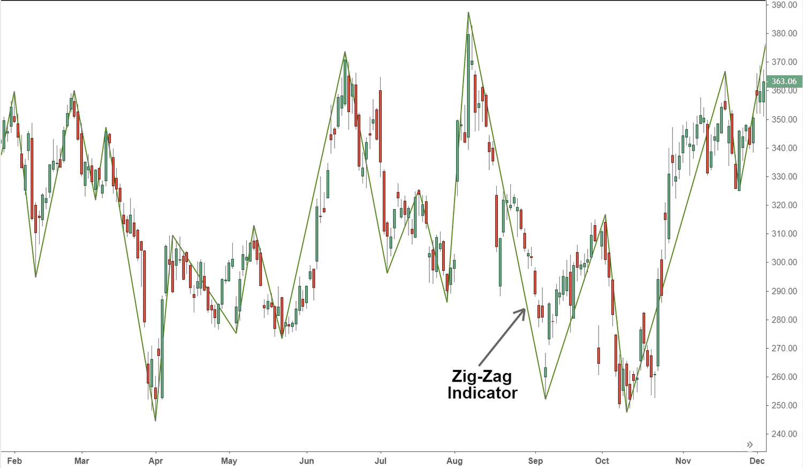

## Table of Contents

## What is the Zig Zag indicator?

The Zig Zag indicator is a tool used in technical analysis of financial markets, like stocks or forex. It helps traders see the overall direction of price movements by filtering out smaller price changes. The indicator draws lines between significant highs and lows on a chart, making it easier to spot trends and patterns. It's called Zig Zag because the lines move back and forth, like a zigzag.

Traders often use the Zig Zag indicator to identify support and resistance levels, which are important points where the price tends to stop and reverse. It can also help in recognizing chart patterns, such as head and shoulders or double tops and bottoms. However, the Zig Zag indicator doesn't predict future price movements; it only shows what has already happened. Because of this, it's usually used along with other tools and indicators to make better trading decisions.

## How does the Zig Zag indicator work?

The Zig Zag indicator works by drawing straight lines on a price chart to connect significant highs and lows. It ignores small price changes and only shows the bigger moves. You can set it to show moves of a certain percentage or number of points. For example, if you set it to 5%, it will only draw a new line when the price moves up or down by at least 5% from the last point.

Once the price moves by the set amount, the Zig Zag indicator draws a line from the last point to the new high or low. If the price keeps moving in the same direction and goes past the set amount again, the line will extend to the new point. But if the price reverses and goes back past the set amount in the opposite direction, the indicator will draw a new line to show the change in direction. This helps traders see the overall trend more clearly without getting distracted by small ups and downs.

## What is the basic formula for the Zig Zag indicator?

The Zig Zag indicator uses a simple rule to draw its lines. It looks at the price changes and only draws a line when the price moves up or down by a certain amount that you set. For example, if you set it to 5%, the indicator will only draw a new line when the price goes up or down by at least 5% from the last point it drew a line from.

When the price moves by the set amount, the Zig Zag indicator draws a line from the last point to the new high or low. If the price keeps moving in the same direction and goes past the set amount again, the line will extend to the new point. But if the price reverses and goes back past the set amount in the opposite direction, the indicator will draw a new line to show the change in direction. This helps traders see the big moves and ignore the small ones.

## How is the Zig Zag indicator calculated step-by-step?

The Zig Zag indicator starts by looking at the price of a stock or other financial instrument. You set it to a certain percentage, like 5%. It waits for the price to go up or down by that percentage from the last point it drew a line from. When the price moves by that amount, the Zig Zag indicator draws a line from the last point to the new high or low. If the price keeps going in the same direction and goes past the set percentage again, the line will keep going to the new point.

If the price changes direction and goes back past the set percentage in the opposite way, the Zig Zag indicator will draw a new line to show the change in direction. This helps traders see the big moves and ignore the small ups and downs. The Zig Zag indicator keeps doing this, drawing lines from high to low and low to high, as long as the price keeps moving by the set percentage.

## What are the default settings for the Zig Zag indicator?

The Zig Zag indicator usually comes with a default setting of 5%. This means it will only draw a new line when the price goes up or down by at least 5% from the last point it drew a line from. This setting helps traders see the big moves in the price without getting distracted by small changes.

Some trading platforms might have different default settings, but 5% is common. Traders can change this setting to a different percentage if they want to see bigger or smaller moves. The Zig Zag indicator is useful because it helps show the overall direction of the price, making it easier to spot trends and patterns.

## How can the Zig Zag indicator help in identifying trends?

The Zig Zag indicator helps in identifying trends by showing the big moves in the price of a stock or other financial instrument. It draws lines between significant highs and lows, which makes it easier to see the overall direction the price is moving. If the lines are going up more often than down, it suggests an upward trend. If the lines are going down more often, it suggests a downward trend. This helps traders see the main direction without getting confused by small price changes.

By using the Zig Zag indicator, traders can also spot when a trend might be changing. If the lines start to change direction more often, it could mean the trend is weakening or reversing. For example, if the price has been going up but then starts to make more downward moves, it might be a sign that the upward trend is ending. This information can help traders decide when to buy or sell, making it a useful tool for understanding trends in the market.

## What are the common applications of the Zig Zag indicator in technical analysis?

The Zig Zag indicator is often used in technical analysis to help traders see the big moves in price without getting distracted by small changes. It draws lines between important highs and lows, making it easier to spot the overall direction of the market. This is helpful for figuring out if the market is going up or down, which is known as identifying trends. Traders can set the Zig Zag to a certain percentage, like 5%, and it will only draw lines when the price moves by that amount. This makes it simpler to see the main trend without all the little ups and downs getting in the way.

Another common use of the Zig Zag indicator is to find support and resistance levels. These are price points where the market often stops and turns around. By connecting the highs and lows with the Zig Zag lines, traders can see where these levels might be. This can help them decide when to buy or sell. The Zig Zag indicator can also help in recognizing chart patterns, like head and shoulders or double tops and bottoms. These patterns can give clues about what the market might do next, so spotting them with the Zig Zag can be very useful for making trading decisions.

## How does the Zig Zag indicator differ from other technical indicators?

The Zig Zag indicator is different from other technical indicators because it only shows the big moves in the price of a stock or other financial instrument. It draws lines between important highs and lows, ignoring the small ups and downs. This makes it easier for traders to see the overall trend without getting distracted by little price changes. Other indicators, like moving averages or the Relative Strength Index (RSI), look at all the price movements, not just the big ones. They can give signals about when to buy or sell based on all the data, while the Zig Zag just shows what has already happened.

Another way the Zig Zag indicator is different is that it doesn't predict future price movements. It only helps traders see the main direction the price has been going. Indicators like the Moving Average Convergence Divergence (MACD) or Bollinger Bands try to predict where the price might go next by looking at current trends and patterns. The Zig Zag is more about showing the big picture of past price movements, which can help traders spot trends, support and resistance levels, and chart patterns. But it doesn't give direct buy or sell signals like some other indicators do.

## What are the limitations of using the Zig Zag indicator?

The Zig Zag indicator has some limitations that traders should know about. It only shows what has already happened, not what might happen next. This means it can't predict future price movements, so it's not good for making quick trading decisions based on where the price might go. Also, the Zig Zag indicator can change its lines if the price moves a lot after it's drawn them. This can be confusing because the lines you see today might not be the same tomorrow if the price keeps changing.

Another limitation is that the Zig Zag indicator doesn't work well on its own. Traders need to use it with other tools and indicators to get a full picture of the market. For example, it can help spot trends and patterns, but it doesn't give clear signals about when to buy or sell. Also, the setting you choose for the Zig Zag, like 5%, can make a big difference in what you see. If you set it too high, you might miss important price moves. If you set it too low, you might see too many small moves and lose the big picture.

## How can the Zig Zag indicator be optimized for different trading strategies?

To optimize the Zig Zag indicator for different trading strategies, you need to adjust the percentage setting based on what you're trying to achieve. If you're a long-term trader looking for big trends, you might set the Zig Zag to a higher percentage, like 10% or 15%. This will show you the really big moves in the market and help you see the main direction without getting distracted by small ups and downs. For short-term trading, you might want to use a lower percentage, like 3% or 4%, so you can catch more of the smaller moves that happen more often.

Another way to optimize the Zig Zag indicator is to use it with other tools and indicators that fit your trading strategy. For example, if you're looking for trend reversals, you might combine the Zig Zag with indicators like the Relative Strength Index (RSI) or Moving Average Convergence Divergence (MACD). These can help you spot when the market might be about to change direction. By using the Zig Zag to see the big picture and other indicators to get more detailed signals, you can make better trading decisions that match your strategy.

## What advanced techniques can be used with the Zig Zag indicator for better market analysis?

One advanced technique for using the Zig Zag indicator is to combine it with Fibonacci retracement levels. When the Zig Zag indicator draws a line from a high to a low or vice versa, you can use those points to draw Fibonacci levels. This can help you see where the price might go next. If the price bounces off a Fibonacci level and then follows the Zig Zag line, it can give you a strong signal about the trend. This technique can be useful for figuring out where to set your buy or sell orders.

Another technique is to use the Zig Zag indicator to spot Elliott Wave patterns. The Zig Zag can help you see the waves more clearly by showing the big moves in the price. Once you spot the waves, you can use Elliott Wave theory to predict where the price might go next. This can be a powerful way to analyze the market, especially if you're looking for long-term trends. By combining the Zig Zag with Elliott Wave analysis, you can get a better understanding of the market's direction and make more informed trading decisions.

## How can the Zig Zag indicator be integrated with other indicators to enhance trading decisions?

To make better trading decisions, you can use the Zig Zag indicator with other tools like the Relative Strength Index (RSI). The Zig Zag shows the big moves in the price, while the RSI tells you if the market is overbought or oversold. If the Zig Zag shows a big move up and the RSI is over 70, it might mean the price is too high and could go down soon. On the other hand, if the Zig Zag shows a big move down and the RSI is under 30, it might mean the price is too low and could go up. By looking at both indicators together, you can get a better idea of when to buy or sell.

Another way to use the Zig Zag indicator with other tools is to combine it with moving averages. The Zig Zag helps you see the main trend, and moving averages can show you if the trend is getting stronger or weaker. For example, if the Zig Zag shows a series of higher highs and the moving average is going up, it's a good sign that the upward trend is strong. But if the Zig Zag starts showing lower highs and the moving average starts to flatten or go down, it might mean the trend is weakening. By using the Zig Zag with moving averages, you can get a clearer picture of the market and make smarter trading choices.

## How does the Zig Zag indicator work?

The Zig Zag Indicator operates by connecting key price points on a financial chart, effectively filtering out minor price fluctuations and focusing on significant trends. The core mechanism involves setting a specific percentage threshold, typically starting at 5%, which determines the minimum price movement required to register a change in trend direction. For instance, if a trader sets this threshold at 5%, the Zig Zag Indicator will only plot a new line between points if the closing price reverses by at least 5% from a previous high or low.

Below are the basic steps of how the Zig Zag Indicator functions:

1. **Calculation of Percentage Change**: The indicator scans through historical price data to identify reversals. It looks for price movements that exceed the predefined percentage threshold. 
$$
   \text{Percentage Change} = \left( \frac{\text{New Price} - \text{Old Price}}{\text{Old Price}} \right) \times 100

$$
   If this percentage exceeds the threshold set by the trader, the indicator considers this a significant move.

2. **Plotting Zig Zag Lines**: Once a significant reversal is detected, the indicator plots a straight line between the most recent reversal points, effectively highlighting the significant highs and lows that form the backbone of a market trend.

3. **Highlighting Trends and Levels**: By focusing on larger price movements, the Zig Zag Indicator provides traders with a clearer visual representation of the prevailing trend. This can help identify potential areas of support (price levels where the price tends to stop falling) and resistance (price levels where the price tends to stop rising).

4. **Adjustable Sensitivity**: Traders can tweak the indicator's sensitivity by adjusting the percentage threshold. A lower percentage will result in more frequent swings being plotted, while a higher percentage will focus on major trends. This flexibility allows it to be tailored to different trading styles or market conditions.

It is important to note that the Zig Zag Indicator is not designed to predict future market movements; it is purely a descriptive tool that aids traders in understanding past price dynamics. This focus on historical price action makes it a valuable component for identifying structural price patterns and turning points, but it is best used in conjunction with other analytical tools for making informed trading decisions.

## References & Further Reading

[1]: ["Technical Analysis of the Financial Markets: A Comprehensive Guide to Trading Methods and Applications"](https://www.amazon.com/Technical-Analysis-Financial-Markets-Comprehensive/dp/0735200661) by John J. Murphy

[2]: Kirkpatrick, C. D., & Dahlquist, J. R. (2010). ["Technical Analysis: The Complete Resource for Financial Market Technicians."](https://ptgmedia.pearsoncmg.com/images/9780134137049/samplepages/9780134137049.pdf) FT Press.

[3]: Weitzman, S. M. (2005). ["Encyclopedia of Chart Patterns."](https://www.wiley.com/en-us/Encyclopedia+of+Chart+Patterns,+3rd+Edition-p-9781119739685) Wiley.

[4]: Pardo, R. (2008). ["The Evaluation and Optimization of Trading Strategies."](https://onlinelibrary.wiley.com/doi/book/10.1002/9781119196969) Wiley.

[5]: Elder, A. (2002). ["Come Into My Trading Room: A Complete Guide to Trading."](https://www.amazon.com/Come-Into-My-Trading-Room/dp/0471225347) Wiley.