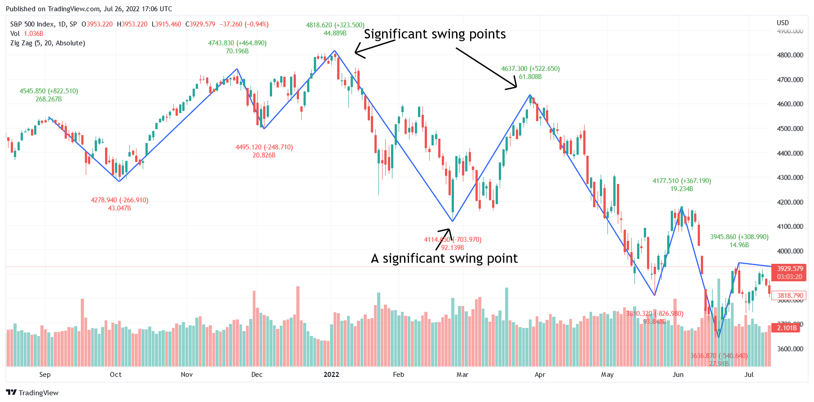

Algorithmic trading, a transformative force in the financial sector, enhances trading efficiency and objectivity by minimizing emotional biases in decision-making. This advanced trading approach heavily relies on technical indicators to interpret market trends and determine optimal entry and exit points. A lesser-known yet highly effective tool in this arsenal is the Zig Zag indicator, which offers nuanced insights into market dynamics.

The Zig Zag indicator excels by highlighting significant trends while filtering out the noise of minor price movements. This makes it a critical component for traders seeking to understand market patterns more deeply. By focusing only on substantial price changes, usually quantified by a pre-determined percentage, the Zig Zag indicator provides a clearer representation of the underlying trend.



This article explores the role of the Zig Zag indicator in algorithmic trading, examining its advantages, constraints, and its integration into trading strategies. Understanding the Zig Zag's ability to refine market analysis, while acknowledging its limitations, is essential for traders aiming to improve the precision of their algorithmic trading models.

## Table of Contents

## What is the Zig Zag Indicator?

The Zig Zag indicator is a technical analysis tool designed to assist traders in identifying significant price movements and trends within a volatile market environment. By eliminating minor price fluctuations, this indicator provides clarity by plotting major tops and bottoms on a price chart, allowing for the visualization of clear trend lines.

This indicator's primary function is to connect critical swing highs and lows, effectively highlighting the predominant direction of market movement. To achieve this, a minimum percentage threshold is set for price movements, typically ranging from 5% to 10%. This threshold determines when a significant change in trend has occurred, thereby filtering out less relevant price changes. This threshold acts as a sensitivity parameter, playing a crucial role in defining what constitutes a meaningful price movement.

For example, if a financial instrument's price needs to change by at least 5% to be considered significant, only those movements which meet or exceed this threshold will be connected by the Zig Zag line. This aspect of the Zig Zag indicator helps traders avoid being led astray by minor fluctuations and instead focus on the market's primary trends.

The ability of the Zig Zag indicator to clarify market structure makes it particularly appealing to traders seeking a deeper understanding of price action dynamics. By providing a clearer picture of market trends, traders can develop more informed trading strategies that align with the prevailing market direction.

## How the Zig Zag Indicator Works

The Zig Zag indicator operates by identifying pivotal turning points on a price chart whenever a price movement surpasses a predetermined percentage threshold, typically set between 5% and 10%. These points, representing significant reversals, are systematically connected using straight lines to create a zig-zag formation. This pattern is instrumental in delineating major price trends over time, offering a blueprint of the market's primary movements.

This indicator is not designed to forecast future price movements; instead, it serves as a retrospective tool. It analyzes historical price data, pinpointing where substantial shifts have occurred. By mapping these changes, the Zig Zag indicator provides traders with an unobstructed view of genuine price trajectories, aiding in the identification of key support and resistance levels. This retrospective analysis is critical for understanding the underlying structure of the market, allowing for better-informed trading decisions.

One of the notable features of the Zig Zag indicator is its customizable sensitivity, controlled through the adjustment of the percentage threshold. Traders have the flexibility to modify this threshold to suit the [volatility](/wiki/volatility-trading-strategies) and behavior of different assets. For more stable assets, a lower percentage might be used, while more volatile instruments may require a higher threshold to filter out insignificant price movements. This adaptability ensures that the Zig Zag indicator is versatile across various trading styles and asset classes, making it a valuable component of an [algorithmic trading](/wiki/algorithmic-trading) toolkit.

## Benefits of the Zig Zag Indicator in Algo Trading

The Zig Zag indicator offers several distinct advantages in algorithmic trading, primarily through its ability to filter out market noise. This filtering process allows trading algorithms to focus on significant price movements rather than being misled by negligible fluctuations. By emphasizing notable price changes, the Zig Zag indicator enhances the accuracy of trade signals and minimizes the risk of overreacting to short-term market volatility.

One of the critical benefits is its utility in [backtesting](/wiki/backtesting) and refining trading algorithms. With its precise depiction of historical trends, the Zig Zag indicator aids traders in identifying effective trading strategies by analyzing past market data. Its retrospective approach enables traders to assess the viability of certain strategies over time, thereby optimizing algorithmic models for future use.

The Zig Zag indicator's integration into broader trading systems further amplifies its utility. By employing it alongside other technical tools like Elliott Wave analysis or Fibonacci retracement levels, traders can achieve a multi-layered analysis, thereby increasing the depth and precision of their trading models. This compatibility ensures that the broader trading system can better interpret market dynamics and adjust strategies accordingly.

Incorporating such a versatile tool into algorithmic trading systems not only refines signal accuracy but also enriches the overall trading strategy framework, facilitating more informed and strategic decision-making by traders.

## Limitations of the Zig Zag Indicator

The Zig Zag indicator, while useful in highlighting significant market trends by filtering out minor price fluctuations, has inherent limitations when applied to real-time trading scenarios. A primary drawback is its lagging characteristic; it identifies trend changes only after they have occurred. This retrospective confirmation makes it unsuitable for predicting future price movements, which is often required in proactive trading strategies.

In markets characterized by high volatility or low trading [volume](/wiki/volume-trading-strategy), the Zig Zag indicator's performance can be compromised. Frequent price swings in such environments may trigger false signals. These false alarms can mislead traders into making untimely or erroneous trading decisions, thus necessitating caution while using this tool in unstable market conditions.

Another significant limitation of the Zig Zag indicator is its tendency to "repaint" its lines. As new data points are added to a chart, the indicator can adjust its existing zigzag lines. This dynamic adjustment potentially alters the most recent part of the pattern, which can lead to confusion among traders about current market trends. For instance, a Zig Zag line that initially indicates a trend reversal may change its slope with the arrival of new data, invalidating previous interpretations of market movements.

Given these constraints, traders should employ the Zig Zag indicator judiciously, ideally supplementing it with other technical analysis tools to cross-verify trends and minimize misleading signals.

## Incorporating the Zig Zag Indicator into Trading Strategies

To effectively incorporate the Zig Zag indicator into algorithmic trading strategies, traders often combine it with other technical indicators like the Relative Strength Index (RSI) or moving averages. This synergy helps confirm trends and optimize entry and [exit](/wiki/exit-strategy) points. For instance, when the Zig Zag indicator marks a significant price reversal, an RSI can indicate whether the asset is overbought or oversold, thereby adding a layer of confirmation. Similarly, moving averages can provide a broader market context, helping to determine the overall trend direction, which the Zig Zag indicator can further refine by highlighting key turning points.

Moreover, the Zig Zag indicator is instrumental in identifying classic chart patterns such as head and shoulders or double tops and bottoms. Recognizing these patterns can offer valuable context for executing trades. For example, the Zig Zag indicator can help highlight the symmetrical shoulders of a head and shoulders pattern, thereby enabling traders to anticipate potential market reversals.

To maximize the utility of the Zig Zag indicator in algorithmic trading, understanding its limitations is essential. The indicator's sensitivity settings must be calibrated to the specific asset and time frame to avoid false signals. For instance, setting the percentage threshold too low may result in identifying insignificant price movements as trends, while setting it too high might overlook vital trend shifts.

Traders can use Python to implement the Zig Zag indicator as part of their automated trading systems. Here's a simple example of using the Python library `pandas` and `numpy` for calculating the Zig Zag indicator points:

```python
import pandas as pd
import numpy as np

def calculate_zigzag(data, threshold=5):
    zigzag = np.zeros(len(data))
    current_trend = None
    last_extreme = data[0]
    last_extreme_idx = 0

    for i in range(1, len(data)):
        change = ((data[i] - last_extreme) / last_extreme) * 100

        if current_trend is None:
            if abs(change) >= threshold:
                current_trend = np.sign(change)
                last_extreme = data[i]
                last_extreme_idx = i
                zigzag[i] = data[i]
        else:
            if current_trend * change < 0:
                if abs(change) >= threshold:
                    zigzag[last_extreme_idx] = last_extreme
                    last_extreme = data[i]
                    last_extreme_idx = i
                    current_trend = np.sign(change)
                    zigzag[i] = data[i]

    zigzag[last_extreme_idx] = last_extreme
    return zigzag

# Sample data
data = pd.Series([1, 1.1, 1.2, 0.9, 0.95, 1.4, 1.0, 1.2, 1.3, 1.1])
zigzag_values = calculate_zigzag(data)

print(zigzag_values)
```

In this example, the function `calculate_zigzag` identifies and marks significant turning points based on a specified percentage threshold. When incorporating the Zig Zag indicator into trading strategies, traders should adjust settings like the threshold percentage to tailor the indicator to specific assets and market conditions. This adjustment ensures more reliable signals and potentially enhances the effectiveness of algorithmic trading strategies.

## Conclusion

In conclusion, the Zig Zag indicator serves as a valuable tool for filtering noise and highlighting genuine market trends in algorithmic trading. By focusing on significant price movements, the Zig Zag indicator provides a clearer view of overall price trends by eliminating minor fluctuations. This capability makes it a critical component in many trading strategies, enabling traders to concentrate on meaningful market movements rather than being distracted by insignificant changes.

Despite certain limitations, such as its lagging nature and susceptibility to false signals in volatile markets, the Zig Zag indicator's strengths make it a useful asset when integrated effectively. By combining it with other analysis techniques, such as Relative Strength Index or moving averages, traders can navigate its limitations and enhance the indicator's utility. Properly calibrating its settings to suit the specific asset and time frame is essential for maximizing its effectiveness.

Ultimately, the Zig Zag indicator's ability to provide a simplified representation of price trends can lead to better-informed decisions in algorithmic trading, improving the overall efficiency and success of the trading strategies employed.

## FAQs

How does the Zig Zag indicator work differently from other trend indicators?

The Zig Zag indicator distinguishes itself from other trend indicators by its focus on significant price movements, ignoring smaller fluctuations to highlight the core trends in a market. Unlike moving averages or the Relative Strength Index (RSI), which often include minor price changes, the Zig Zag indicator applies a filtering mechanism based on a predetermined percentage threshold. This feature enables it to connect swing highs and lows with straight lines, providing an uncluttered view of price action. Consequently, the Zig Zag indicator excels in revealing the overall market structure without the distraction of noise typical in short-term indicators.

Can the Zig Zag indicator be used for real-time trading strategies or solely for analysis of historical data?

The Zig Zag indicator is primarily designed for analyzing historical price data rather than real-time trading strategies. Its retrospective nature means it confirms a trend change only after a considerable price reversal has occurred. Consequently, it is not suitable for predicting future movements or for time-sensitive trading decisions in dynamic markets. However, traders often use the Zig Zag indicator alongside leading indicators to guide their real-time trading decisions, providing context for price action and confirming the validity of emerging trends when planning entry or exit points.

What are some common mistakes traders make when using the Zig Zag indicator in algo trading?

One common mistake traders make when using the Zig Zag indicator in algo trading is setting an inappropriate percentage threshold. A threshold too low may result in excessive sensitivity to price fluctuations, generating false signals, while a too high threshold might overlook significant trends. Another mistake is relying on the Zig Zag indicator in isolation without confirming signals through additional indicators, which can lead to misconstruing the broader market context. Additionally, traders sometimes overfit their strategies to historical data using the indicator, which may not perform well in real market conditions due to its lagging nature.

How is the percentage threshold for the Zig Zag indicator determined?

The percentage threshold for the Zig Zag indicator is usually determined based on historical price volatility and the specific asset's characteristics. Traders often set this threshold within a range of 5% to 15%, adjusting it according to their strategy and the asset being analyzed. A backtesting process is typically employed to evaluate how different thresholds perform under varying market conditions, allowing traders to calibrate the indicator to reduce noise effectively while capturing meaningful price movements.

In what situations would the Zig Zag indicator not be recommended for use?

The Zig Zag indicator may not be recommended in highly volatile or low-volume markets where frequent, substantial price swings can create misleading signals. Its lagging nature and dependency on past data make it less effective for short-term trading strategies or in conditions where rapid trend reversals occur. Additionally, due to its tendency to repaint the most recent lines as new data becomes available, the Zig Zag indicator can cause confusion regarding the current trend, making it unsuitable as a sole tool for real-time decision-making. Instead, it is better utilized as part of a comprehensive strategy that includes other indicators to ensure a well-rounded analysis.

## References & Further Reading

[1]: ["Technical Analysis of the Financial Markets: A Comprehensive Guide to Trading Methods and Applications"](https://www.amazon.com/Study-Technical-Analysis-Financial-Markets/dp/0735200653) by John J. Murphy

[2]: Schweighofer, S. (2016). ["A Note on the Tuning of the ZigZag Indicator by Stochastic Dominance."](https://scholar.google.com/citations?user=S7mBXuIAAAAJ) European Journal of Operational Research.

[3]: Uri, E. (2006). ["Repainting in ZigZag Indicators: A False Sense of Security."](https://www.supermoney.com/encyclopedia/zig-zag-indicator) Financial Analysts Journal.

[4]: Peters, E. E. (1991). ["Chaos and Order in the Capital Markets: A New View of Cycles, Prices, and Market Volatility"](https://www.semanticscholar.org/paper/Chaos-and-Order-in-the-Capital-Markets%3A-A-New-View-Peters/5a90ff905ed4f7a95cb83dea486e9feef468d6d3) by Edgar E. Peters

[5]: Aronson, D. R. (2006). ["Evidence-Based Technical Analysis: Applying the Scientific Method and Statistical Inference to Trading Signals"](https://www.amazon.com/Evidence-Based-Technical-Analysis-Scientific-Statistical/dp/0470008741) by David Aronson