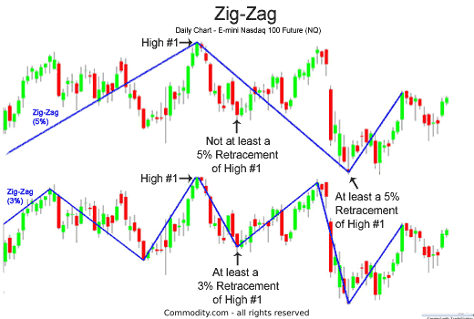

## Table of Contents

## What is the Zig-Zag indicator and how does it work?

The Zig-Zag indicator is a tool used in technical analysis to help traders identify trends and significant price movements in a financial market. It works by filtering out small price changes and focusing on larger, more significant movements. The indicator connects the high and low points of a price chart with straight lines, creating a zigzag pattern. This helps traders see the overall direction of the market more clearly, without getting distracted by minor fluctuations.

To use the Zig-Zag indicator, traders set a percentage or point value that determines the minimum price change needed to form a new high or low point. For example, if the Zig-Zag is set to a 5% change, the indicator will only draw a new line when the price moves up or down by at least 5% from the last high or low point. This setting can be adjusted based on the trader's preference and the volatility of the market they are analyzing. By highlighting these key price movements, the Zig-Zag indicator helps traders spot potential trend reversals and make more informed trading decisions.

## How can the Zig-Zag indicator be used to identify trends in trading?

The Zig-Zag indicator helps traders see the big moves in the market by drawing straight lines between important high and low points on a price chart. This makes it easier to spot the overall direction of the market, which is the trend. When the Zig-Zag lines are going up, it means the market is in an uptrend, and when they are going down, it shows a downtrend. Traders can use this information to decide when to buy or sell.

To use the Zig-Zag indicator for identifying trends, traders set a percentage or point value that tells the indicator how big a price change needs to be before it draws a new line. If the price moves more than this set amount, the Zig-Zag will connect the old high or low point to the new one, showing a clear trend. By watching these lines, traders can see if the market is moving in a steady direction or if it's changing, helping them make better choices about when to trade.

## What are the key settings for the Zig-Zag indicator and how do they affect its performance?

The main setting for the Zig-Zag indicator is the percentage or point value that decides how big a price change needs to be before it draws a new line. This setting is called the "depth" or "threshold." If you set it to a small number, like 1%, the Zig-Zag will show more lines because it will catch smaller price changes. If you set it to a bigger number, like 10%, it will only show the really big moves, so you'll see fewer lines but they will be more important.

Choosing the right setting for the Zig-Zag depends on what you are trading and how much the market moves around. If the market is very up and down, you might want a bigger number so the indicator doesn't show too many small changes. If the market is calmer, a smaller number can help you see more details. The setting you choose affects how clear the trends look on your chart, so it's important to pick one that fits your trading style and the market you're looking at.

## Can the Zig-Zag indicator be used to predict market reversals?

The Zig-Zag indicator can help traders spot when the market might be about to change direction, which is called a market reversal. It does this by drawing lines between big price changes. When the Zig-Zag line changes from going up to going down, or from going down to going up, it can be a sign that the market is reversing. Traders look for these changes to decide when to buy or sell.

However, the Zig-Zag indicator is not perfect for predicting reversals because it only shows what has already happened. It connects past high and low points, so it can't tell you exactly when a reversal will happen in the future. Traders often use the Zig-Zag along with other tools and indicators to get a better idea of when the market might reverse. This way, they can make more informed decisions about their trades.

## How does the Zig-Zag indicator help in setting stop-loss and take-profit levels?

The Zig-Zag indicator can help traders set stop-loss and take-profit levels by showing them the big price moves on a chart. When the Zig-Zag line changes direction, it can tell traders where the market might reverse. For example, if the Zig-Zag line goes from up to down, traders might set their stop-loss just below the last high point that the Zig-Zag line connected. This way, if the price drops back to that level, the stop-loss will trigger and help limit their losses.

For take-profit levels, traders can use the Zig-Zag to see how far the price might go before it changes direction again. If the Zig-Zag line shows a big move up, traders might set their take-profit just below the next high point that the Zig-Zag line might reach. This helps them lock in profits before the market possibly reverses. By using the Zig-Zag indicator, traders can make smarter choices about where to set their stop-loss and take-profit levels based on the big price movements they see on the chart.

## What are the common mistakes traders make when using the Zig-Zag indicator?

One common mistake traders make when using the Zig-Zag indicator is relying on it too much. The Zig-Zag only shows what has already happened in the market, not what will happen next. So, if traders use it alone to make decisions, they might miss out on other important information that could help them trade better. It's best to use the Zig-Zag along with other tools and indicators to get a fuller picture of the market.

Another mistake is setting the Zig-Zag's threshold too high or too low. If the threshold is set too high, the indicator might miss out on smaller but still important price moves. If it's set too low, it can show too many lines, making it hard to see the big trends. Traders need to find a balance that fits the market they are trading in, so the Zig-Zag can help them see the most important price changes without getting confused by too much detail.

## How can the Zig-Zag indicator be combined with other technical indicators for better results?

The Zig-Zag indicator works well when you use it with other technical indicators. One good way is to use it with moving averages. The Zig-Zag can show you the big price moves, and the moving average can help you see the overall trend. For example, if the Zig-Zag line changes direction and the moving average is also going in that direction, it can give you a stronger signal that the market is really turning. This can help you make better decisions about when to buy or sell.

Another helpful combination is using the Zig-Zag with the Relative Strength Index (RSI). The RSI can tell you if a market is overbought or oversold, which means it might be ready to change direction. If the Zig-Zag shows a big price move and the RSI is also showing that the market is overbought or oversold, it can be a good sign of a coming reversal. By looking at both indicators together, you can get a clearer picture of what the market might do next and make smarter trading choices.

## What are the limitations of the Zig-Zag indicator in different market conditions?

The Zig-Zag indicator has some limitations that traders need to know about. In markets that move a lot and change direction often, the Zig-Zag can be hard to use. If you set the threshold too high, you might miss important price changes. If you set it too low, the chart can get too busy with lines, making it hard to see the big trends. This means the Zig-Zag might not be as helpful in very up-and-down markets because it can be tricky to find the right setting.

Another problem with the Zig-Zag is that it only shows what has already happened, not what will happen next. This means it can't predict the future, so traders can't use it alone to know when the market will change direction. In markets that are calm and don't move much, the Zig-Zag might not show any lines at all if the price changes are smaller than the threshold you set. So, it's important to use the Zig-Zag with other tools to get a better idea of what the market might do.

## How can backtesting be used to optimize a trading strategy based on the Zig-Zag indicator?

Backtesting is a way to test a trading strategy using past market data to see how well it would have worked. When using the Zig-Zag indicator, [backtesting](/wiki/backtesting) can help you find the best settings for the threshold. You can try different threshold values and see which one gives the best results over time. For example, you might test a 5% threshold and then a 10% threshold to see which one catches more profitable trades and fewer losing ones. By doing this, you can figure out the best setting for the Zig-Zag that fits your trading style and the market you are trading in.

Once you have backtested different settings, you can also combine the Zig-Zag with other indicators to see if it improves your strategy. For instance, you might backtest using the Zig-Zag along with a moving average or the RSI to see if these combinations give better results than using the Zig-Zag alone. By running these tests, you can see how well your strategy would have done in the past and make changes to improve it. This way, you can feel more confident that your strategy will work well in the future.

## What advanced techniques can be applied to enhance the effectiveness of the Zig-Zag indicator?

One advanced technique to enhance the effectiveness of the Zig-Zag indicator is to use it in combination with other technical indicators, like the Fibonacci retracement levels. When the Zig-Zag shows a significant price move, you can draw Fibonacci levels from the last high to the last low point. These levels can help you predict where the price might go next. If the price bounces off a Fibonacci level and the Zig-Zag shows a change in direction, it can be a strong signal to enter or [exit](/wiki/exit-strategy) a trade. This combination can give you more confidence in your trading decisions by providing additional confirmation of potential reversals or continuations.

Another technique is to use the Zig-Zag indicator to identify Elliott Wave patterns. The Zig-Zag can help you see the big price swings that make up these patterns. By looking at the Zig-Zag lines, you can count the waves and predict where the market might go next. For example, if the Zig-Zag shows five waves up and then three waves down, it might be an Elliott Wave pattern that suggests the market will continue up after the correction. Using the Zig-Zag to spot these patterns can help you make more accurate predictions about future price movements and improve your trading strategy.

## How does the Zig-Zag indicator perform in various asset classes like stocks, forex, and commodities?

The Zig-Zag indicator can be used in different asset classes like stocks, [forex](/wiki/forex-system), and commodities, but its performance can vary depending on the market's [volatility](/wiki/volatility-trading-strategies) and the settings you choose. In the stock market, the Zig-Zag can help you see the big price moves of individual stocks or indexes. If you set the threshold right, it can show you the main trends and help you spot when a stock might be about to change direction. However, stocks can be less volatile than other markets, so you might need to use a smaller threshold to catch important price changes.

In the forex market, the Zig-Zag can be very useful because currency pairs often have big price swings. The forex market is open 24 hours a day, so there are lots of price movements to track. A higher threshold might work better here because it can help you focus on the most important moves and ignore the smaller ones. This can make it easier to see the overall trend and spot potential reversals. But, you need to be careful because the high volatility can also make the Zig-Zag less reliable if the threshold is not set correctly.

For commodities like gold or oil, the Zig-Zag can help you see the big price changes that are common in these markets. Commodities can be affected by many things like supply and demand, so their prices can move a lot. A medium threshold might be best here, as it can help you catch the important trends without getting too many false signals. Just like with stocks and forex, you need to adjust the Zig-Zag settings to fit the specific commodity you are trading to get the best results.

## What are some real-world examples of successful trades using the Zig-Zag indicator strategy?

One real-world example of a successful trade using the Zig-Zag indicator happened in the stock market. A trader was watching the price of a tech company's stock. The Zig-Zag showed a big move up, followed by a smaller move down. The trader set the Zig-Zag threshold at 5% and saw that the price had bounced off a key support level. When the Zig-Zag line changed direction again and started going up, the trader bought the stock. A few weeks later, the stock price went up even more, and the trader sold it for a nice profit. The Zig-Zag helped the trader see the big trend and make a good decision about when to buy and sell.

Another example comes from the forex market. A trader was looking at the EUR/USD currency pair. The Zig-Zag was set to a 1% threshold to catch the big moves in this volatile market. The indicator showed a strong downward trend, but then it changed direction and started going up. The trader saw this as a sign that the market might be reversing, so they bought the EUR/USD pair. Over the next few days, the price kept going up, and the trader sold at a higher price, making a profit. The Zig-Zag helped the trader spot the change in trend and take advantage of it.

## References & Further Reading

[1]: ["Technical Analysis of the Financial Markets: A Comprehensive Guide to Trading Methods and Applications"](https://www.amazon.com/Study-Technical-Analysis-Financial-Markets/dp/0735200653) by John J. Murphy

[2]: Schweighofer, S. (2016). ["A Note on the Tuning of the ZigZag Indicator by Stochastic Dominance."](https://scholar.google.com/citations?user=S7mBXuIAAAAJ) European Journal of Operational Research.

[3]: Uri, E. (2006). ["Repainting in ZigZag Indicators: A False Sense of Security."](https://www.supermoney.com/encyclopedia/zig-zag-indicator) Financial Analysts Journal.

[4]: Peters, E. E. (1991). ["Chaos and Order in the Capital Markets: A New View of Cycles, Prices, and Market Volatility"](https://www.semanticscholar.org/paper/Chaos-and-Order-in-the-Capital-Markets%3A-A-New-View-Peters/5a90ff905ed4f7a95cb83dea486e9feef468d6d3) by Edgar E. Peters

[5]: Aronson, D. R. (2006). ["Evidence-Based Technical Analysis: Applying the Scientific Method and Statistical Inference to Trading Signals"](https://www.amazon.com/Evidence-Based-Technical-Analysis-Scientific-Statistical/dp/0470008741) by David Aronson