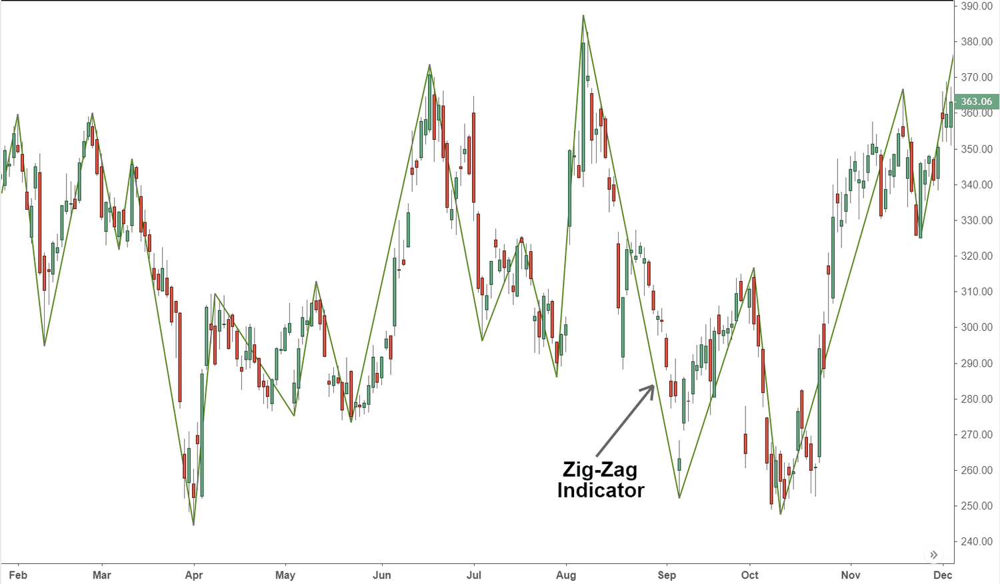

In the world of trading, success often hinges on the ability to anticipate and respond to market trends. Technical analysis forms a cornerstone of this effort, providing traders with a suite of tools to interpret and act on data-driven insights. Among these tools, the Zig Zag indicator stands out for its capacity to filter out noise and highlight significant market movements. It is a valuable asset for traders who seek to comprehend and predict price trends with greater accuracy.

This article examines the Zig Zag indicator, focusing on its integration within technical analysis frameworks and its utility in algorithmic trading. By understanding the mechanics of the Zig Zag indicator, traders can apply it to enhance their trading strategies, identifying key trends and turning points more effectively. While the growing tide of algorithmic trading widens the competitive landscape, familiarizing oneself with analytical tools like the Zig Zag indicator becomes imperative. These tools not only refine trading models but also contribute to making informed, strategic decisions that harness market opportunities.



We aim to uncover the potential advantages and constraints of the Zig Zag indicator and explore methods for incorporating it into various trading strategies. Through this exploration, traders will gain insights into optimizing their trading approach, potentially leading to increased efficiency and precision in their market interactions. With its distinctive ability to highlight primary price movements and diminish the impact of inconsequential fluctuations, the Zig Zag indicator serves as an indispensable component in the toolkit of modern traders.

## Table of Contents

## What is the Zig Zag Indicator?

The Zig Zag indicator is a technical analysis tool designed to simplify the interpretation of price movements by filtering out the 'noise' of random fluctuations. It achieves this by connecting significant swing highs and lows on a price chart, allowing traders to focus on primary market trends rather than minor price changes.

To effectively reduce noise, the Zig Zag indicator requires the setting of a minimum percentage change threshold, commonly ranging from 5% to 10%. This threshold is crucial as it determines which price movements are significant enough to indicate a trend change. Movements that do not meet this criterion are disregarded, thereby providing a cleaner representation of the market's underlying direction.

The indicator is particularly valued for its capacity to highlight key price shifts. By simplifying the visual representation of market movements, it aids traders in identifying important trends and potential turning points. This focus on significant price changes allows traders to gain a clearer understanding of the market's general trajectory, which is essential for making informed trading decisions.

Overall, the Zig Zag indicator serves as a valuable tool for traders seeking to identify and analyze trends in a more straightforward manner, minimizing the impact of trivial price fluctuations and emphasizing major market shifts.

## How the Zig Zag Indicator Works

The Zig Zag indicator operates by plotting points on a chart based on price reversals that exceed a specific percentage threshold. This threshold is predetermined by the trader to filter out minor price fluctuations and highlight significant market movements. The indicator draws straight lines between these plotted points, thereby creating a zig-zag pattern that outlines the dominant price trends.

To function effectively, the Zig Zag indicator requires the setting of a minimum percentage change. For example, a trader may set this threshold between 5% and 10%. This setting helps in filtering out market noise, allowing the indicator to focus only on substantial price changes. The lower the threshold, the more sensitive the indicator is to price movements, potentially capturing smaller trend shifts but also increasing the likelihood of false signals.

Although the Zig Zag indicator does not forecast future market trends, it plays a crucial role in identifying potential support and resistance levels on a price chart. These levels are key in understanding where prices might find buying interest (support) or selling pressure (resistance) in the future.

A flexible tool in various trading strategies, the Zig Zag indicator allows traders to adjust the percentage threshold according to market conditions. By customizing this threshold, traders can tailor the indicator's sensitivity, thus optimizing it for different market environments, whether they are trending or volatile.

Incorporating the Zig Zag indicator programmatically can offer additional benefits. The following Python code provides a simple implementation example:

```python
def zig_zag(prices, percentage_threshold):
    points = []
    direction = None
    last_point = prices[0]

    for price in prices:
        change = ((price - last_point) / last_point) * 100

        if change > percentage_threshold:
            if direction != 'up':
                points.append((last_point, price))
                direction = 'up'
            last_point = price
        elif change < -percentage_threshold:
            if direction != 'down':
                points.append((last_point, price))
                direction = 'down'
            last_point = price

    return points
```

This code calculates points based on a specified threshold, providing a basic framework for integrating the Zig Zag indicator into [algorithmic trading](/wiki/algorithmic-trading) systems. Such flexibility and customization make it a valuable tool for traders in analyzing price movements comprehensively.

## Benefits of the Zig Zag Indicator in Algo Trading

The Zig Zag indicator effectively filters out market noise, enabling trading algorithms to concentrate on significant price movements. By focusing on major trends, it enhances the accuracy and reliability of trading signals. This is particularly beneficial in algorithmic trading where precision is key to executing successful trades.

One significant advantage of the Zig Zag indicator is its usefulness in [backtesting](/wiki/backtesting). Traders can refine their trading algorithms using historical data, allowing for a more informed assessment of strategy performance. By analyzing past data, the indicator helps traders identify recurring patterns and potential trends, which can be leveraged to optimize trading strategies.

When the Zig Zag indicator is coupled with other technical analysis tools, such as Elliott Wave theory or Fibonacci retracement levels, it offers a more comprehensive view of market dynamics. This layered approach to market analysis provides traders with deeper insights into market behavior, enabling them to develop strategies with improved precision and depth.

For instance, a Python script utilizing the `pandas` and `numpy` libraries may efficiently calculate the Zig Zag indicator on historical price data, which can then be used to enhance algorithmic strategies:

```python
import numpy as np
import pandas as pd

def calculate_zigzag(data, percent_threshold):
    zigzag = pd.DataFrame(index=data.index)
    zigzag['price'] = data['close']
    zigzag['direction'] = np.where(data['close'] > data['close'].shift(1), 1, -1)

    threshold = percent_threshold / 100.0
    zz_points = [0]

    for i in range(1, len(data)):
        percentage_change = abs((data['close'].iloc[i] - data['close'].iloc[zz_points[-1]]) / data['close'].iloc[zz_points[-1]])
        if percentage_change >= threshold:
            zz_points.append(i)

    zigzag['zigzag'] = np.nan
    zigzag.loc[zz_points, 'zigzag'] = zigzag.loc[zz_points, 'price']

    return zigzag[['zigzag']].ffill()

# Example usage with a DataFrame `price_data` containing a 'close' column.
percent_threshold = 5
zigzag = calculate_zigzag(price_data, percent_threshold)
```

Incorporating such tools into an algorithmic trading framework enables traders to craft robust strategies that emphasize significant price shifts over minor fluctuations, facilitating more strategic decision-making processes in trading operations.

## Limitations of the Zig Zag Indicator

The Zig Zag indicator, while a useful tool in identifying significant price movements by filtering out market noise, presents certain limitations that traders need to consider. One of the primary drawbacks is its lagging nature; the indicator confirms trends only after they have occurred. This characteristic can result in delayed responses to market changes, which may be critical in fast-moving markets.

In volatile market conditions, the Zig Zag indicator can be prone to frequent swings, potentially generating false signals. These false signals can lead to erroneous trading decisions, as the indicator may suggest trend reversals that are not supported by the underlying market dynamics.

Another issue with the Zig Zag indicator is its propensity to "repaint" its lines as new data becomes available. This means that past signals can be altered retroactively, which can cause confusion among traders who rely on historical data for making future trading decisions. The tendency for these repaints can mislead traders about the current market trend, impacting the reliability of the indicator.

Given these constraints, the Zig Zag indicator is not typically recommended as a standalone tool for real-time trading, where swift decision-making is essential. Instead, it should be used in conjunction with other technical indicators to validate trends and reduce the likelihood of misleading signals. By corroborating the signals from the Zig Zag indicator with those from other tools, traders can create a more robust trading strategy, improving the accuracy and effectiveness of their trading decisions.

## Incorporating the Zig Zag Indicator into Trading Strategies

Traders often combine the Zig Zag indicator with other technical analysis tools such as the Relative Strength Index (RSI) or moving averages to enhance trend confirmation. This synergy enables traders to optimally time their entry and [exit](/wiki/exit-strategy) points by confirming trend directions with greater certainty. For instance, a trader might use the Zig Zag indicator to highlight significant trend reversals while employing moving averages to validate these trends over different time frames.

The Zig Zag indicator is also beneficial in identifying chart patterns, including formations like head and shoulders. These patterns can provide key insights into potential market movements, offering traders additional information for making informed trading decisions.

Calibration of the percentage threshold used in the Zig Zag indicator is critical for generating reliable signals. Traders must adjust this threshold to reflect specific market conditions, allowing the indicator to accurately represent significant price moves without being overly sensitive to minor fluctuations.

Implementing the Zig Zag indicator programmatically in trading systems can be accomplished using Python or other programming languages. Below is a basic example of how the Zig Zag indicator might be implemented in Python using historical price data:

```python
import pandas as pd

def zigzag(data, percent_threshold):
    zigzag_points = []
    last_price = data[0]
    uptrend = True
    for current_price in data[1:]:
        change_percent = (current_price - last_price) / last_price * 100
        if uptrend and change_percent <= -percent_threshold:
            zigzag_points.append(last_price)
            uptrend = not uptrend
        elif not uptrend and change_percent >= percent_threshold:
            zigzag_points.append(last_price)
            uptrend = not uptrend
        last_price = current_price
    return zigzag_points

historical_data = pd.Series([100, 105, 103, 110, 102, 120, 115, 125])
zigzag_points = zigzag(historical_data, 5)
print("Zig Zag points:", zigzag_points)
```

In this example, `zigzag` is a function that identifies Zig Zag points based on a specified percentage threshold. This function assists in the visual representation of significant price shifts, supporting traders in strategy formulation and pattern recognition. By leveraging programming, traders can tailor the Zig Zag indicator to fit their unique trading strategies, thereby enhancing precision and effectiveness in decision-making processes.

## Conclusion

The Zig Zag indicator offers a refined perspective on market trends by effectively filtering out insignificant price movements. Its ability to highlight major market shifts makes it a valuable component when integrated with other analytical tools. Such integration enhances the overall strategic framework of trading models, providing traders with a more comprehensive analysis of market behavior.

In the domain of algorithmic trading, the Zig Zag indicator serves as a tool that aids traders by providing a historical view of price trends. This retrospective insight is instrumental in informing trading decisions, allowing for a more calculated approach based on previous market patterns. However, the full potential of the Zig Zag indicator is realized only through meticulous calibration and setting adjustments. Parameters such as the percentage change threshold must be carefully fine-tuned to align with specific market conditions, ensuring that the indicator's output is both relevant and actionable.

Ultimately, understanding and leveraging the Zig Zag indicator can pave the way for the development of more effective and precise trading systems. By focusing on significant price movements and integrating these insights within broader analytical frameworks, traders can enhance their ability to make informed and timely decisions in the financial markets.

## FAQs

### FAQs

**How does the Zig Zag indicator differ from other trend indicators?**

The Zig Zag indicator is unique in its approach to identifying significant price movements by filtering out minor price fluctuations. Unlike moving averages, which smooth out data to provide a trend line, the Zig Zag indicator highlights key turning points by connecting significant highs and lows on a chart. While moving averages are often used for trend-following strategies, the Zig Zag indicator assists in visualizing market patterns and potential reversal points.

**Can the Zig Zag indicator be used for real-time trading?**

The Zig Zag indicator is generally not recommended for real-time trading due to its lagging nature. It is designed to confirm trends only after they have occurred, which means it does not provide immediate signals needed for quick decision-making. Additionally, its tendency to repaint—adjusting its plot as new data comes in—can create uncertainty in real-time trading environments.

**What are common mistakes to avoid when using the Zig Zag indicator?**

One common mistake is relying solely on the Zig Zag indicator without corroborating its signals with other technical tools. This can lead to missed opportunities or false signals in volatile markets. Another error is setting an inappropriate percentage threshold, which can either over-filter market noise or under-represent significant market movements. Proper calibration is essential for accurate signal generation.

**How do traders determine the percentage threshold for the Zig Zag indicator?**

Traders often set the percentage threshold based on the market's historical [volatility](/wiki/volatility-trading-strategies) and their trading objectives. A common approach is to analyze past price movements and select a threshold that filters out minor fluctuations while capturing meaningful trends. The threshold typically ranges between 5% and 20%, but it should be customized to align with specific market conditions and trader preferences.

**In which market conditions might the Zig Zag indicator be less effective?**

The Zig Zag indicator may be less effective in highly volatile or sideways markets. In volatile markets, frequent and rapid price swings can produce multiple misleading signals, while in range-bound markets, the indicator may fail to identify clear trends, leading to ambiguous pattern recognition. It is best applied in markets with well-defined trending behavior.

## References & Further Reading

Technical Analysis of the Financial Markets by John J. Murphy is a comprehensive guide that covers a wide range of technical indicators, including the Zig Zag indicator. It provides foundational knowledge on chart analysis, essential for traders who want to understand and implement technical indicators effectively. This book is highly recommended for both novice and experienced traders who are interested in mastering technical analysis techniques.

A Note on the Tuning of the ZigZag Indicator by Stochastic Dominance discusses the nuances of adjusting the Zig Zag indicator's settings to match market conditions. This paper provides insights into optimizing the indicator's parameters for different trading environments, helping traders reduce false signals and improve trend identification.

Repainting in ZigZag Indicators: A False Sense of Security highlights a critical limitation of the Zig Zag indicator: its tendency to repaint. This phenomenon can lead traders to misinterpret market trends as the indicator adjusts historical lines with the introduction of new data. Understanding this limitation is crucial for traders who rely on real-time data analysis.

Chaos and Order in the Capital Markets by Edgar E. Peters explores the application of chaos theory in financial markets. While not exclusively about the Zig Zag indicator, this resource offers a broader perspective on how market trends can be interpreted using advanced mathematical models, further enriching a trader's approach to technical analysis.

Evidence-Based Technical Analysis by David Aronson emphasizes the importance of empirical and statistical validation of trading strategies. It encourages traders to use a scientific approach in analyzing indicators like the Zig Zag, advocating for rigorous testing and validation against historical market data to ensure the reliability and effectiveness of trading models.

