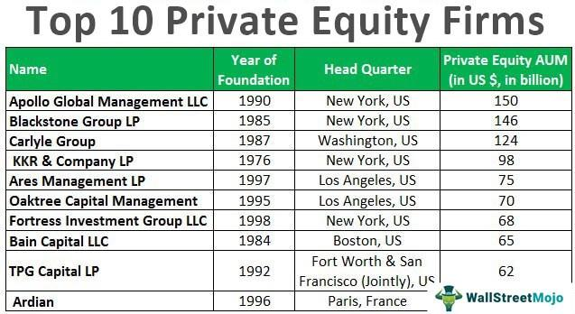

The algorithmic trading industry is a complex and rapidly evolving sector, where legal guidance plays a critical role in ensuring compliance and protecting the interests of trading companies. Ziliak Law, LLC, a boutique law firm, stands out in this industry as a leader in providing specialized legal services tailored to the unique needs of firms engaged in trading and investment management. 

Legal guidance is crucial in the algorithmic trading space due to the intricate regulatory frameworks and the potential legal challenges firms may face. These challenges include intellectual property disputes, compliance with securities regulations, and addressing issues related to market manipulation. Navigating this landscape requires a deep understanding of both technology and law, which Ziliak Law adeptly provides.

Founded by Zachary Ziliak, the firm has carved a niche for itself by focusing on the trading and investment management sector, offering comprehensive legal services designed to support trading companies and financial technology firms. These services encompass aspects such as fund formation, regulatory compliance, and litigation, ensuring firms can operate within the bounds of the law while maximizing their operational efficiency.

To truly grasp the breadth and depth of services provided by Ziliak LLC, it is essential to explore the range of legal aid they offer. The firm is known for its adaptability, tailoring its services to cater to hedge funds, proprietary trading groups, and other entities operating in the fast-paced world of algorithmic trading. Whether addressing day-to-day operational concerns or complex legal disputes, Ziliak Law leverages its expertise to offer innovative legal solutions, thus playing a pivotal role in the industry's development.

In summary, Ziliak Law is distinguished by its specialization in the trading and investment management industry, offering a gateway to understanding the sophisticated nature of legal services required in algorithmic trading. This introduction sets the stage for a detailed examination of the specific services Ziliak LLC provides to meet the legal demands of this dynamic industry.

## Table of Contents

## History of Ziliak Law, LLC

Ziliak Law, LLC was founded in 2013 by Zachary Ziliak, marking a strategic transition from his previous role at Mayer Brown, a well-respected law firm. This transition was driven by Ziliak’s desire to focus specifically on the nuanced legal needs of trading companies and financial technology firms, areas that were rapidly evolving due to technological advancements and emerging regulatory landscapes.

Zachary Ziliak's vision was to create a boutique law firm that could offer specialized legal services tailored to the unique challenges faced by trading entities and investment managers. With a diverse background in both law and finance, Ziliak brought a wealth of knowledge to the firm, enabling it to grow and adapt to the dynamic requirements of its clientele.

From its inception, Ziliak Law, LLC has demonstrated a commitment to addressing the specialized needs of the trading industry. This focus includes a deep understanding of the legal and regulatory challenges associated with high-frequency trading and other sophisticated trading strategies. The firm's growth can be attributed to its dedication to providing comprehensive legal services that address both the legal and operational facets of trading.

Key personnel at Ziliak Law have played a crucial role in the firm's success. Notably, Steven M. Bylina III, a key figure in the firm, brings expertise in compliance and high-frequency trading, complementing Ziliak's own experience. The diverse backgrounds of the team members, many of whom have direct experience in the trading industry, enhance the firm's ability to provide insightful and effective legal solutions.

The Ziliak team comprises professionals from various disciplines within the finance and legal sectors, many with direct experience in high-frequency trading and regulatory compliance. This diversity enables Ziliak Law to maintain a well-rounded perspective on the challenges and opportunities facing their clients, ensuring tailored and effective legal counsel.

Ultimately, Ziliak Law, LLC's growth and evolution reflect its strategic focus on the specialized needs of the trading and investment management industries, positioning itself as a leader in providing legal guidance in algorithmic and high-frequency trading spheres.

## Core Legal Services Offered

Ziliak Law, LLC offers a comprehensive suite of legal services tailored to the dynamic and intricate needs of the [algorithmic trading](/wiki/algorithmic-trading) industry, positioning itself as a pivotal resource for trading companies and financial technology firms. Specializing in fund formation, Ziliak Law assists clients in structuring new investment vehicles, ensuring that they meet both strategic goals and regulatory obligations. This involves crafting tailored partnership agreements, advising on tax-efficient structures, and guiding clients through the complexities of capital-raising processes.

Regulatory filings and compliance form a cornerstone of Ziliak Law's offerings. The firm is adept at navigating the myriad of regulations governing the financial markets, including those set forth by the Securities and Exchange Commission (SEC), the Commodity Futures Trading Commission (CFTC), and other regulatory bodies. Ziliak Law provides counsel on adherence to compliance standards, preparing and submitting necessary regulatory filings, and devising strategies to mitigate the risks of non-compliance. By maintaining an up-to-date understanding of evolving regulatory landscapes, the firm ensures its clients remain in good standing and avoid costly penalties.

In addition to regulatory services, Ziliak Law excels in handling transactions and litigation. The firm provides thorough legal due diligence to support acquisitions, mergers, and other significant business transactions. Its litigation team is equipped to represent clients in disputes, ranging from breach of contract to securities fraud. The firm's approach combines rigorous analysis with strategic insight to achieve favorable outcomes in contentious situations.

Ziliak Law extends its expertise to offering business advice, thus serving as a strategic partner for its clients. Whether advising on corporate governance, structuring compensation plans, or intellectual property issues, the firm addresses both legal and operational aspects that impact its client's success. This holistic approach is particularly beneficial to hedge funds, proprietary trading groups, and investment managers, enabling them to focus on their core activities while relying on Ziliak Law's expertise.

The adaptability of Ziliak Law is evident in its ability to cater to diverse client profiles, including hedge funds, proprietary trading groups, and other financial entities. Each client presents unique challenges and opportunities, and Ziliak Law tailors its services to fit these specific needs. This adaptability is essential in the fast-paced environment of algorithmic trading, where legal and operational challenges can emerge rapidly and unexpectedly.

By providing specific, industry-focused legal services, Ziliak Law, LLC supports its clients in navigating the complexities of the trading landscape. Its commitment to understanding the nuanced requirements of the trading industry allows it to offer legal solutions that are both effective and efficient, ensuring that clients can operate with confidence and compliance.

## Algorithmic Trading and Legal Implications

Algorithmic trading, often referred to as algo trading, involves the use of computer algorithms to automate trading decisions and executions in financial markets. This method leverages mathematical models, historical data, and advanced computations to conduct transactions at speeds and frequencies impossible for human traders. Its significance lies in the efficiency, precision, and [liquidity](/wiki/liquidity-risk-premium) it brings to the markets, and its capacity to execute trades based on quantitative data analyses rather than human intuition.

Despite its benefits, algorithmic trading poses a range of complex legal challenges and regulatory requirements. These challenges stem from the high-speed nature and significant impact that algorithmic trading can have on market stability and fairness. Regulatory bodies like the Securities and Exchange Commission (SEC) in the United States and the Financial Conduct Authority (FCA) in the United Kingdom impose stringent compliance obligations to prevent market manipulation, ensure transparency, and protect against systemic risks. These requirements include thorough testing and validation of algorithms, maintaining audit trails, and adhering to rules on data privacy and cybersecurity.

Ziliak Law, LLC specializes in addressing these specific legal requirements, offering tailored services to navigate the regulatory landscape of algorithmic trading. The firm provides compliance guidance for regulatory filings, risk management strategies, and legal support for proprietary trading algorithms. Their expertise extends to ensuring that clients remain compliant while optimizing the operational functionality of their trading systems.

Notable cases and legal precedents in algorithmic trading represented by Ziliak Law underscore their proficiency in handling disputes and regulatory challenges. These cases often involve issues related to market access, data usage, and algorithmic stability during volatile market conditions. The firm's involvement in these matters not only emphasizes their legal acumen but also their role in shaping industry standards.

Ziliak Law's thought leadership in high-frequency trading includes publications that provide insights into algorithmic trading frameworks and compliance strategies. These works are pivotal for industry stakeholders seeking to stay informed on evolving legal contexts. Additionally, the firm's analysis and recommendations have been featured in various media outlets, reflecting their standing as a trusted source of legal advice in the fintech domain.

In summary, Ziliak Law offers comprehensive legal services specially crafted to address the intricate legal and regulatory environment of algorithmic trading, underscoring their position as industry leaders in this rapidly evolving field.

## Key Achievements and Case Studies

Ziliak Law LLC has garnered a reputation for its effective legal representations and dispute resolutions in the algorithmic trading sector. The firm has played key roles in significant client recoveries, including the successful retrieval of options traders' bonuses, highlighting their capability in navigating complex employment and compensation disputes. These victories underscore the firm's proficiency in securing favorable outcomes for clients in intricate trading and financial contexts.

In addition to individual client achievements, Ziliak Law has also been pivotal in strategic advisory roles within regulatory environments. The firm has provided guidance on compliance with evolving regulatory standards crucial to the algorithmic trading industry. This advisory capacity extends to helping clients interpret and implement regulatory frameworks, which has been critical in maintaining their operations within legal bounds.

Testimonials and case studies further emphasize client satisfaction with Ziliak Law's services. Clients frequently commend the firm's in-depth industry knowledge and ability to tailor legal strategies that align with their business objectives. These anecdotes often highlight the firm's successful interventions in preventing potential legal pitfalls and optimizing operational compliance.

Moreover, Ziliak Law has had a significant influence on shaping legal practices within algorithmic trading. By representing clients in notable cases, the firm has contributed to setting legal precedents that impact the broader trading landscape. Their involvement in high-profile litigation and regulatory advisory work exemplifies the firm’s leadership in advocating for and advancing the legal standards governing algorithmic trading.

Through these achievements, Ziliak Law continues to solidify its status as a leading authority in trading and investment management law, delivering specialized and highly effective legal solutions to clients navigating the complexities of algorithmic trading.

## Publications and Thought Leadership

Ziliak Law, LLC is a leader in legal guidance for the trading and financial technology sectors. Their publications and thought leadership provide insights into the complex arena of automated and high-frequency trading, highlighting their expertise in compliance and regulatory matters. 

Ziliak Law's publications emphasize the importance of understanding ever-evolving legal frameworks. These resources offer guidance on creating robust compliance programs, detailing the intricacies of regulatory filings and the need for continuous adaptation to new rules and technologies. Their comprehensive analysis helps traders and financial institutions navigate challenges like data protection, trade surveillance, and risk management associated with algorithmic trading.

Zachary Ziliak, the firm's founder, frequently shares his insights through interviews and media commentary, shedding light on the legal nuances of high-frequency trading. His discussions often focus on the balance between innovation and regulation, advocating for practices that ensure both market efficiency and fair play. By sharing their expertise, Ziliak Law informs industry participants about the latest trends and regulatory developments, encouraging proactive measures to mitigate legal risks.

For those seeking more detailed information, Ziliak Law offers a wealth of resources through their blog and news outlets. These platforms provide accessible knowledge on pressing legal issues, from the specifics of compliance to strategic considerations for fintech advancements. By staying informed through these publications, trading companies can better align their operational strategies with legal requirements, fostering a compliant and successful trading environment.

## Conclusion

Ziliak Law stands as a vital player in the legal landscape of algorithmic trading, consistently providing industry-specific legal services tailored to the unique needs of trading companies and financial technology firms. Through their deep understanding of fund formation, regulatory compliance, and disputes specific to algorithmic trading, Ziliak Law ensures that their clients remain compliant and strategically positioned in a rapidly evolving market. 

Reflecting a strong commitment to their clients, the firm aids in navigating complex legal frameworks while prioritizing client aspirations. Their expertise makes Ziliak Law an invaluable resource for companies aiming to enhance their legal strategies in trading. Seeking their counsel means aligning technological innovations with robust legal foundations, thereby achieving synergy between market activities and legal requirements.

Trading companies and financial technology firms are encouraged to leverage Ziliak Law's wealth of knowledge and experience to navigate the multifaceted legal landscapes. The firm’s vision, where client goals are balanced with the demands of regulatory frameworks, ensures long-term success and compliance.

For further guidance and to explore tailored legal services, readers are invited to reach out to Ziliak Law. A consultation with the firm promises insights into aligning strategic objectives with the necessary legal frameworks, thereby fostering both compliance and innovation.

## References & Further Reading

[1]: ["Advances in Financial Machine Learning"](https://www.amazon.com/Advances-Financial-Machine-Learning-Marcos/dp/1119482089) by Marcos Lopez de Prado

[2]: ["Evidence-Based Technical Analysis: Applying the Scientific Method and Statistical Inference to Trading Signals"](https://www.amazon.com/Evidence-Based-Technical-Analysis-Scientific-Statistical/dp/0470008741) by David Aronson

[3]: ["Machine Learning for Algorithmic Trading"](https://github.com/stefan-jansen/machine-learning-for-trading) by Stefan Jansen

[4]: ["Quantitative Trading: How to Build Your Own Algorithmic Trading Business"](https://www.amazon.com/Quantitative-Trading-Build-Algorithmic-Business/dp/1119800064) by Ernest P. Chan

[5]: SEC's official page on [Algorithmic Trading](https://www.sec.gov/files/Algo_Trading_Report_2020.pdf)

[6]: Financial Conduct Authority (FCA) guidance and publications on [algorithmic trading](https://www.fca.org.uk/publications/multi-firm-reviews/algorithmic-trading-compliance-wholesale-markets)