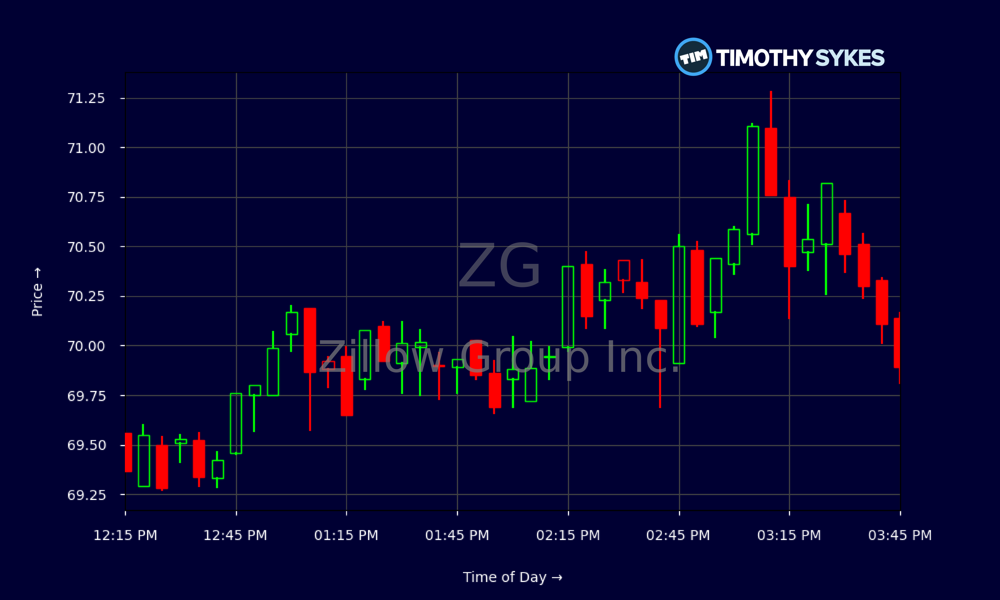

## Table of Contents

## What is a stock split and why do companies do it?

A stock split is when a company decides to divide its existing shares into more shares. For example, in a 2-for-1 stock split, if you own one share, you will get another share for free. The total value of your shares stays the same because the price of each share is cut in half. Stock splits don't change the overall value of the company or your investment, but they do make the stock's price lower, which can make it more affordable for more people to buy.

Companies do stock splits for a few reasons. One big reason is to make their stock seem more affordable to small investors. If the price per share is lower, more people might want to buy it. This can increase the demand for the stock and make it more popular. Another reason is to show that the company is doing well. A stock split can be a sign that the company's leaders think the stock price will keep going up. It's like a vote of confidence that can make investors feel good about the company's future.

## Has Zillow ever performed a stock split before?

Yes, Zillow has done a stock split before. It happened back in 2015. They did a 3-for-1 stock split, which means if you had one share of Zillow, you got two more shares for free.

This stock split made the price of each Zillow share lower. Instead of one share at a higher price, you had three shares at a lower price. The total value of your investment stayed the same, but more people could afford to buy Zillow's stock because each share cost less.

## What was the stock price of Zillow before and after the split?

Before the stock split in 2015, Zillow's stock price was around $115 per share. This was the price you would have paid to buy one share of Zillow before the split happened.

After the 3-for-1 stock split, the price of each Zillow share went down to about $38.33. If you owned one share before the split, you now had three shares, but the total value of your investment stayed the same. The lower price per share made it easier for more people to buy Zillow's stock.

## How does a stock split affect the total value of my Zillow shares?

A stock split does not change the total value of your Zillow shares. If you owned one share of Zillow before the 2015 stock split, you had one share worth about $115. After the 3-for-1 split, you had three shares, but each share was worth about $38.33. So, if you multiply three shares by $38.33, you still have a total value of about $115.

The main reason for this is that a stock split simply divides the existing shares into more shares. The company's overall value stays the same, and so does the value of your investment. It's like slicing a pizza into more pieces; the total amount of pizza doesn't change, just the number of slices. So, even though the price per share goes down after a stock split, the total value of your Zillow shares remains the same.

## What are the potential benefits of Zillow's stock split for investors?

One big benefit of Zillow's stock split for investors is that it makes the stock more affordable. Before the split, Zillow's stock was pricey at around $115 per share. After the split, the price dropped to about $38.33 per share. This lower price means that more people can afford to buy Zillow's stock. It's easier for smaller investors to get a piece of the company without spending a lot of money.

Another benefit is that a stock split can make investors feel good about the company's future. When Zillow decided to split its stock, it was like saying, "We think our stock price will keep going up." This vote of confidence can make investors feel more secure about keeping their money in Zillow. It might also attract new investors who see the lower price and the company's positive outlook as a good reason to buy the stock.

## How has the stock split announcement impacted Zillow's stock performance?

When Zillow announced its stock split in 2015, it had a positive effect on the stock's performance. The announcement made more people want to buy Zillow's stock because the price per share was going to be lower. This increased demand often pushes the stock price up, even before the split happens. So, after the announcement, Zillow's stock price went up as more investors got excited about the lower price and the company's confidence in its future.

After the actual stock split happened, Zillow's stock price did drop to about $38.33 per share, as expected. But because the total value of the company stayed the same, the stock didn't lose value overall. The lower price per share made it easier for more people to buy Zillow's stock, which can help keep the stock's performance strong over time. Overall, the stock split helped Zillow attract more investors and showed that the company was doing well, which is good for its stock performance.

## What are the key financial metrics to consider when analyzing Zillow's stock post-split?

When looking at Zillow's stock after the split, it's important to pay attention to a few key financial numbers. One big one is the price-to-earnings ratio, or P/E ratio. This tells you how much you're paying for each dollar of Zillow's earnings. A lower P/E ratio might mean the stock is a good deal, while a higher one could mean it's expensive. Another important number is the company's revenue growth. This shows how much money Zillow is making and if it's going up or down. If revenue is growing, it's a good sign that the company is doing well.

You should also look at Zillow's earnings per share (EPS). This tells you how much profit the company makes for each share of stock. After a split, the number of shares goes up, so the EPS might go down a bit, but what's important is if it's growing over time. Finally, keep an eye on Zillow's stock price compared to its 52-week high and low. This helps you see if the stock is near its highest or lowest price over the past year. All these numbers together can help you understand how Zillow is doing and if its stock is a good investment after the split.

## How might the stock split influence Zillow's market perception and investor sentiment?

A stock split like Zillow's can make the company look better to investors. When Zillow did its 3-for-1 stock split in 2015, it made the price of each share lower. This lower price can attract more people to buy the stock because it's easier to afford. More buyers can make the stock seem more popular and valuable. Also, when a company decides to split its stock, it's often seen as a sign that the company thinks its stock price will keep going up. This can make investors feel good about Zillow and more confident in its future.

The stock split can also change how people see Zillow in the market. When the stock price goes down because of the split, it might look like the stock is cheaper and a good deal. This can bring in new investors who were waiting for a lower price to buy in. Plus, the excitement around the split can make the stock more talked about and increase its visibility. Overall, the stock split can make Zillow seem like a strong, growing company that's worth investing in.

## What are the long-term implications of the stock split on Zillow's growth strategy?

A stock split like Zillow's in 2015 can have big effects on its long-term growth strategy. By making the stock price lower, the split makes it easier for more people to buy Zillow's stock. This can help the company grow by attracting more investors. More investors mean more money coming into the company, which Zillow can use to expand its business. For example, they might use this money to improve their website, buy other companies, or start new services. So, the stock split can help Zillow grow by making it easier for the company to raise money.

Another way the stock split can help Zillow's growth is by making the company seem more attractive to investors. When a company splits its stock, it often shows that the company is doing well and expects its stock price to keep going up. This can make investors feel good about Zillow and more likely to keep their money in the company or buy more stock. Over time, this positive feeling can help Zillow keep its stock price strong and continue to grow. The stock split can also make Zillow more visible in the market, which can help the company find new customers and partners to help it grow even more.

## How does Zillow's stock split compare to similar actions by competitors in the real estate sector?

Zillow's 3-for-1 stock split in 2015 was a big move that made its shares more affordable for investors. In the real estate sector, other companies have also done stock splits to make their stocks easier to buy. For example, Redfin, another real estate company, did a 2-for-1 stock split in 2020. This made their shares cheaper, just like Zillow's split did. Both companies wanted to attract more investors by lowering the price per share, which can help them grow by bringing in more money.

The stock splits by Zillow and Redfin show that these companies are trying to make their stocks more popular and easier to buy. When a company does a stock split, it often means they think their stock price will keep going up. This can make investors feel good about the company's future. In the real estate sector, where companies like Zillow and Redfin compete for investors, these stock splits can help them stand out and attract more people to buy their stocks. This can be a smart move to help them grow and stay strong in the market.

## What technical analysis indicators should be monitored following Zillow's stock split?

After Zillow's stock split, it's a good idea to keep an eye on a few technical analysis indicators to see how the stock is doing. One important indicator is the moving average, like the 50-day and 200-day moving averages. These can help you see if the stock price is going up or down over time. If the stock price stays above these moving averages, it might mean the stock is doing well. Another indicator to watch is the Relative Strength Index (RSI). This tells you if the stock is overbought or oversold. If the RSI is over 70, the stock might be too expensive and could go down soon. If it's under 30, the stock might be a good buy because it's cheap.

You should also look at the stock's trading [volume](/wiki/volume-trading-strategy). After a stock split, more people might want to buy or sell the stock, so the volume could go up. High volume can mean that the stock is popular and a lot of people are interested in it. Another thing to check is the stock's support and resistance levels. These are prices where the stock tends to stop going down or up. If the stock price stays above the support level, it's a good sign. If it goes below the support level, the stock might keep going down. Keeping an eye on these indicators can help you understand how Zillow's stock is doing after the split.

## How can investors use options strategies to capitalize on the volatility post-Zillow's stock split?

After Zillow's stock split, the stock might move around a lot more because more people are buying and selling it. Investors can use options to make money from these big moves. One way is to buy call options if they think the stock price will go up. A call option gives you the right to buy the stock at a certain price before a certain date. If the stock goes up a lot, you can make a lot of money because the call option will be worth more. Another way is to buy put options if you think the stock price will go down. A put option gives you the right to sell the stock at a certain price before a certain date. If the stock goes down a lot, the put option will be worth more, and you can make money.

Another options strategy is to sell options. If you think the stock won't move much after the split, you can sell call options or put options. This is called selling options or writing options. When you sell a call option, you get money right away, but you have to sell the stock at the price in the option if the buyer wants it. If the stock doesn't go up much, you keep the money you got for selling the option. When you sell a put option, you also get money right away, but you have to buy the stock at the price in the option if the buyer wants it. If the stock doesn't go down much, you keep the money you got for selling the option. These strategies can help you make money from the stock's [volatility](/wiki/volatility-trading-strategies) after the split, but they can also be risky, so be careful.

## What are stock splits and how do they work?

A stock split is a corporate action where a company divides its existing shares into multiple shares, thereby increasing the total number of shares outstanding. This process is primarily aimed at enhancing the [liquidity](/wiki/liquidity-risk-premium) of the stock, making it more affordable to retail investors. For instance, if a company with 1 million shares priced at $100 per share undertakes a 2-for-1 stock split, it will end up with 2 million shares priced at $50 each. Importantly, this adjustment in share price does not alter the intrinsic value of the company or the total equity held by shareholders. The market capitalization remains constant, as illustrated by the formula:

$$
\text{Market Capitalization} = \text{Share Price} \times \text{Number of Shares Outstanding}
$$

Zillow's stock split in 2015 serves as a pertinent example of the strategic motivations behind such financial maneuvers. During this split, Zillow introduced a new class of non-voting shares, known as Class C shares, which were issued at a ratio of two new shares for every existing Class A or B share. The primary objective of this corporate action was to afford Zillow the flexibility to engage in stock-based acquisitions without diluting the voting power of its existing shareholders. Additionally, creating new share classes facilitated innovative approaches to executive compensation, aligning management incentives with the company’s long-term growth strategies. This strategic stock split positioned Zillow to better manage its capital structure and foster future growth through potential acquisitions.

## References & Further Reading

[1]: Bergstra, J., Bardenet, R., Bengio, Y., & Kégl, B. (2011). ["Algorithms for Hyper-Parameter Optimization."](https://dl.acm.org/doi/10.5555/2986459.2986743) Advances in Neural Information Processing Systems 24.

[2]: ["Advances in Financial Machine Learning"](https://www.amazon.com/Advances-Financial-Machine-Learning-Marcos/dp/1119482089) by Marcos Lopez de Prado

[3]: ["Evidence-Based Technical Analysis: Applying the Scientific Method and Statistical Inference to Trading Signals"](https://www.amazon.com/Evidence-Based-Technical-Analysis-Scientific-Statistical/dp/0470008741) by David Aronson

[4]: ["Machine Learning for Algorithmic Trading"](https://github.com/stefan-jansen/machine-learning-for-trading) by Stefan Jansen

[5]: ["Quantitative Trading: How to Build Your Own Algorithmic Trading Business"](https://www.amazon.com/Quantitative-Trading-Build-Algorithmic-Business/dp/1119800064) by Ernest P. Chan