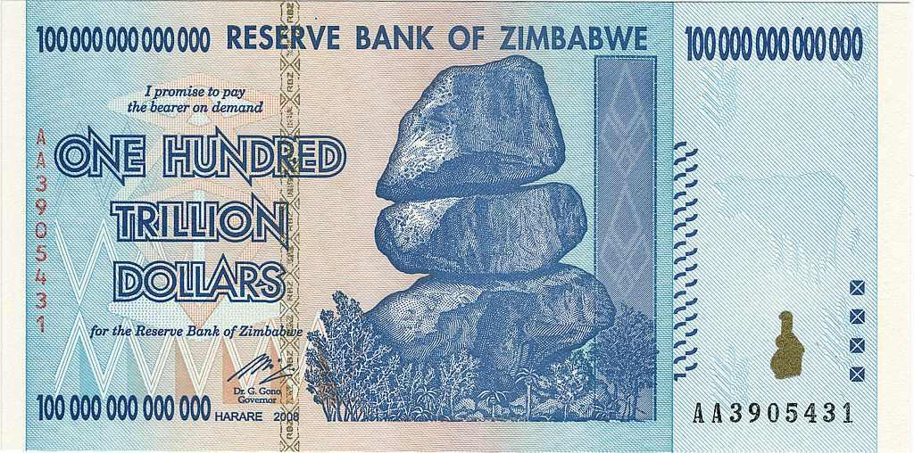

The Zimbabwe Dollar (ZWD) has a tumultuous history marked by hyperinflation and economic instability. As a currency that began its journey with relative strength and optimism post-independence, the ZWD quickly faced challenges that would lead it to be one of the most notable examples of hyperinflation in modern history. This article seeks to provide a comprehensive overview of the ZWD's progression, identifying key factors that influenced its value and assessing its impact on Zimbabwe's economic landscape. Among the many elements contributing to its volatile journey were economic mismanagement, political decisions, and the broader global market influences that exacerbated its depreciation.

In recent times, financial markets have seen the rise of algorithmic trading, a sophisticated method that leverages advanced algorithms to automate trading decisions. This technological development has started to play a role in forex markets, introducing new ways to manage and potentially capitalize on the volatility of currencies like the ZWD. The application of algorithmic trading in the context of the Zimbabwe Dollar not only presents new financial strategies but also poses challenges in navigating unpredictable economic conditions. By exploring these aspects, we aim to understand the potential integration of algorithmic tools in the Zimbabwean market and their capacity to influence trading strategies and economic recovery.



## Table of Contents

## Understanding the Zimbabwe Dollar

The Zimbabwe Dollar (ZWD) was introduced in 1980, following the country's independence, to replace the Rhodesian Dollar at a par value of 1:1. Initially, the ZWD had a relatively strong footing against the US Dollar, reflecting post-independence optimism and economic potential. However, this initial valuation was short-lived as a result of a sequence of detrimental economic policies and mismanagement.

The early optimism surrounding the ZWD quickly dissipated as the country struggled with economic instability. Factors such as land reform policies, fiscal indiscipline, and political interference adversely affected economic output, leading to a rapid depreciation of the currency. By the late 1990s, the ZWD had begun to lose substantial value, a trend that accelerated dramatically in the subsequent decade.

The currency's decline is most infamously marked by a period of hyperinflation that ranks among the most severe in recorded history. During the late 2000s, Zimbabwe experienced hyperinflation unprecedented in peacetime. At its peak, inflation rates reached astronomical levels, rendering the ZWD practically worthless for ordinary transactions. The hyperinflation was primarily fueled by excessive printing of money to finance national expenditure, devoid of equivalent economic growth or means to back the currency, thereby drastically increasing the money supply while reducing its value.

This economic scenario highlighted the acute sensitivity of currency valuations to mismanaged fiscal and monetary policies, and the devastating effect they can have on a nation's economy. Despite initial hopes that the ZWD would serve as a stable and reliable medium of exchange, these internal and external challenges thwarted its potential, leading to continuous depreciation until its eventual demonetization.

## A History of Hyperinflation

Zimbabwe's hyperinflation, peaking in 2008, remains one of the most severe instances of hyperinflation globally. During this period, Zimbabwe experienced a staggering inflation rate, with prices doubling approximately every 24 hours. This unprecedented economic situation was the culmination of several factors, primarily rooted in political decisions and post-independence economic policies.

The roots of Zimbabwe's hyperinflation can be traced back to the late 1990s and early 2000s when the government embarked on the Fast Track Land Reform program. This initiative aimed to redistribute land from the minority white farmers to black Zimbabweans. However, the hasty and often violent approach led to a significant decline in agricultural productivity, which was a cornerstone of Zimbabwe's economy.

Compounded by this, the country's economic policies became increasingly erratic. The government's decision to finance budget deficits by excessively printing money led to a drastic devaluation of the Zimbabwe Dollar (ZWD). The lack of fiscal discipline was evident as the government engaged in unbridled spending without a corresponding increase in revenue. The resulting loss of confidence in the ZWD precipitated a steep decline in its value, escalating inflation rates.

In an effort to curb the rampant hyperinflation, Zimbabwe implemented several currency redenomination processes between 2006 and 2008, where multiple zeroes were removed from banknotes. Despite these attempts to stabilize the currency and restore public confidence, these measures proved largely ineffective due to the underlying economic mismanagement and lack of structural reforms. 

In 2009, Zimbabwe introduced the Real Time Gross Settlement (RTGS) Dollar as part of its monetary reforms. The RTGS Dollar was meant to provide a new platform for stabilizing the currency, but the instability persisted. The RTGS Dollar faced similar challenges of depreciation and lack of trust, partly because the structural issues within Zimbabwe’s economy—such as ongoing political uncertainty and lack of robust economic recovery plans—remained unaddressed.

The combination of these factors resulted in sustained economic instability in Zimbabwe, reflecting the dire consequences of economic mismanagement and highlighting the complexities faced by countries undergoing post-conflict economic transitions.

## The Demise of the Zimbabwe Dollar

In 2009, the Zimbabwean government officially demonetized the Zimbabwe Dollar (ZWD), rendering it a worthless currency. This decisive move marked the culmination of years of hyperinflation and economic instability, forcing the nation to abandon its own currency in favor of more stable foreign alternatives. The ZWD's demise was primarily due to the severe devaluation it experienced, leading to its inability to function as a reliable means of exchange.

Following the demonetization, Zimbabwe's economy transitioned to a multi-currency regime, wherein several foreign currencies, most notably the United States Dollar (USD), the South African Rand (ZAR), and the Botswana Pula (BWP), became legally acceptable mediums of exchange. This transition aimed to stabilize the economy by injecting confidence into the monetary system through the use of currencies perceived as stable and globally trustworthy. The USD emerged as the predominant currency for transactions, primarily due to its international standing and widespread acceptance.

Despite the move to foreign currencies, Zimbabwe continued to grapple with significant economic challenges. Inflationary pressures persisted, albeit at a reduced intensity compared to the hyperinflation experienced prior to the demonetization. The reliance on foreign currencies introduced vulnerabilities such as dependency on foreign exchange availability and pricing, impacting the cost of living and purchasing power within the nation. Furthermore, the lack of a sovereign currency limited the Zimbabwean government's ability to implement independent monetary policies to address domestic economic issues effectively.

The ongoing struggle with inflation and economic recovery highlights the complexities faced by Zimbabwe in restoring financial stability. While the adoption of foreign currencies provided a temporary solution, long-term economic health requires continued efforts in economic reform and ensuring political stability to attract investment and foster growth.

## The Advent of the Zimbabwe Gold (ZiG)

In April 2024, the Reserve Bank of Zimbabwe introduced the Zimbabwe Gold (ZiG) with the intention of addressing ongoing economic instability and restoring confidence in the national currency framework. The ZiG is a unique monetary unit backed by physical gold bullion and foreign currency reserves, designed to offer a more stable alternative to prior currency attempts, like the Zimbabwe Dollar and subsequent bond notes. This strategic move aimed to provide a hedge against inflation and stabilize the country's monetary system.

Initially, the ZiG was pegged to the US Dollar, a measure taken to leverage the perceived reliability and stability of the American currency. Despite this effort, widespread acceptance of the ZiG remained elusive. One significant [factor](/wiki/factor-investing) contributing to its struggle for broad adoption is the entrenched preference for the US Dollar in Zimbabwe due to its longstanding credibility and consistent value in transactions. The Zimbabwean populace, accustomed to past [volatility](/wiki/volatility-trading-strategies), lingered in their preference for the US Dollar which continued to dominate the local economy as the primary medium of exchange.

Another challenge faced by the ZiG is the fundamental trust in Zimbabwe's financial governance. Historical economic missteps have made both consumers and businesses wary of fully committing to a newly introduced currency, even one that was purported to be as stable as the ZiG. Consequently, the success of the ZiG largely hinges on the government's ability to provide transparent policies and guarantees that would foster confidence in its sustainability.

In summary, the introduction of the Zimbabwe Gold represents a significant effort towards monetary reform. However, overcoming ingrained economic skepticism and achieving substantial public trust remain obstacles to its widespread acceptance, particularly when competing against the relatively steadfast US Dollar.

## Algorithmic Trading and the Forex Market

Algorithmic trading, often referred to as algo trading, has transformed the [forex](/wiki/forex-system) market by enhancing both efficiency and the speed of execution. This form of trading makes use of complex mathematical models and sophisticated algorithms to automate the process of making trading decisions. The primary aim is to maximize trading profits by analyzing vast datasets far quicker than a human could do manually. Algorithms assess the fluctuating market conditions, identify trading opportunities, and execute orders at precise times without involving human emotions, which can often lead to bias or error.

In a typical [algorithmic trading](/wiki/algorithmic-trading) model, a trader might program an algorithm to [carry](/wiki/carry-trading) out a specific task or strategy automatically. For example, a moving average crossover strategy can be implemented in Python as follows:

```python
import pandas as pd

def moving_average_crossover(data, short_window, long_window):
    signals = pd.DataFrame(index=data.index)
    signals['price'] = data['price']
    signals['short_mavg'] = data['price'].rolling(window=short_window, min_periods=1, center=False).mean()
    signals['long_mavg'] = data['price'].rolling(window=long_window, min_periods=1, center=False).mean()
    signals['signal'] = 0.0
    signals['signal'][short_window:] = np.where(
        signals['short_mavg'][short_window:] > signals['long_mavg'][short_window:], 1.0, 0.0)
    signals['positions'] = signals['signal'].diff()

    return signals
```

This script calculates the moving averages of closing prices over two different time windows and generates buy or sell signals based on crossover points. Such strategies, once coded, can operate without human intervention, thus achieving timely and data-driven trades.

In the volatile arena of Zimbabwe Dollar (ZWD) trading, the benefits of algorithmic trading become even more pronounced. Given the historical instability and fluctuation of the ZWD, traders and investors are often cautious. Algorithmic trading tools can assist by offering robust strategies tailored to handle erratic shifts in currency value. For example, algorithms can be programmed to execute trades effectively even during periods of extreme volatility, thereby potentially minimizing losses and maximizing gains.

Moreover, algorithmic trading allows for capturing [arbitrage](/wiki/arbitrage) opportunities in forex markets. Arbitrage involves taking advantage of price differentials in different markets or forms. Algorithms can swiftly identify and exploit these inefficiencies before they correct, ensuring a competitive edge.

Overall, algorithmic trading has introduced a level of precision and speed in executing trades that is unattainable through conventional manual trading. For currencies like the Zimbabwe Dollar, which have been subject to significant shifts, algorithmic trading offers a route to more stable and strategic financial engagement.

## Application of Algorithmic Trading in Zimbabwe

Algorithmic trading, characterized by using computer algorithms to execute trading decisions, plays a critical role in managing the volatility of the Zimbabwe Dollar (ZWD). This approach involves deploying complex mathematical models to forecast currency movements, thus aiding in the stabilization of financial portfolios amidst the ZWD's frequent fluctuations.

Traders often utilize these algorithms to exploit arbitrage opportunities across various currency exchanges. Arbitrage in financial markets refers to the simultaneous purchase and sale of an asset in different markets to profit from unequal prices. In the context of Zimbabwe, where exchange rate volatility is common, algorithmic trading systems can be programmed to detect and respond to such disparities swiftly and efficiently. For example, if the ZWD is traded at different rates in separate markets, an algorithm can automatically identify and execute trades to capitalize on these differences, ensuring profits from the ensuing price corrections.

Implementing algorithmic trading in Zimbabwe, however, is not without its challenges. One significant hurdle is the requirement to tailor these algorithms to handle the unique market anomalies and economic unpredictability within the country. The optimization of algorithms to adapt to rapidly changing economic indicators and unexpected policy shifts is essential for maintaining their effectiveness. This involves continuous refinement of trading strategies and adjusting parameters to reflect the current market conditions accurately.

Moreover, the effectiveness of algorithms hinges on data availability and quality. In a market where historical and real-time data might be scarce or unreliable, developing robust models that can predict trends accurately becomes complex. Therefore, algorithmic trading in Zimbabwe necessitates integrating reliable data sources and incorporating advanced [machine learning](/wiki/machine-learning) techniques to compensate for potential data gaps.

In conclusion, while algorithmic trading offers promising avenues for navigating the volatility inherent in Zimbabwe's currency market, its successful application requires overcoming significant challenges related to market irregularities and data constraints. As the financial technology landscape evolves, ongoing advancements in machine learning and computational capacity are likely to enhance the robustness and adaptability of algorithmic systems in Zimbabwe.

## The Future of Zimbabwe's Currency and Trading

The introduction of the Zimbabwe Gold (ZiG) currency in April 2024 represents a strategic effort to instill confidence and stability within the Zimbabwean economy. As a currency backed by bullion and foreign reserves, the ZiG aims to offer a more secure alternative to previous monetary systems that were plagued by hyperinflation and depreciation. Its pegging to the US Dollar provides initial stability, although the journey to widespread acceptance among the populace is ongoing.

Algorithmic trading is anticipated to become increasingly salient in Zimbabwe's efforts to align more closely with global financial markets. By leveraging the power of advanced algorithms, traders can optimize decision-making processes and execute transactions at unprecedented speeds and efficiencies. These trading algorithms, which incorporate complex mathematical models, allow for real-time analysis and response to market changes, thus offering a competitive edge in managing the volatility historically associated with Zimbabwean currency.

For Zimbabwe's new currency initiatives, the path to success is contingent upon continuous economic reform and stability. Economic policies must focus on restoring trust and maintaining resilient financial structures. The use of algorithmic trading can aid in stabilizing the currency's value by identifying and acting upon arbitrage opportunities across various currency exchanges. Additionally, these technologies can mitigate risks through the early recognition of anomalies and market disruptions.

As Zimbabwe prepares to integrate deeper into the global financial fabric, international market perceptions will play a crucial role in shaping the future trajectory of its currency initiatives. Transparent governance and consistent policy measures are vital to fostering a conducive environment for economic growth and innovation. The introduction of the ZiG, paired with the strategic adoption of algorithmic trading, holds the potential to transform Zimbabwe's economic landscape, contingent on robust policymaking and global economic integration.

## Conclusion

Zimbabwe's currency history illustrates the nation's broader economic challenges and complex political dynamics. From its inception in 1980 to its hyperinflation crisis and subsequent attempts at currency reform, the Zimbabwe Dollar’s journey underscores the impact of policy decisions on economic stability.

Algorithmic trading offers significant opportunities for Zimbabwean financial markets by enhancing market efficiency and providing tools to manage risk in unstable environments. Through advanced mathematical models and predictive analytics, algorithmic trading can help stabilize portfolios and exploit arbitrage opportunities amid fluctuating currency values. For instance, sophisticated algorithms are capable of processing market data to predict currency movements and execute trades at the optimal moment, thereby minimizing exposure to volatility. This is crucial in contexts where traditional trading methods might fall short due to emotional biases or the sheer speed required to capture fleeting opportunities.

The success of Zimbabwe's new financial strategies, such as the introduction of the Zimbabwe Gold (ZiG), hinges on effective internal governance and favorable international market perceptions. A stable political environment and sound economic policies will be essential to build trust and restore faith in national currency initiatives. Moreover, international perceptions play a pivotal role, as global investors and trading partners assess the risk and potential of engaging with Zimbabwe's economy.

Ultimately, a commitment to economic reform and transparency, alongside technological integration like algorithmic trading, may drive Zimbabwe towards improved economic stability and integration with global financial markets. The path forward requires balancing innovative financial strategies with robust economic management to ensure sustainable long-term growth.

## References & Further Reading

[1]: ["The Art of Currency Trading: A Professional's Guide to the Foreign Exchange Market"](https://www.amazon.com/Art-Currency-Trading-Professionals-Exchange/dp/1119583551) by Brent Donnelly

[2]: ["When Money Destroys Nations"](https://www.amazon.com/When-Money-Destroys-Nations-Hyperinflation/dp/0620590033) by Philip Haslam and Russell Lamberti

[3]: Cooter, R., & Schaefer, H.-B. (2012). ["Solving the Puzzle of Zimbabwe’s Hyperinflation: History, Theories, and Evidence."](https://press.princeton.edu/books/hardcover/9780691147925/solomons-knot) Journal of Economic Literature.

[4]: ["Trading and Exchanges: Market Microstructure for Practitioners"](https://academic.oup.com/book/52292) by Larry Harris

[5]: ["Zimbabwe's Casino Economy: Extraordinary Measures for Extraordinary Challenges"](https://books.google.com/books/about/Zimbabwe_s_Casino_Economy.html?id=MdpSPgAACAAJ) by Gideon Gono