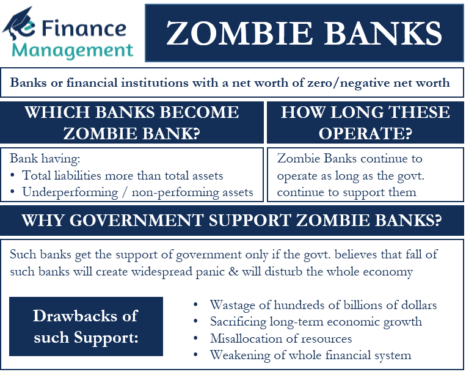

## Table of Contents

## What is a zombie bank?

A zombie bank is a bank that is not healthy enough to operate on its own but is still allowed to stay open. This happens because the government or other banks help it to avoid failing. The term "zombie" is used because, like the undead in movies, these banks are not really alive but not completely dead either.

These banks can be dangerous for the economy. They might not lend money as much as healthy banks, which can slow down business and growth. Also, keeping zombie banks alive can use up resources that could be better spent on helping the economy in other ways. Governments often have to decide whether to keep supporting these banks or let them fail, which is a tough choice.

## How does a bank become a zombie bank?

A bank becomes a zombie bank when it gets into big financial trouble but doesn't go out of business. This can happen if the bank made bad loans that people can't pay back, or if it invested in things that lost value. When this happens, the bank might not have enough money to keep going on its own. But instead of letting the bank fail, the government or other banks might step in to help. They do this because they're worried that if the bank fails, it could cause bigger problems for the economy.

The help from the government or other banks keeps the troubled bank open, but it's not really healthy. It's like a zombie - not fully alive but not dead either. These zombie banks often don't lend as much money as they should, which can slow down the economy. They use up resources that could be used to help the economy in better ways. Governments have to decide if it's worth keeping these banks alive or if it's better to let them fail and deal with the consequences.

## What are the characteristics of a zombie bank?

A zombie bank is a bank that is not healthy enough to operate well but is kept open with help from the government or other banks. It doesn't have enough money to lend or invest like a healthy bank should. This happens because the bank made bad loans or investments that lost value, leaving it in financial trouble. Instead of letting the bank fail, which could cause bigger problems for the economy, it gets support to stay open.

These banks are called "zombie" because they are not fully alive but not dead either. They don't lend as much money as they should, which can slow down the economy. Keeping zombie banks alive uses up resources that could be better spent on helping the economy in other ways. Governments have to decide whether to keep supporting these banks or let them fail, which is a tough choice because both options have risks.

## How do zombie banks function in the economy?

Zombie banks don't work well in the economy. They don't lend money like healthy banks do. This is because they are in financial trouble and don't have enough money to lend. When banks don't lend money, businesses can't grow and people can't buy homes or start new projects. This slows down the whole economy because businesses need loans to operate and grow.

Keeping zombie banks open uses up resources that could help the economy in better ways. The government or other banks have to spend money to keep these troubled banks alive. This money could be used to support healthy banks or help the economy in other ways. Governments have to decide if it's worth keeping these banks open or if it's better to let them fail. It's a hard choice because letting a bank fail can cause big problems, but keeping it open can also slow down the economy.

## What are the risks associated with zombie banks?

Zombie banks are risky for the economy. They don't lend money like healthy banks do. This means businesses can't get the loans they need to grow, and people can't borrow money to buy homes or start new projects. When businesses don't grow, they might have to close, and people might lose their jobs. This can slow down the whole economy because everyone depends on businesses to keep things moving.

Keeping zombie banks open also uses up a lot of resources. The government or other banks have to spend money to keep these troubled banks alive. This money could be used to help healthy banks or support the economy in other ways. Governments have to decide if it's worth keeping these banks open or if it's better to let them fail. It's a tough choice because letting a bank fail can cause big problems, like people losing their savings or businesses going bankrupt. But keeping zombie banks open can also slow down the economy and waste resources that could be better used elsewhere.

## How do zombie banks affect the financial system?

Zombie banks can hurt the financial system a lot. They don't lend money like they should, which means businesses can't get the loans they need to grow. When businesses don't grow, they might have to close down, and people might lose their jobs. This can make the whole economy slow down because everyone depends on businesses to keep things moving. If many businesses can't get loans, it can lead to a big economic problem.

Keeping zombie banks open also uses up a lot of resources. The government or other banks have to spend money to keep these troubled banks alive. This money could be used to help healthy banks or support the economy in other ways. Governments have to decide if it's worth keeping these banks open or if it's better to let them fail. It's a tough choice because letting a bank fail can cause big problems, like people losing their savings or businesses going bankrupt. But keeping zombie banks open can also slow down the economy and waste resources that could be better used elsewhere.

## Can you provide historical examples of zombie banks?

In Japan during the 1990s, there were a lot of zombie banks. This happened after a big economic bubble burst. Many banks had made loans to companies that couldn't pay them back. Instead of letting these banks fail, the Japanese government helped keep them open. These zombie banks didn't lend much money, which made it hard for businesses to grow. This slowed down Japan's economy for a long time, and people called it the "Lost Decade."

Another example is from the United States during the 2008 financial crisis. Some banks, like Lehman Brothers, were in big trouble because they had made bad investments. The government decided to let Lehman Brothers fail, but it helped other banks to stay open. These banks were not healthy but were kept alive with government help. They were called zombie banks because they didn't lend money like they should, which slowed down the economy. The government had to spend a lot of money to keep these banks open, which could have been used in better ways to help the economy recover.

## What measures can be taken to identify a zombie bank?

To identify a zombie bank, you need to look at how healthy the bank is financially. A zombie bank is one that is not making enough money to operate well on its own. It might have a lot of bad loans that people can't pay back, or it might have lost money on investments. If a bank needs help from the government or other banks to stay open, that's a big sign it might be a zombie bank. Also, if a bank isn't lending much money even when the economy needs it, that can be another clue.

Another way to spot a zombie bank is to see if it's holding back the economy. Zombie banks don't lend money like healthy banks do, which means businesses can't grow and people can't buy homes or start new projects. If you see a bank that's not helping the economy grow, and it's getting help to stay open, it might be a zombie bank. Governments and financial experts keep a close eye on these things to decide if a bank is a zombie and what to do about it.

## How do governments and financial regulators deal with zombie banks?

Governments and financial regulators have a tough job when it comes to dealing with zombie banks. They have to decide if it's better to keep the bank open with help or let it fail. If they keep it open, they might give the bank money or make rules to help it stay alive. This can stop the bank from causing big problems if it fails, like people losing their savings or businesses going bankrupt. But keeping zombie banks open uses up a lot of resources that could help the economy in better ways.

If governments decide to let a zombie bank fail, they have to be ready for the problems that come with it. They might need to help people who lose money or businesses that can't get loans anymore. Sometimes, they let the bank fail but then help clean up the mess afterward. It's a hard choice because both options have risks. Governments and regulators have to think carefully about what's best for the economy and the people who depend on it.

## What are the long-term economic impacts of having zombie banks?

Zombie banks can hurt the economy a lot over a long time. They don't lend money like healthy banks do, which means businesses can't grow and people can't buy homes or start new projects. When businesses don't grow, they might have to close down, and people might lose their jobs. This can make the whole economy slow down because everyone depends on businesses to keep things moving. If many businesses can't get loans, it can lead to a big economic problem that lasts for years, like what happened in Japan during the "Lost Decade."

Keeping zombie banks open also uses up a lot of resources that could be used to help the economy in better ways. The government or other banks have to spend money to keep these troubled banks alive. This money could be used to help healthy banks or support the economy in other ways, like building new roads or helping people find jobs. Governments have to decide if it's worth keeping these banks open or if it's better to let them fail. It's a tough choice because letting a bank fail can cause big problems, but keeping zombie banks open can also slow down the economy and waste resources that could be better used elsewhere.

## How can zombie banks be rehabilitated or resolved?

To fix or get rid of zombie banks, governments and financial regulators have to make some tough choices. One way is to give the bank money or help it in other ways so it can get healthy again. This might mean the government taking over the bank for a while to fix its problems, like getting rid of bad loans or finding new people to run it. If the bank can start lending money again and make money on its own, it can stop being a zombie bank. But this takes a lot of time and money, and it's not always successful.

Another way is to let the zombie bank fail, but in a way that doesn't hurt the economy too much. This can be done by breaking up the bank and selling its good parts to other healthy banks. The bad parts, like the bad loans, might be taken over by the government or a special company that can deal with them. This way, the good parts of the bank can keep working and help the economy, while the bad parts are cleaned up without causing big problems. It's a tricky process, but it can help get rid of zombie banks and make the economy healthier in the long run.

## What are the global implications of zombie banks in today's interconnected financial markets?

Zombie banks can cause big problems not just in one country, but all over the world because financial markets are all connected. If a big zombie bank in one country fails, it can make people in other countries worried about their own banks. This can make the whole world's economy slow down. For example, if a bank in the United States has problems, it might affect banks in Europe or Asia that have business with it. This can make it hard for businesses everywhere to get loans and grow, which can lead to job losses and slower economic growth.

Governments and financial regulators around the world have to work together to deal with zombie banks. They need to share information and help each other to stop problems in one country from spreading to others. If they don't work together, a zombie bank in one place can start a chain reaction that hurts the global economy. It's important for everyone to keep an eye on banks and make sure they are healthy, so the whole world can keep growing and stay strong.

## What is the impact of algorithmic trading on zombie banks?

Algorithmic trading refers to the use of computer programs to execute trade orders automatically based on predefined criteria, such as timing, price, and [volume](/wiki/volume-trading-strategy). Algorithms analyze market data and execute trades at speeds impossible for human traders. This technology has gained prominence, accounting for a significant portion of trades in major financial markets.

The influence of [algorithmic trading](/wiki/algorithmic-trading) on zombie banks can be multifaceted. On one hand, it has the potential to exacerbate problems for these financially unstable institutions. Zombie banks, which are insolvent but continue to operate often due to government support, might face increased market pressure due to the agility and precision of algorithmic trading. Algorithms exploit inefficiencies and price discrepancies, which could intensify the financial strain on these banks by exposing their vulnerabilities in real time.

On the other hand, algorithmic trading could potentially alleviate some challenges faced by zombie banks. By providing [liquidity](/wiki/liquidity-risk-premium) and improving market efficiency, algorithms can help stabilize markets where zombie banks operate. Enhanced liquidity may aid these banks in refinancing or restructuring efforts by making it easier to buy and sell financial assets. Additionally, the precision of algorithmic trades can lead to fairer pricing, which might benefit zombie banks with undervalued assets.

However, the automation inherent in algorithmic trading also brings risks. The high-frequency nature of algorithmic operations can lead to increased market [volatility](/wiki/volatility-trading-strategies), adversely affecting zombie banks whose capital structures are fragile. Rapid trading can trigger price swings that destabilize asset values, potentially leading to a liquidity crunch for banks that are already on shaky ground. Furthermore, algorithm-driven trading systems can propagate systemic risk, especially when interconnected algorithms react to market signals in a similar manner, causing cascading effects.

To assess the risk or stability introduced by algorithmic trading, one can consider the impact of market microstructure changes. The influx of algorithm-driven strategies can lead to significant shifts in supply and demand dynamics. Mathematically, the volatility $\sigma$ observed in the market can be modeled as follows:

$$
\sigma = \sqrt{\sum_{i=1}^{n} (R_i - \bar{R})^2 / (n-1)}
$$

where $R_i$ is the return at time $i$ and $\bar{R}$ is the average return. High-frequency trading might cause increased $\sigma$, reflecting higher risk, but also indicates a vibrant market where price discovery is efficient. The challenge for policymakers and financial institutions lies in balancing these factors to mitigate potential threats while harnessing algorithmic trading's benefits for market health and stability.

## References & Further Reading

[1]: Caballero, R. J., Hoshi, T., & Kashyap, A. K. (2008). ["Zombie Lending and Depressed Restructuring in Japan."](https://www.aeaweb.org/articles?id=10.1257/aer.98.5.1943) The Quarterly Journal of Economics.

[2]: Acharya, V. V., Eisert, T., Eufinger, C., & Hirsch, C. (2019). ["Whatever It Takes: The Real Effects of Unconventional Monetary Policy."](https://academic.oup.com/rfs/article/32/9/3366/5298322) The Review of Financial Studies.

[3]: Hoshi, T., & Kashyap, A. (2004). ["Japan's Financial Crisis and Economic Stagnation."](https://pubs.aeaweb.org/doi/pdfplus/10.1257/089533004773563412) Journal of Economic Perspectives.

[4]: Kiyotaki, N., & Moore, J. (2002). ["Evil Is the Root of All Money."](https://www.jstor.org/stable/3083378) American Economic Review, 92(2), 62-66.

[5]: Philippon, T. (2010). ["Financiers vs. Engineers: Should the Financial Sector be Taxed or Subsidized?"](https://www.aeaweb.org/articles?id=10.1257/mac.2.3.158) American Economic Review, 100(2), 300-306.

[6]: Shin, H. S. (2012). ["Global Banking Glut and Loan Risk Premium."](https://www.imf.org/external/np/res/seminars/2011/arc/pdf/hss.pdf) IMF Economic Review.

[7]: LSE Editorial Board. (2013). [Insolvency: Bankruptcy, Shortfall, and Economic Failure.](https://www.studocu.com/en-gb/course/the-london-school-of-economics-and-political-science/the-law-of-corporate-insolvency/2170395) London School of Economics Research Publication.

[8]: Schnabl, P. (2012). ["Financial Globalization and Banking Crises: Global vs. Regional Effects."](https://pages.stern.nyu.edu/~pschnabl/research/Schnabl2012.pdf) Review of Economics and Statistics.