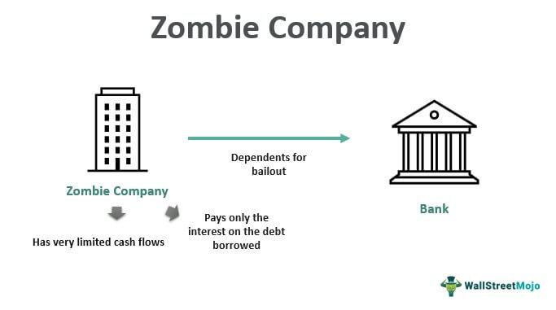

A zombie bank is a financial institution that continues to operate despite being insolvent, often due to government support or other interventions that keep it artificially afloat. These banks are unable to fulfill their financial obligations and rely on external aid to avoid closure. The presence of zombie banks poses substantial threats to financial stability and the economy at large. Insolvent banks disrupt efficient allocation of resources, leading to a misallocation of capital and inhibited economic growth. By tying up resources, they hinder the entry and progression of more efficient financial entities, perpetuating inefficiencies within the financial system.

Algorithmic trading, which utilizes complex algorithms to execute large orders at high speeds, is increasingly significant in bank operations. These algorithms can be designed to respond to minute changes in the market, making trading decisions faster and often more precise than human traders. Given its growing role, algorithmic trading influences market dynamics significantly and can impact zombie banks by exacerbating or mitigating risks. For instance, during periods of market volatility, algorithmic trading might contribute to rapid price swings, which can stress financially fragile banks or, alternatively, provide liquidity that assists them in managing their portfolios more effectively.



Understanding the implications of zombie banks on the financial system is crucial for maintaining economic health. These banks, by virtue of their inefficiencies and dependencies on governmental support, create systemic risks. Consequently, they call into question the robustness of financial institutions and necessitate a reevaluation of regulatory frameworks to ensure resilience. Recognizing the intertwined nature of financial stability, insolvency, and technological advancements like algorithmic trading is imperative for policymakers, financial institutions, and stakeholders to devise strategies that mitigate risks associated with zombie banks and bolster the overall stability and efficiency of the financial system.

## Table of Contents

## What is a Zombie Bank?

A zombie bank is a financial institution that, despite being insolvent, continues to operate largely due to government support and regulatory forbearance. These banks are characterized by their inability to generate sufficient revenue to cover their operating expenses and debt obligations, thereby making them financially unsustainable. Insolvency occurs when a bank's liabilities exceed its assets, rendering it incapable of fulfilling its financial commitments without external intervention.

Zombie banks persist due to several factors. Primarily, governments may provide support to prevent a broader financial collapse, fearing that the sudden liquidation of such banks could lead to systemic failures. Consequently, these banks often receive financial aid in the form of capital injections, low-interest loans, or guarantees on their liabilities. Another reason for their continued operation is the regulatory tendency to extend leniency, allowing banks more time to stabilize their finances in hopes of eventual recovery.

Historically, the phenomenon of zombie banks has been observed during significant financial crises. One prominent example is Japan's banking issues during the 1990s, often referred to as the "Lost Decade." After the asset price bubble burst, many Japanese banks were left holding a vast number of non-performing loans. Despite being effectively insolvent, these banks continued to function with the help of government interventions, which prolonged economic stagnation.

The Savings and Loan crisis in the United States during the 1980s is another notable instance. Savings and loan associations faced a severe mismatch between long-term fixed-rate mortgages and rising short-term interest rates, leading to widespread insolvency. The government's strategy to support these ailing institutions resulted in significant taxpayer burdens before eventual reforms and closures restored stability.

Understanding the characteristics and persistence of zombie banks is crucial, as their existence can hinder economic recovery and growth. Addressing the issue requires careful consideration of policy interventions that balance immediate financial stability with long-term economic health.

## Financial Stability and Zombie Banks

Zombie banks pose a significant challenge to the financial system's stability. These financial institutions continue to operate despite being insolvent, primarily due to prolonged support from government interventions. This section examines the negative impact these banks have on economic stability and growth, and the role of governmental policies in sustaining them.

### Impact on Financial Stability

Zombie banks remain operational even when they lack the necessary capital to meet their obligations. This situation can mislead stakeholders regarding the underlying health of the financial system. Because they continue to exist, these banks often engage in practices detrimental to financial stability, such as distributing poorly allocated loans to avoid recognizing bad debt on their balance sheets. Data from studies, such as Caballero et al. (2008) on Japan's lost decade, indicates that zombie banks contribute to prolonged periods of deflation and stagnation by clogging the credit channels that are vital for vibrant economic activity.

### Government Intervention

Governments often intervene to keep zombie banks afloat, fearing the adverse effects of a bank's failure on the economy. This can include measures such as capital infusions, loan guarantees, and other forms of financial support. While these interventions might provide short-term relief, they often delay necessary restructuring and prolong the resolution of financial instability. For instance, during the Savings and Loan crisis in the United States, government actions initially sustained insolvency issues, which eventually required more extensive and costly interventions.

### Deterrence of Economic Recovery and Growth

Zombie banks can deter economic recovery and growth by absorbing financial resources that could be better utilized by more viable enterprises. They create a competitive disadvantage for healthy banks by saturating the market with non-performing loans that distort pricing and risk assessments. Furthermore, they impede monetary policy effectiveness, as central banks' efforts to stimulate the economy through rate cuts can be less effective if zombie banks fail to pass these benefits to the real economy. The presence of these institutions can also discourage investments, as markets may anticipate prolonged periods of financial instability.

To highlight these points through a hypothetical example, consider a financial market with 100 banks, of which 20 are zombies. If the government provides each zombie bank with a subsidy, non-zombie banks must compete against these subsidized entities, potentially leading to misallocation of resources. A simple Python simulation could model this scenario, showing the inefficiencies introduced by governmental support for insolvent banks:

```python
import numpy as np

# Simulate 100 banks, 20 of which are zombies
banks = np.zeros(100)
zombie_indices = np.random.choice(range(100), 20, replace=False)
banks[zombie_indices] = 1  # Mark zombie banks

# Simulate government intervention
subsidy = 100
banks += subsidy * (banks == 1)

# Calculate capital allocation efficiency
efficiency = np.sum(banks > subsidy) / len(banks)
print(f"Efficiency of capital allocation: {efficiency:.2f}")
```

In this simple model, the presence of zombie banks leads to reduced capital allocation efficiency, illustrating how state intervention in maintaining insolvent banks can skew market dynamics and hinder economic recovery.

Effective policies aimed at resolving zombie banks are crucial for restoring stability and promoting long-term economic health. Addressing the root causes of insolvency through stringent regulatory mechanisms and facilitating orderly exits are essential policy measures to improve financial system resilience.

## Bank Insolvency and Consequences

Bank insolvency refers to a situation where a financial institution's liabilities exceed its assets, rendering it unable to meet its debt obligations. Insolvency is fundamentally about a deficit in net assets, distinguished from illiquidity, where a bank may have short-term issues meeting cash flow requirements. Insolvency is a critical financial state that can, if unresolved, lead to bankruptcy, where legal proceedings are initiated to manage the insolvent entity's debts and business affairs.

The economic costs associated with insolvent banks are substantial. Financial instability can result from the failure of such institutions, leading to a loss of public confidence in the banking system. This often necessitates costly government interventions, which may include bailouts funded by taxpayer money. The diversion of resources to rescue failing banks can deplete the fiscal reserves intended for infrastructure, healthcare, and other public services, impacting overall economic welfare.

Policymakers face significant dilemmas in dealing with insolvent banks, primarily deciding between supporting them through financial aid or allowing liquidation. Supporting insolvent banks usually involves capital injection or ensuring [liquidity](/wiki/liquidity-risk-premium) through measures like governmental guarantees. While such steps can prevent immediate destabilization, they risk fostering moral hazard, where banks might engage in risky behavior, expecting governmental rescue during crises.

Alternatively, liquidating insolvent banks might ensure market discipline, signaling that poorly managed banks will not be perpetually cushioned by state interventions. However, this approach can amplify immediate financial distress, potentially triggering broader economic repercussions, especially if the insolvent bank is sizable enough to be considered "too big to fail."

Successfully managing bank insolvency requires weighing long-term economic health against immediate financial stability. This involves creating a regulatory environment that not only addresses present insolvency issues but also implements preventative measures to ensure banks operate within sustainable risk frameworks.

## Algorithmic Trading and Its Impact on Zombie Banks

Algorithmic trading refers to the use of computer programs to execute trade orders automatically based on predefined criteria, such as timing, price, and [volume](/wiki/volume-trading-strategy). Algorithms analyze market data and execute trades at speeds impossible for human traders. This technology has gained prominence, accounting for a significant portion of trades in major financial markets.

The influence of [algorithmic trading](/wiki/algorithmic-trading) on zombie banks can be multifaceted. On one hand, it has the potential to exacerbate problems for these financially unstable institutions. Zombie banks, which are insolvent but continue to operate often due to government support, might face increased market pressure due to the agility and precision of algorithmic trading. Algorithms exploit inefficiencies and price discrepancies, which could intensify the financial strain on these banks by exposing their vulnerabilities in real time.

On the other hand, algorithmic trading could potentially alleviate some challenges faced by zombie banks. By providing liquidity and improving market efficiency, algorithms can help stabilize markets where zombie banks operate. Enhanced liquidity may aid these banks in refinancing or restructuring efforts by making it easier to buy and sell financial assets. Additionally, the precision of algorithmic trades can lead to fairer pricing, which might benefit zombie banks with undervalued assets.

However, the automation inherent in algorithmic trading also brings risks. The high-frequency nature of algorithmic operations can lead to increased market [volatility](/wiki/volatility-trading-strategies), adversely affecting zombie banks whose capital structures are fragile. Rapid trading can trigger price swings that destabilize asset values, potentially leading to a liquidity crunch for banks that are already on shaky ground. Furthermore, algorithm-driven trading systems can propagate systemic risk, especially when interconnected algorithms react to market signals in a similar manner, causing cascading effects.

To assess the risk or stability introduced by algorithmic trading, one can consider the impact of market microstructure changes. The influx of algorithm-driven strategies can lead to significant shifts in supply and demand dynamics. Mathematically, the volatility $\sigma$ observed in the market can be modeled as follows:

$$
\sigma = \sqrt{\sum_{i=1}^{n} (R_i - \bar{R})^2 / (n-1)}
$$

where $R_i$ is the return at time $i$ and $\bar{R}$ is the average return. High-frequency trading might cause increased $\sigma$, reflecting higher risk, but also indicates a vibrant market where price discovery is efficient. The challenge for policymakers and financial institutions lies in balancing these factors to mitigate potential threats while harnessing algorithmic trading's benefits for market health and stability.

## International Case Studies

Zombie banks, often characterized by insolvency yet sustained through external support, present unique challenges in various international contexts. Examining specific scenarios, particularly in Japan and Europe, provides insights into the strategies employed to manage these financial entities and their effectiveness in terms of economic recovery.

Japan provides one of the most illustrative examples of zombie banks. The issue surfaced prominently during the 1990s, following the burst of the asset price bubble. Japanese banks, heavily loaded with non-performing loans (NPLs), were kept afloat through substantial government bailouts and regulatory forbearance. A key strategy was the injection of public funds and the establishment of the Resolution and Collection Corporation (RCC) to purchase and manage bad loans. Despite these efforts, the result was prolonged economic stagnation often referred to as the "Lost Decade." The continuation of zombie banks in Japan is largely attributed to the reluctance to allow market forces to naturally resolve insolvencies, thereby creating an environment of credit misallocation and impeding economic recovery.

In Europe, the phenomenon of zombie banks became pronounced in the aftermath of the 2007-2008 financial crisis. Similar to Japan, European banks received significant state support, including recapitalizations and asset relief measures, to stabilize the financial system. Under the European Stability Mechanism (ESM), several banks received aid packages to maintain operational viability. However, these interventions have been met with mixed outcomes. While immediate financial stability was achieved, the persistence of such banks has led to weak credit growth and impeded efficient investment allocation across the economy. In certain cases, regulatory reforms, such as the European Union's Bank Recovery and Resolution Directive (BRRD), have aimed to address these issues by emphasizing bank resolvability and bail-in mechanisms to reduce reliance on taxpayer bailouts.

Despite different approaches, both Japan and Europe highlight the complexities in handling zombie banks. Managing such banks is crucial not only to ensure their eventual recovery but also to prevent systemic risks that could arise from unresolved financial distress. While the strategies adopted have provided short-term stability, the long-term consequences often involve delayed economic recovery and investment distortions. Consequently, the experiences from these regions underscore the importance of implementing comprehensive reforms that strike a balance between immediate financial stability and sustainable economic growth.

## Policy Interventions and Solutions

To address the challenges posed by zombie banks, effective policy measures are crucial. One primary strategy involves regulatory reforms aimed at improving bank health, thereby preventing the emergence of zombie banks. Regulatory bodies can implement stricter capital adequacy requirements, ensuring banks maintain sufficient capital buffers to absorb losses. For instance, enhancing the Tier 1 capital ratio, which measures a bank’s core equity capital against its total risk-weighted assets, can help banks remain solvent during economic downturns.

Moreover, improving transparency through robust disclosure requirements can aid in promptly identifying financial distress within banks. Financial institutions should be mandated to provide detailed accounts of their asset quality and financial health, allowing regulators to act quickly when issues arise. Early intervention can prevent banks from continuing operations while insolvent, reducing the prevalence of zombie banks.

Another critical measure is the implementation of more effective stress testing frameworks. Stress tests, which assess how banks can cope with economic shocks, should be designed to realistically reflect potential market conditions. Tailoring stress test scenarios to individual banks' risk profiles ensures that even those institutions susceptible to becoming zombie banks can be identified and address their weaknesses before they reach critical distress levels.

Encouraging financial resilience is another crucial aspect of combatting dependence on government bailouts. Promoting a culture of sound risk management and prudent lending within banks not only strengthens their financial position but also contributes to the stability of the broader financial system. Educating bank management and stakeholders about the importance of financial health and risk diversification can lead to more sustainable banking practices.

Furthermore, the role of resolution planning is pivotal. Regulators should require banks to prepare comprehensive resolution plans, often referred to as "living wills," which outline the strategy for orderly resolution in case of insolvency. These plans ensure that a bank's failure does not require taxpayer-funded bailouts, and instead, its restructuring or liquidation can occur with minimal systemic impact.

Lastly, governments can consider establishing specialized asset management companies (AMCs) to handle the distressed assets that weigh down zombie banks. By transferring non-performing loans and other toxic assets to AMCs, banks can clean up their balance sheets, allowing them to refocus on viable business activities. This separation can facilitate the recovery of the banking sector while providing a more organized method for dealing with problematic assets.

In summary, through a combination of stringent regulatory reforms, improved transparency, stress testing, proactive resolution planning, and potential asset management solutions, policymakers can significantly mitigate the risks associated with zombie banks. Implementing these strategies can enhance financial resilience and reduce the likelihood of future dependencies on government support.

## Conclusion

Zombie banks, entities that continue to operate despite insolvency often due to government support, pose significant challenges to financial stability. These banks can become a drain on economic resources, as they typically fail to contribute to economic growth and innovation. By maintaining low-interest loans or rolling over bad debt, they tie up capital that could otherwise be allocated to more productive sectors. Hence, their existence can serve as an impediment to economic recovery, creating a perpetuating cycle of stagnation.

The rise of algorithmic trading has added another dimension to the issues faced by zombie banks. While the automation and speed of algorithmic trading can bring efficiency and greater liquidity to the financial markets, it can also increase volatility, presenting both risks and opportunities for zombie banks. On one hand, algorithmic trading can lead to market dynamics that exacerbate a bank’s financial instability; on the other hand, it holds within its scope the potential to enhance risk management and price discovery processes.

Effective policy interventions are crucial to address the threats posed by zombie banks. Robust regulatory frameworks should aim to prevent the occurrence of zombie banks by ensuring sound bank management and early detection of financial distress. Policies that facilitate the restructuring or liquidation of such banks can help minimize economic disruptions. Moreover, global cooperation in enforcing these policies can prevent the cross-border risks associated with zombie institutions.

Further research and development of innovative solutions in financial regulation and market practices are needed to sustain financial stability. This research should focus on understanding the interplay between new technologies, like algorithmic trading, and traditional banking practices. Encouraging dialogue between policymakers, economists, and technologists will be vital in crafting strategies that not only mitigate the current challenges posed by zombie banks but also anticipate future threats to financial stability.

## References & Further Reading

[1]: Caballero, R. J., Hoshi, T., & Kashyap, A. K. (2008). ["Zombie Lending and Depressed Restructuring in Japan."](https://www.aeaweb.org/articles?id=10.1257/aer.98.5.1943) The Quarterly Journal of Economics.

[2]: Acharya, V. V., Eisert, T., Eufinger, C., & Hirsch, C. (2019). ["Whatever It Takes: The Real Effects of Unconventional Monetary Policy."](https://academic.oup.com/rfs/article/32/9/3366/5298322) The Review of Financial Studies.

[3]: Hoshi, T., & Kashyap, A. (2004). ["Japan's Financial Crisis and Economic Stagnation."](https://pubs.aeaweb.org/doi/pdfplus/10.1257/089533004773563412) Journal of Economic Perspectives.

[4]: Kiyotaki, N., & Moore, J. (2002). ["Evil Is the Root of All Money."](https://www.jstor.org/stable/3083378) American Economic Review, 92(2), 62-66.

[5]: Philippon, T. (2010). ["Financiers vs. Engineers: Should the Financial Sector be Taxed or Subsidized?"](https://www.aeaweb.org/articles?id=10.1257/mac.2.3.158) American Economic Review, 100(2), 300-306.

[6]: Shin, H. S. (2012). ["Global Banking Glut and Loan Risk Premium."](https://www.imf.org/external/np/res/seminars/2011/arc/pdf/hss.pdf) IMF Economic Review.

[7]: LSE Editorial Board. (2013). [Insolvency: Bankruptcy, Shortfall, and Economic Failure.](https://www.studocu.com/en-gb/course/the-london-school-of-economics-and-political-science/the-law-of-corporate-insolvency/2170395) London School of Economics Research Publication.

[8]: Schnabl, P. (2012). ["Financial Globalization and Banking Crises: Global vs. Regional Effects."](https://pages.stern.nyu.edu/~pschnabl/research/Schnabl2012.pdf) Review of Economics and Statistics.