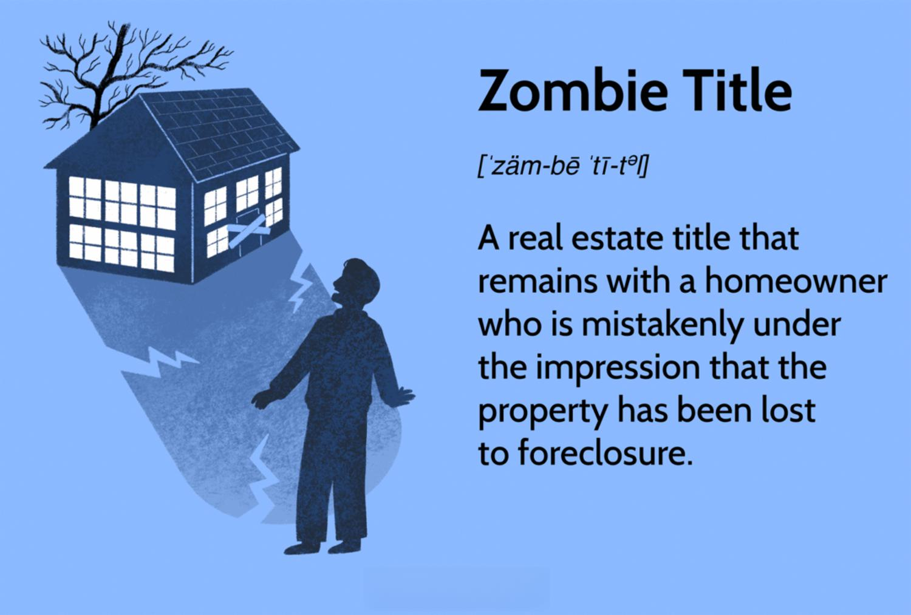

In recent years, there has been a notable convergence between literature, real estate, and financial technology, leading to intriguing concepts such as literary zombie titles and algorithmic trading in publishing. This intersection highlights the growing influence of contemporary technological advancements on traditional sectors.

The concept of zombie titles in real estate emerged following the 2008 financial crisis, as foreclosure processes left properties in an ambiguous state of ownership. These properties, often unbeknownst to their original homeowners, become financial liabilities due to ongoing taxes and maintenance issues. This situation not only affects the individuals directly involved but also has broader economic implications on property markets and communities.

In literature, zombie narratives have transcended their origins in pulp fiction to become a valuable tool for authors in exploring complex societal and ethical themes. Writers like Max Brooks and Colson Whitehead have utilized zombies as metaphors for societal collapse and human behavior, offering commentary on issues such as pandemics and social unrest. This evolution of the genre demonstrates literature's adaptability in reflecting contemporary global challenges.

In parallel, the publishing industry is undergoing significant changes with the incorporation of algorithmic trading models, initially designed for finance. These models analyze vast datasets to identify marketable book concepts, thereby influencing publishing trends and decisions. While this technological integration enhances efficiency, it also prompts discussions about the balance between artistic expression and market demands.

This article will explore how these domains intertwine and assess their collective impact on literature, finance, and real estate. Through understanding zombie titles in real estate, literary zombie influences, and the role of algorithmic trading in publishing, we gain insight into how these intersections are shaping cultural and economic landscapes.

## Table of Contents

## Understanding Zombie Titles in Real Estate

Zombie titles in real estate describe a scenario where the title of a foreclosed property remains with the original homeowner, despite the foreclosure process pausing unexpectedly. This situation arises when a lender initiates foreclosure proceedings but does not complete them, often without informing the homeowner. As a result, the homeowner might vacate the property, assuming the foreclosure has concluded and the property ownership has transferred to the lender. However, because the legal title was never actually transferred, the homeowner remains the official owner.

This unresolved ownership status can lead to significant financial burdens for the homeowner. Although they may have vacated the property, they are still liable for property taxes, homeowner association fees, and code violations. Accumulating such debts can impact the homeowner's financial standing and credit score. Local municipalities often enforce maintenance regulations, and an owner unaware of their continuing responsibilities may inadvertently violate these codes, potentially leading to fines.

The proliferation of zombie titles surged following the 2008 financial crisis. During this period, many financial institutions were overwhelmed by the sheer [volume](/wiki/volume-trading-strategy) of defaulted mortgages, leading to procedural delays and foreclosures being left incomplete. Homeowners, meanwhile, faced significant confusion over the state of their property ownership.

Data indicates that while the occurrence of zombie titles decreased slightly during economic recovery periods, they remain a pressing issue. Shifting economic conditions and evolving lender policies continue to leave some homeowners unaware of their continued ownership. Real estate dynamics, such as fluctuations in housing markets and the financial health of lending institutions, can exacerbate or mitigate the prevalence of zombie titles. While legislation in some areas aims to provide clarity and protection for homeowners, the complexity of foreclosure laws across different jurisdictions complicates their resolution.

Efforts to address zombie titles involve ensuring better communication between lenders and borrowers and implementing laws that mandate lenders to notify homeowners about halted foreclosure processes. Addressing these issues requires coordination among financial institutions, legal systems, and advocacy groups to protect homeowners from unintended and unjust financial ramifications.

## Literary Concepts in Zombie Narratives

Zombie literature has transformed from its origins in pulp fiction to a genre that addresses significant societal fears and ethical dilemmas. The portrayal of the undead in literature is not only a medium for horror but also an allegorical tool for discussing profound real-world issues.

Authors such as Max Brooks and Colson Whitehead have notably advanced the zombie genre, using their works to critique societal collapse and examine human behavior in extreme circumstances. Max Brooks' seminal work, "World War Z," is structured as an oral history of a global war against zombies, providing a unique platform to explore themes of global politics, military strategies, and human survival. Each narrative serves as a commentary on societal deficiencies and international relations, reflecting the complex interplay between humanity's strengths and weaknesses during crises.

Colson Whitehead's "Zone One" similarly uses the zombie apocalypse as a backdrop to scrutinize human behavior and societal norms. In his novel, Whitehead focuses on the psychological effects of post-apocalyptic survival, capturing the existential dread and disconnection that can arise in the face of widespread societal collapse. This narrative not only critiques contemporary socio-economic disparities but also questions the resilience of social structures under pressure.

Zombie narratives frequently act as allegories for real-world issues such as pandemics and social unrest. By weaving these elements into their stories, authors engage with both historical and contemporary anxieties. For instance, the spread of a zombie virus often mirrors the fear and chaos associated with real epidemics, offering a platform to explore the dynamics of public health crises and government responses. Furthermore, the ubiquitous theme of surviving in a world overrun by the undead can symbolize societal strife, delving into issues of race, class, and individualism versus collectivism.

In conclusion, zombie literature's evolution from pulp fiction to a respected genre is marked by its ability to transcend mere entertainment, engaging readers with incisive social criticism and introspection. Through vibrant storytelling and deep allegorical meaning, the genre continues to reflect and influence perceptions of societal and ethical issues.

## The Role of Algo Trading in Publishing

Algorithmic trading, a technique widely associated with financial markets, has begun to significantly affect the publishing industry. By applying algorithmic systems to the decision-making processes within publishing houses, stakeholders aim to not only streamline operations but also predict and influence literary market trends. This technological advancement in publishing revolves around the utilization of complex algorithms that analyze vast datasets to forecast which book concepts might resonate with consumers.

Algorithms in publishing conduct textual analysis and pattern recognition through [machine learning](/wiki/machine-learning) techniques. This involves examining consumer reviews, sales data, social media interactions, and historical purchasing behaviors. Through this comprehensive analysis, algorithms can identify emerging literary themes and genres that are gaining traction. As an example, if data indicates a rising interest in dystopian narratives or climate fiction, publishing houses can prioritize acquiring manuscripts in these areas. Thus, [algorithmic trading](/wiki/algorithmic-trading) in publishing serves as a pivotal tool in determining marketable book concepts. 

The integration of such technology within publishing fundamentally challenges traditional methods of literary selection. Historically, editors and literary [agents](/wiki/agents) relied largely on subjective judgment and intuition to select manuscripts. With algorithmic insights, however, there's a shift toward data-driven choices, marrying creative instincts with empirical evidence. For instance, a publishing house might receive data suggesting that a particular narrative style is underrepresented yet highly desired by readers. This information could prompt editors to seek out and publish works that fill this niche.

This technological shift leads to an equilibrium between artistic integrity and market demands. While algorithmic data provides objective insights, there remains an essential place for human judgment in recognizing unique voices and groundbreaking storytelling that might not immediately align with market algorithms. Hence, the challenge lies in leveraging algorithms to enhance the literary selection process while preserving the artistry at the heart of literature.

The role of algorithmic trading in publishing is a testament to the broader digital transformation of creative industries. Just as stock trading has evolved with technology to optimize financial outcomes, publishing is using similar technologies to navigate the shifting literary landscape. The balance achieved between algorithms and human expertise could ultimately lead to a more informed, dynamic, and responsive literary market, positioned well to meet the diverse and evolving tastes of readers worldwide.

## Recent Trends and Future Projections

Zombie titles have maintained their presence in the real estate markets due to evolving economic conditions and changing lender policies. Following the 2008 financial crisis, the phenomenon of zombie titles surged as numerous foreclosures were left unresolved, resulting in significant legal and financial challenges for both lenders and homeowners. As these properties remain tied to unwary homeowners, zombie titles continue to influence market dynamics, often contributing to urban blight and declining property values. Recent economic uncertainties and regulatory shifts have sustained the prevalence of zombie titles, highlighting a need for policy reforms and innovative financial solutions to manage these lingering issues effectively.

Meanwhile, literary zombie narratives have broadened into diverse genres, mirroring the complexities of contemporary global challenges. Originally emphasizing themes of societal collapse and survival in the wake of zombie apocalypses, the genre has expanded to incorporate a variety of themes such as climate change, political unrest, and pandemics. This evolution can be attributed to the adaptability of zombie literature as a tool for allegory, allowing authors to explore intricate societal issues with creativity and critical insight. The genre's expansion reflects a growing public appetite for narratives that challenge readers to confront the realities of an increasingly turbulent world.

In the publishing industry, the emergence of AI and machine learning heralds a transformative era of literary curation shaped by algorithms. Traditionally reliant on editorial intuition and market trends, the publishing process is increasingly guided by algorithmic data analysis, which aids in identifying promising book concepts and predicting market performance. This technology offers a more data-driven approach to decision-making, providing insights into emerging literary trends and audience preferences. However, it also raises questions about the balance between artistic expression and market demands. As AI continues to evolve, it is poised to redefine the relationships between authors, publishers, and readers, potentially increasing efficiency while challenging traditional notions of literary value.

In summary, while zombie titles persist as a pressing issue in real estate, literary zombie narratives and AI-driven publishing practices exemplify the broader shifts occurring across interconnected domains of literature, finance, and technology. Each of these elements demonstrates an evolution in response to external pressures and internal innovations, signaling ongoing changes in both societal structures and creative landscapes.

## Conclusion

The convergence of literary, financial, and technological elements marks a pivotal transformation in both creative and financial arenas. As we integrate these distinct domains, they collectively reshape the manner in which we approach literature and business. This fusion underscores the necessity of recognizing the societal, artistic, and economic impacts that arise.

By intertwining literary genres with financial innovations and technological advancements, there is a profound recalibration of how information is produced and consumed. The narrative paradigms, such as zombie literature, reflect deeper societal concerns and offer allegories that resonate with contemporary issues. On the financial and technological fronts, advances like algorithmic trading in publishing suggest a gradual shift from traditional methods to a data-driven approach. This has influenced not only what content reaches audiences, but also how publishers gauge market demand.

To effectively navigate these evolving intersections, it is crucial to remain adaptable and forward-thinking. Cultivating an understanding of these changes enables stakeholders to make informed decisions that acknowledge both creative integrity and economic viability. By embracing this integration, there exists the potential to not only respond to current shifts but also anticipate future cultural and economic landscapes. This holistic understanding ensures that the drive toward progress remains inclusive of artistic vision, societal reflection, and economic sustainability.

## References & Further Reading

[1]: Moreno, P. "Zombies in Property: How Foreclosures Created a New Form of Ownership." [Real Estate Journal](https://greenvillejournal.com/2024-tax-sales/).

[2]: Whitehead, Colson. ["Zone One."](https://en.wikipedia.org/wiki/Zone_One) Anchor Books.

[3]: Brooks, Max. ["World War Z: An Oral History of the Zombie War."](https://www.amazon.com/World-War-Oral-History-Zombie/dp/0307346617) Crown Publishers.

[4]: Lopez de Prado, M. ["Advances in Financial Machine Learning."](https://www.amazon.com/Advances-Financial-Machine-Learning-Marcos/dp/1119482089) Wiley.

[5]: Macfarlane, K. "Foreclosure Crisis Leaves Behind Zombie Titles." [The New York Times](https://www.lisc.org/media/filer_public/5d/b4/5db4c4b5-d311-4b04-99f8-87bd473029ce/042518_housing_zombie_vacant_properties_best_pracitces.pdf).

[6]: Jansen, S. ["Machine Learning for Algorithmic Trading."](https://github.com/stefan-jansen/machine-learning-for-trading) Packt Publishing.