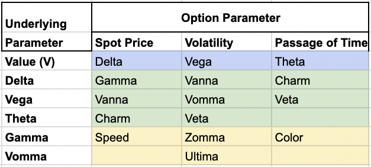

## Table of Contents

## What is Zomma in the context of options trading?

Zomma is a term used in options trading that measures how sensitive the gamma of an option is to changes in the underlying asset's volatility. Gamma itself is a measure of how much an option's delta changes when the price of the underlying asset moves. So, Zomma looks at how the rate of change of delta (gamma) reacts to changes in volatility. This can be important for traders because it helps them understand how their options might behave if the market's volatility shifts unexpectedly.

In simpler terms, imagine you're driving a car and the speedometer (delta) tells you how fast you're going. The accelerator (gamma) affects how quickly your speed changes. Zomma is like a sensitivity meter for the accelerator, showing how its effectiveness changes when the road conditions (volatility) change. Traders use Zomma to fine-tune their strategies, especially in volatile markets, to better predict and manage the risks associated with their options positions.

## How does Zomma differ from other Greek metrics like Delta and Gamma?

Zomma is a bit different from Delta and Gamma because it looks at how changes in the market's ups and downs (volatility) affect the Gamma of an option. Delta tells you how much the price of an option might change if the price of the underlying stock moves a little bit. It's like a direct link between the stock price and the option price. Gamma, on the other hand, tells you how much the Delta itself changes when the stock price moves. It's like a measure of how sensitive the Delta is to the stock's price changes.

Zomma adds another layer by showing how the Gamma changes when the market's volatility changes. So while Delta and Gamma focus on the relationship between the stock price and the option's price or Delta, Zomma focuses on how the whole situation changes when the market gets more or less wild. This can be really useful for traders who want to understand how their options might behave if the market starts to swing more than expected.

## What is the mathematical formula for calculating Zomma?

Zomma is a measure of how much an option's gamma changes when the market's volatility changes. To calculate Zomma, you need to use the third derivative of the option's price with respect to the underlying asset's price, and also take into account how this changes with volatility. The formula for Zomma is a bit complex, but it looks like this: Zomma = ∂²Γ/∂σ², where Γ is the gamma of the option, σ is the volatility, and ∂ means "partial derivative."

In simpler terms, imagine you're looking at how much the speed of your car (gamma) changes when the road conditions (volatility) change. Zomma helps you see this by taking the rate of change of gamma and seeing how that rate changes with volatility. This can be useful for traders because it helps them understand how sensitive their options are to big swings in the market.

## Can you explain the impact of Zomma on an option's price?

Zomma affects how much an option's price changes when the market gets more or less wild. Imagine you're driving a car, and the speedometer shows how fast you're going. The speedometer is like the Delta of an option, showing how the option's price changes with the stock price. The [accelerator](/wiki/accelerator), which controls how quickly your speed changes, is like the Gamma of an option. Zomma is like a meter that shows how the accelerator's effectiveness changes when the road conditions (volatility) change.

If Zomma is high, it means that even small changes in the market's ups and downs can make a big difference in how sensitive the option's price is to the stock price. This is important for traders because it helps them understand how their options might behave if the market starts swinging more than expected. A high Zomma means the option's price could change a lot if volatility goes up or down, so traders need to be ready for that.

## How does Zomma change as the underlying asset's price moves?

Zomma changes as the price of the underlying asset moves because it measures how sensitive the Gamma of an option is to changes in the market's ups and downs. Imagine you're driving a car, and the speedometer (Delta) shows how fast you're going. The accelerator (Gamma) controls how quickly your speed changes. Zomma is like a meter that shows how the accelerator's effectiveness changes when the road conditions (volatility) change. If the price of the underlying asset moves a lot, it can change how sensitive the Gamma is to changes in volatility, which is what Zomma measures.

When the price of the underlying asset goes up or down, the Zomma can increase or decrease depending on how close the option is to being in the money or out of the money. If an option is deep in the money or far out of the money, the Zomma might be smaller because the option's price is less sensitive to changes in volatility. But if the option is near the money, where small changes in the stock price can make a big difference, the Zomma can be larger, showing that the option's Gamma is more sensitive to changes in volatility. This helps traders understand how their options might behave if the market starts swinging more than expected.

## What role does volatility play in the value of Zomma?

Volatility is really important when it comes to Zomma because Zomma measures how much an option's Gamma changes when the market's ups and downs (volatility) change. Think of Zomma like a meter that shows how the accelerator in your car (Gamma) works differently when the road conditions (volatility) change. If the market is calm and not moving much, the Zomma might be smaller because the option's price isn't very sensitive to changes in volatility. But if the market starts to swing a lot, the Zomma can get bigger, showing that even small changes in volatility can make a big difference in how sensitive the option's price is to the stock price.

This is why traders pay attention to Zomma when they're trying to figure out how their options might behave if the market gets more or less wild. If an option has a high Zomma, it means the option's price could change a lot if the market's volatility goes up or down. This helps traders prepare for big swings in the market and adjust their strategies accordingly. So, volatility is a key [factor](/wiki/factor-investing) in the value of Zomma because it directly affects how much the option's Gamma changes, which in turn impacts the option's price.

## How can traders use Zomma to manage their options portfolio?

Traders can use Zomma to better understand how their options might behave when the market gets more or less wild. Zomma tells them how sensitive the option's speedometer (Gamma) is to changes in the road conditions (volatility). If a trader sees that their options have a high Zomma, it means the options' prices could change a lot if the market starts swinging more than expected. This helps traders prepare for big swings in the market and adjust their strategies to manage risk better.

For example, if a trader has options with a high Zomma and they expect the market to get more volatile, they might decide to sell some of those options to reduce their exposure to big price changes. On the other hand, if they expect the market to calm down, they might hold onto those options or even buy more, knowing that the options' prices won't be as sensitive to small changes in volatility. By keeping an eye on Zomma, traders can make smarter decisions about when to buy, sell, or hold their options, helping them manage their portfolio more effectively.

## In what scenarios would Zomma be particularly important for a trader to monitor?

Zomma is particularly important for a trader to monitor when the market is expected to get more or less wild. Imagine you're driving a car, and the speedometer (Delta) shows how fast you're going. The accelerator (Gamma) controls how quickly your speed changes. Zomma is like a meter that shows how the accelerator's effectiveness changes when the road conditions (volatility) change. If a trader expects big swings in the market, knowing the Zomma helps them understand how sensitive their options' prices will be to these changes. This can help them decide whether to hold onto their options, sell them, or even buy more to take advantage of the situation.

Another scenario where Zomma is crucial is when an option is near the money. When an option is close to being in the money or out of the money, even small changes in the stock price can make a big difference. If the market's volatility changes, the Zomma can tell the trader how much the option's Gamma will change, which affects the option's price. By monitoring Zomma, traders can better manage their risk and make smarter decisions about their options, especially in times when the market might be unpredictable.

## How does time to expiration affect Zomma?

Time to expiration plays a big role in how Zomma works. Imagine Zomma like a meter that tells you how the speed of your car (Gamma) changes when the road gets bumpy (volatility). When an option is close to expiring, Zomma can change a lot because the option's price becomes more sensitive to changes in the stock price and volatility. If there's less time left, even small changes in the market can make a big difference in how the option's price moves.

On the other hand, if there's a lot of time left before the option expires, Zomma might not change as much. This is because the option has more time to react to changes in the stock price and volatility, so the price isn't as sensitive. Traders need to keep an eye on Zomma as the expiration date gets closer, especially if they expect the market to get more or less wild, to better manage their options and make smart decisions.

## What are some practical examples of using Zomma in real trading situations?

Imagine you're a trader with options that are about to expire in a few days, and you've been watching the market closely. You notice that the market has been calm, but there's news coming out that could make things swing a lot. You check the Zomma of your options and see it's pretty high. This tells you that if the market does start to swing, your options' prices could change a lot. So, you decide to sell some of your options to reduce your risk, knowing that the high Zomma means your options are very sensitive to changes in volatility right now.

In another situation, you have options that are near the money, meaning they're close to being in the money or out of the money. The market has been pretty stable, but you think it might get more volatile soon because of an upcoming earnings report. You look at the Zomma and see it's starting to increase, which means your options' Gamma could change a lot if volatility goes up. You decide to hold onto your options because you think the potential for big price changes could work in your favor. By keeping an eye on Zomma, you're able to make a smart decision based on how sensitive your options are to the market's ups and downs.

## How does Zomma interact with other second-order Greeks like Charm and Vanna?

Zomma is like a special meter that tells you how much an option's speedometer (Gamma) changes when the road gets bumpy (volatility). Charm, on the other hand, is like a meter that shows how the speedometer (Delta) changes as time ticks away. When you look at Zomma and Charm together, you see how sensitive your options are to both changes in volatility and the passage of time. If Zomma is high and Charm is also high, it means your options' prices could change a lot if the market gets wild and as the expiration date gets closer. This helps you decide whether to hold onto your options or sell them, depending on what you expect to happen in the market.

Vanna is another second-order Greek that measures how the speedometer (Delta) changes when the road conditions (volatility) change. It's a bit like Zomma, but instead of looking at how Gamma changes with volatility, Vanna looks at how Delta changes with volatility. When you consider Zomma and Vanna together, you get a fuller picture of how your options might behave if the market swings a lot. If Zomma is high, it means Gamma is very sensitive to changes in volatility, and if Vanna is also high, it means Delta is sensitive to those changes too. This helps you understand the overall risk and potential rewards of your options, so you can make better trading decisions.

## What advanced strategies can be employed by understanding Zomma's behavior in different market conditions?

Understanding Zomma can help traders use advanced strategies to make the most of their options in different market conditions. Imagine you're a trader and you see that Zomma is high for your options. This means that if the market starts to swing a lot, the options' prices could change a lot too. You might decide to use a strategy called "delta hedging," where you buy or sell the underlying stock to balance out the changes in your options' prices. This way, you can protect yourself from big swings in the market. If you expect the market to get more volatile, you might also use a strategy called "volatility trading," where you buy options with high Zomma to take advantage of the expected changes in volatility.

Another strategy is to use Zomma to time your trades. If you see that Zomma is starting to increase as your options get closer to expiring, you might decide to sell them before the market gets too wild. This can help you lock in profits or reduce your risk. On the other hand, if Zomma is low and you expect the market to stay calm, you might hold onto your options or even buy more, knowing that their prices won't be as sensitive to small changes in volatility. By understanding how Zomma behaves in different market conditions, you can make smarter decisions about when to buy, sell, or hold your options, helping you manage your portfolio more effectively.

## What is Gamma Sensitivity: A Deeper Dive?

Gamma is a crucial second-order Greek in the domain of options trading, fundamentally representing the rate of change of delta in response to a $1 change in the underlying asset's price. Mathematically, gamma ($\Gamma$) measures the curvature of an option's delta ($\Delta$) and can be expressed as:

$$
\Gamma = \frac{\partial^2 V}{\partial S^2}
$$

where $V$ is the option's value and $S$ is the price of the underlying asset. 

A precise understanding of gamma is vital for traders aiming to anticipate fluctuations in delta, thereby allowing them to preemptively modify their trading strategies. High gamma indicates that an option's delta is especially sensitive to changes in the price of the underlying asset. This sensitivity can escalate the [volatility](/wiki/volatility-trading-strategies) of a portfolio, as large swings in delta can lead to unexpected changes in the option's value and consequently, in the overall portfolio.

Consider an option close to expiration or one with its strike price near the current price of the underlying asset; such options typically exhibit high gamma. This means that even minor changes in the underlying asset's price could result in substantial changes in delta, significantly affecting the option's hedge ratio.

Gamma sensitivity analysis is an indispensable tool for traders seeking to maintain a delta-neutral position. A delta-neutral strategy involves configuring a portfolio such that the overall delta is zero, meaning the portfolio's value doesn't change for small price movements in the underlying asset. However, since delta can change as the price of the underlying asset changes—especially in high-gamma scenarios—traders are required to frequently rebalance their portfolios to sustain delta neutrality. 

Here's a Python code snippet that demonstrates how one might calculate the gamma of an option using numerical differentiation:

```python
def calculate_gamma(option_value, underlying_price, epsilon=0.01):
    """
    Calculate the gamma of an option using numerical differentiation.

    :param option_value: Function to compute option value
    :param underlying_price: The current price of the underlying asset
    :param epsilon: A small increment to compute the numerical derivative, default is 0.01
    :return: gamma value
    """
    delta_plus = (option_value(underlying_price + epsilon) - option_value(underlying_price)) / epsilon
    delta_minus = (option_value(underlying_price) - option_value(underlying_price - epsilon)) / epsilon
    gamma = (delta_plus - delta_minus) / epsilon
    return gamma
```

This approach aids in approximating gamma by evaluating the change in delta over a small price increment of the underlying asset. Maintaining an optimal gamma level is integral for mitigating risk and refining the accuracy of hedging strategies in dynamic market conditions. As traders dynamically adjust their hedges based on gamma, they can better manage portfolio volatility and align their risk objectives with market movements.

## What is Exploring Zomma?

Zomma is a critical yet often overlooked metric in the landscape of financial derivatives, serving as a third-order Greek that evaluates the sensitivity of an option's gamma to fluctuations in implied volatility. This measure is instrumental for traders who aim to navigate the complexities of derivative markets with precision. Zomma builds upon the foundational concept of gamma, which itself assesses the rate of change in delta, the first-order Greek that reflects the sensitivity of an option's price to price shifts in the underlying asset.

Mathematically, zomma can be conceived as the derivative of gamma with respect to implied volatility. This highlights its role as a nuanced indicator when examining how an option's risk profile evolves with market volatility. Mathematically, zomma is expressed as:

$$
\text{Zomma} = \frac{\partial^2 V}{\partial S \partial \sigma}
$$

where $V$ denotes the option's value, $S$ the underlying asset's price, and $\sigma$ the implied volatility.

A positive zomma suggests that as implied volatility increases, gamma likewise escalates. This relationship alerts traders to potential significant shifts in the option's directional risk profile, necessitating strategic adjustments. For instance, with higher implied volatility, an option with positive zomma may see an amplified gamma, indicating a rapid change in delta. Such dynamics could lead to increased portfolio volatility if not managed correctly.

In practice, traders leverage zomma to execute advanced risk management strategies, particularly within gamma-hedged portfolios. Employing zomma effectively enables traders to anticipate and adjust for changes in the underlying volatility environment, thus maintaining a balanced risk exposure. By accounting for zomma, traders can enhance their ability to predict price swings and volatility shifts, ensuring their portfolios are resilient against adverse market conditions.

Incorporating zomma into trading strategies demands sophisticated analytical tools and models. High-frequency data analytics, [machine learning](/wiki/machine-learning) techniques, and real-time volatility assessment can provide traders with actionable insights and a competitive advantage. Mastery of zomma, supported by such computational tools, empowers traders to enhance their predictive capabilities, making strategic decisions that optimize portfolio outcomes. As financial markets become increasingly dynamic, understanding zomma becomes indispensable for traders seeking to maximize profits while mitigating risks.

## References & Further Reading

[1]: Jabbour, R. E., & Budinger, J. M. (2017). ["The Greeks of Options: Examining Sensitives and Strategies for Risk Management."](https://www.semanticscholar.org/paper/The-relationship-between-enterprise-risk-management-Crawford-Jabbour/eb2109dd3d6fc994bd8b2ae066d81895f9a56246) CFA Institute.

[2]: Hull, J. C. (2018). ["Options, Futures, and Other Derivatives"](https://www.semanticscholar.org/paper/Options%2C-Futures%2C-and-Other-Derivatives-Hull/89bdee500c8623864fc9eb7a471546aa713acc44) (10th ed.). Pearson.

[3]: Gatheral, J., & Taleb, N. N. (2006). ["The Volatility Surface: A Practitioner's Guide."](https://www.amazon.com/Volatility-Surface-Practitioners-Guide/dp/0471792519) Wiley.

[4]: Lopez de Prado, M. (2018). ["Advances in Financial Machine Learning."](https://www.amazon.com/Advances-Financial-Machine-Learning-Marcos/dp/1119482089) Wiley.

[5]: Chan, E. (2009). ["Quantitative Trading: How to Build Your Own Algorithmic Trading Business."](https://github.com/ftvision/quant_trading_echan_book) Wiley.