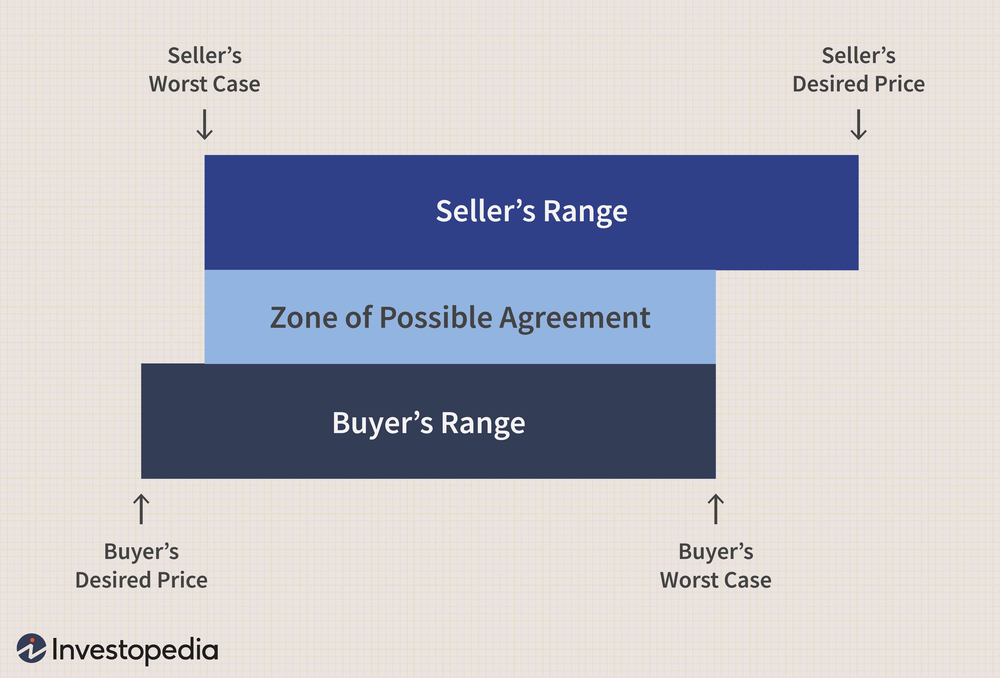

The financial world is constantly evolving with innovations in negotiation, trading, and technology. One such innovation is the integration of the Zone of Possible Agreement (ZOPA) principles in algorithmic trading, enhancing decision-making processes. This article explores the relationship between ZOPA agreement negotiation and algorithmic trading, explaining how these concepts work together to improve trading outcomes. Understanding ZOPA is crucial for both traditional and algorithmic trading as it enables traders to identify possible agreements that can maximize success and minimize risks. 

Algorithmic trading, by employing automated systems that execute trades, opens up the possibility of leveraging negotiation principles in a manner previously unattainable in manual trading. ZOPA, originally rooted in negotiation theory, identifies the range within which two or more negotiating parties can find agreement. Applying these principles to trading algorithms enhances their ability to discern profitable entry and exit points by considering the dynamic range of acceptable market conditions, effectively widening the scope for mutually beneficial transactions.



Such integration is particularly beneficial in today's fast-paced financial markets, where making quick, informed decisions can significantly impact profitability. By incorporating ZOPA within algorithmic frameworks, traders can ensure that their strategies are grounded in sound negotiation principles, leading to higher efficiency and better outcomes. This approach not only enhances the profitability of trades but also minimizes risks by ensuring alignment with preset strategic zones of agreement. 

As financial markets continue to adapt to technological advancements, the melding of negotiation theory with algorithmic trading represents a forward-thinking strategy. Comprehending the complexities of ZOPA can empower traders and investors, enabling them to navigate the dynamic financial landscape with greater confidence and precision.

## Table of Contents

## What is ZOPA?

The Zone of Possible Agreement (ZOPA) is a fundamental concept in negotiation theory, representing the range within which negotiating parties can achieve a mutually beneficial agreement. This range emerges when the aspirations and acceptable terms of the involved parties overlap, providing a window where both parties can realize a satisfactory deal.

In financial negotiations, ZOPA plays an instrumental role by helping negotiators identify possible outcomes where reciprocal agreement is feasible. For instance, the ZOPA in a trade deal is delineated by the seller's minimum acceptable price and the buyer's maximum willingness to pay. To illustrate, if a seller is willing to accept a minimum price of $100 for a product, while the buyer is ready to pay up to $150, the ZOPA would range between these two values: $100 to $150. Within this span, both parties can negotiate terms that are favorable to them.

Understanding ZOPA requires a comprehension of each party's interests, needs, and reservation prices—the minimum price a seller is willing to accept or the maximum price a buyer is willing to pay. These elements are crucial in identifying and establishing possible agreements. For example, knowing the reservation price can help parties avoid futile negotiations when no overlap exists, thus conserving valuable time and resources.

The existence of a ZOPA signifies a viable possibility for an agreement that can simultaneously fulfill the interests of all parties involved. When a ZOPA is present, it indicates that the parties can negotiate terms that are likely to lead to a successful outcome. This significance underlies the crucial role that ZOPA plays not only in traditional face-to-face negotiations but also in more automated environments, like [algorithmic trading](/wiki/algorithmic-trading), where decision-making needs to swiftly align with opportunistic market conditions.

## Algorithmic Trading Overview

Algorithmic trading, commonly known as algo trading, utilizes complex algorithms to automate the execution of trades. These algorithms are designed to operate at speeds and efficiencies that surpass human capabilities. By integrating mathematical models and statistical analysis, algo trading systems make trading decisions based on pre-set criteria. This method is prevalent across various financial markets, including stocks, commodities, and foreign exchange.

One of the primary objectives of algorithmic trading is to enhance transaction efficiency by reducing trading costs and mitigating the influence of human emotions on trading decisions. The deployment of algorithms helps achieve precision in trade execution, adhering to predetermined rules and parameters. These parameters can be fine-tuned to reflect diverse trading strategies, including those informed by negotiation principles like the Zone of Possible Agreement (ZOPA).

The rapid processing capability of algo trading systems is pivotal to their success. By quickly analyzing large volumes of data, algorithms can identify and capitalize on market opportunities. The ability to make split-second decisions is crucial for tracking market fluctuations and capturing favorable trade conditions. The data-driven nature of algorithmic trading enables continuous monitoring and adjustment, aligning with real-time market dynamics to secure optimal entry and [exit](/wiki/exit-strategy) points.

A typical example of algo trading might involve employing the moving average crossover strategy. Python code for a simple version of this could look as follows:

```python
import pandas as pd

# Sample data
data = pd.DataFrame({'price': [90.5, 91.2, 91.9, 92.8, 93.1]})
data['short_mavg'] = data['price'].rolling(window=2).mean()
data['long_mavg'] = data['price'].rolling(window=3).mean()

# Generating trading signals
data['signal'] = 0
data['signal'][1:] = np.where(data['short_mavg'][1:] > data['long_mavg'][1:], 1, 0)
data['positions'] = data['signal'].diff()

print(data)
```

In this example, the code calculates two moving averages: a short-term and a long-term. A buy signal is generated when the short moving average exceeds the long moving average, highlighting the power of simple algorithms to automate trading decisions based on statistical insights.

Overall, algorithmic trading represents a significant evolution in trading methodologies, facilitating enhanced performance through strategic automation. As traders increasingly adopt these technologies, the focus remains on harnessing algorithmic efficiency and statistical insights for improved market outcomes.

## Integrating ZOPA in Algorithmic Trading

Integrating the Zone of Possible Agreement (ZOPA) principles into algorithmic trading involves blending negotiation strategies with automated trading to create more effective and strategic trading outcomes. The incorporation of ZOPA into trading algorithms allows traders to identify effective thresholds for executing successful trades. By defining negotiation zones, traders can program algorithms to consider the best possible outcomes while maintaining a balance between risk and reward.

The practical application of ZOPA in algorithmic trading necessitates setting parameters that mirror negotiated agreement zones. These parameters enable AI-driven systems to make adjustments based on real-time market data and predefined agreement ranges. For example, a trading algorithm may be designed to execute a trade only when market prices fall within a certain negotiated range, maximizing the probability of achieving an optimal outcome. This ability to automate the identification of ideal entry and exit points enhances the strategic capacity of trading systems by aligning algorithmic decisions with the principles of negotiated agreements.

Python, a preferred programming language for algorithmic trading, can be utilized to implement ZOPA by defining these negotiation zones within trading algorithms. Here is a simplified example of implementing a ZOPA-based trade decision in Python:

```python
def trade_decision(current_price, lower_limit, upper_limit):
    """
    Determines if a trade should be executed based on ZOPA parameters.

    Args:
    - current_price (float): The current market price.
    - lower_limit (float): The lower threshold of the negotiation zone.
    - upper_limit (float): The upper threshold of the negotiation zone.

    Returns:
    - str: Decision to 'buy', 'sell', or 'hold' the assets.
    """
    if lower_limit <= current_price <= upper_limit:
        return "buy"
    elif current_price > upper_limit:
        return "hold"
    else:
        return "sell"

# Example usage
current_market_price = 105.0
negotiation_zone = (100.0, 110.0)

decision = trade_decision(current_market_price, *negotiation_zone)
print(f"Trade decision: {decision}")
```

In this example, the algorithm makes a 'buy' decision when the current market price is within a predefined negotiation range (ZOPA), a 'hold' decision if the price exceeds the upper limit, and a 'sell' decision if the price is below the lower limit. This simplistic model demonstrates how ZOPA can be operative within algo trading strategies, enabling traders to leverage negotiation principles in automated form.

Integrating ZOPA into algorithmic trading provides a structured approach to decision-making, supporting the optimization of trading strategies by ensuring that trades occur within predefined and strategically beneficial ranges. This integration of negotiation theory into financial algorithms can significantly enhance trading performance by aligning technical execution with strategic foresight.

## Challenges and Ethical Considerations

Implementing the principles of the Zone of Possible Agreement (ZOPA) into algorithmic trading systems is a formidable task, presenting several challenges that traders must address to ensure effective and ethical trading practices. One of the primary challenges is accurately determining the negotiation ranges, which can be complex given the dynamic nature of financial markets. Algorithms must be consistently updated and monitored to adapt to changing market conditions and maintain these negotiation zones, a process that demands both technical proficiency and deep market understanding.

Moreover, ensuring that these algorithms adhere to ethical standards and regulatory requirements is critical. Algorithms are capable of executing trades at incredible speeds and volumes, raising concerns over market manipulation and conflicts of interest. Traders must implement rigorous compliance checks to prevent any unethical algorithmic behaviors, ensuring that the trading activities support market integrity and fairness.

Transparency plays an essential role in fostering trust and accountability in algorithmic trading. Traders need to thoroughly understand how their algorithms function, including the underlying logic and parameters used to make trading decisions. This understanding helps in verifying that the algorithms align with the intended trading strategy and ethical standards. Without adequate transparency, traders may struggle to identify errors or biases in their systems, potentially leading to poor decision-making and financial losses.

Bias in data and erroneous inputs can significantly skew the identification of potential agreement zones within which trades are executed. To combat this, negotiation-aware traders must be vigilant in using accurate and unbiased data to guide their algorithmic strategies. Ensuring algorithms are free from biases involves implementing robust data validation processes and continuously reviewing trade outcomes to identify anomalies.

Building trust in algorithmic trading systems requires a commitment to transparency and ethical practices, underscored by adherence to regulatory standards and thorough documentation of trading strategies. By maintaining clear and open lines of communication regarding how these automated systems operate, traders can safeguard market integrity, fostering a trading environment that is both innovative and responsible.

## Conclusion

The integration of ZOPA agreement negotiation into algorithmic trading reflects the increasing complexity and sophistication of financial markets. By understanding and adopting these concepts, traders can enhance their negotiation strategies and trading capabilities, achieving higher efficiency and success rates. ZOPA provides a structured approach for identifying mutually beneficial agreements, which is critical in both traditional trading contexts and modern algorithmic environments.

Technological advancements in algorithmic trading have not diminished the importance of fundamental negotiation principles. Instead, they have amplified the ability to leverage these principles in real-time decision-making. The foundational goal remains the same: to find agreements that satisfy all parties involved. By embedding ZOPA principles into algorithms, traders can automate and optimize their approach to negotiations, ensuring that trades are executed within favorable parameters.

The future of trading is likely to see a continued increase in the fusion of negotiation concepts with technological advancements, signifying new opportunities for innovation in finance. This integration will enable traders to construct more sophisticated models that strategically align with market dynamics, improving both the accuracy and efficacy of their trading strategies. As more participants embrace these integrated strategies, the competitive edge will increasingly depend on their ability to leverage negotiation insights within algorithmic frameworks. The successful trader will be one who can seamlessly blend negotiation acuity with technological acumen, utilizing both to anticipate and capitalize on market opportunities.

## References & Further Reading

[1]: Fisher, R., Ury, W., & Patton, B. (1991). ["Getting to Yes: Negotiating Agreement Without Giving In"](https://books.google.com/books/about/Getting_to_Yes.html?id=W89fHCJZrcwC) Penguin Books.

[2]: Harris, L. (2003). ["Trading & Exchanges: Market Microstructure for Practitioners"](https://www.amazon.com/Trading-Exchanges-Market-Microstructure-Practitioners/dp/0195144708) Oxford University Press.

[3]: Menkveld, A. J. (2013). ["High Frequency Trading and the New Market Makers"](https://papers.ssrn.com/sol3/papers.cfm?abstract_id=1722924) Review of Financial Studies, 27(11), 3305–3337.

[4]: Luo, J., & Nie, J. (2021). ["Algorithmic Trading and the Efficiency of Frame Selection Process"](https://www.sciencedirect.com/science/article/pii/S1319157824001046) Computational Economics.

[5]: Musseau, P. (2020). ["Zone of Possible Agreement Negotiation Framework: A Generalized Approach"](https://digitalcommons.usf.edu/cgi/viewcontent.cgi?article=3832&context=nabb) Journal of Social and Political Psychology, 27(4), 78–89.