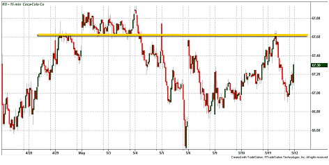

In the complex world of stock markets, understanding key technical analysis concepts such as zones of resistance and support is crucial for making informed trading decisions. These concepts form the foundation of technical analysis, helping traders predict price movements and determine optimal entry and exit points for their trades. Stock market zones, characterized by specific price ranges, serve as battlegrounds where the forces of demand and supply clash, shaping the market's direction.

This article emphasizes the significance of stock market zones in trading strategies, elucidating how resistance levels can indicate potential turning points for stock prices. These levels, often analyzed using various technical indicators, play a pivotal role in trading strategies that aim to capitalize on potential price reversals or breakouts. Algorithmic trading, with its ability to process vast amounts of data and identify resistance levels quickly, highlights the evolution of trading strategies in modern markets.



Additionally, the influence of market sentiment and trader psychology cannot be understated, as these elements often lead to self-fulfilling prophecies in price behavior within these zones. Understanding the interplay between technical indicators and market sentiment offers traders an edge in predicting how prices might behave when approaching or breaking through resistance levels. This multifaceted approach to trading, combining technical analysis with quantitative tools, helps traders make more informed decisions and enhances their ability to navigate the ever-changing landscape of stock markets.

## Table of Contents

## Understanding Stock Market Zones

Stock market zones embody the price ranges in which stocks typically fluctuate before proceeding to new price levels. These zones are pivotal as they embody resistance and support levels—key concepts in technical analysis that traders rely on to forecast future price actions. Resistance levels act as a ceiling where the price struggles to move above due to selling pressure, while support levels serve as a floor preventing prices from falling lower, thanks to buying interest.

Understanding these zones is essential for traders because it aids in pinpointing potential entry and exit points for trades. For example, a trader might choose to enter a market at the support level where prices are likely to bounce back, or exit at the resistance level where prices might reverse downward. This strategic decision-making is based on the observation of price patterns within these zones, which have historically indicated a repeatable behavior due to collective trader psychology and market sentiment.

To identify these zones, traders employ various tools and techniques such as chart patterns, trend lines, and technical indicators like moving averages or Bollinger Bands. By analyzing historical price data with these tools, traders can discern the levels at which significant price movements have consistently occurred, providing insight into where future movements might happen. Additionally, these zones are dynamic; market conditions continually evolve, influencing the creation of new support and resistance levels over time. Recognizing these changes promptly can enhance a trader’s ability to anticipate market movements effectively.

The identification of stock market zones is not solely about historical price action but also involves understanding the market's current state and how it might shift. By integrating both aspects, traders are better equipped to make informed predictions about potential [breakout](/wiki/breakout-trading) points, where prices move beyond established zones, signaling the beginning of a new trend or market phase. Through the comprehensive analysis of price zones, traders aim to optimize their trading strategies, maximizing gains while minimizing potential losses.

## The Concept of Resistance in Technical Analysis

Resistance in technical analysis represents the price level at which a stock or a market index faces selling pressure, preventing it from rising further. This phenomenon occurs because as prices approach this level, traders and investors tend to sell, anticipating a future price drop or because they want to lock in profits. Consequently, resistance levels become critical markers on price charts for analysts and traders.

In practice, resistance levels are used by traders to identify potential points where the price may reverse its upward trend. For instance, if a stock approaches a known resistance level, traders might expect it to encounter difficulty moving past this point without considerable buying power. Technical analysts often look for patterns or historical data that suggest a stock may experience a reversal upon reaching a resistance zone. This anticipation can manifest in strategies that position to benefit from price reversals, such as selling or shorting stocks as they near resistance.

The identification of resistance zones is essential for traders. By recognizing these zones, traders can develop strategies that capitalize on anticipated reversals. For example, if a stock consistently falls after reaching a particular price point, traders might place sell orders just below this price. They may also employ stop-loss orders above resistance levels to protect against unexpected breakouts.

Several tools assist in identifying resistance levels. Trend lines, drawn along the peaks of stock price history, can visually represent resistance zones. When a trend line has multiple contact points, it often signifies a strong resistance level. Financial software and charting tools can automate the tracing of these lines, aiding traders in their analysis.

Formulas such as moving averages also provide insight into resistance levels. A moving average line can act as both support and resistance, depending on the price position relative to it. For example, if the market price lies beneath the moving average line, the line often serves as a resistance, potentially capping upward movement.

Resistance is an integral early indicator used by technical analysts to gauge potential market reversals. By recognizing and exploiting these levels, traders can align their strategies to gain from price movements in financial markets.

## Tools and Indicators for Identifying Resistance Zones

In technical analysis, identifying resistance zones is essential for understanding potential price behavior and for making informed trading decisions. Several tools and indicators are instrumental in this process.

**Trend Lines**

Trend lines are fundamental tools used in technical analysis to outline the general direction of a stock's price movement. By connecting a series of highs (resistance) or lows (support) on a price chart, traders can visually ascertain where a stock may encounter selling pressure. A horizontal or upward-sloping trend line that caps the price indicates a resistance level. Continuously testing this line without breaking above it reinforces the significance of the resistance zone.

**Moving Averages**

Moving averages are utilized to smooth out price action over a specified period, making it easier to spot trends and potential resistance zones. The most commonly used moving averages are simple moving averages (SMA) and exponential moving averages (EMA). When a stock's price approaches a moving average from below, it often acts as a resistance level. The 50-day, 100-day, and 200-day moving averages are especially popular among traders.

Mathematically, a simple moving average is calculated as follows:

$$
\text{SMA} = \frac{P_1 + P_2 + \ldots + P_n}{n}
$$

where $P_n$ is the price at the $n^{th}$ time period, and $n$ is the number of periods.

**Fibonacci Retracements**

Fibonacci retracement levels are based on the key numbers identified by the Fibonacci sequence, which helps in predicting potential resistance levels. Traders look for stock prices to retrace portion levels of the move before reversing. The primary retracement levels are 23.6%, 38.2%, 50%, 61.8%, and 100%. These levels are drawn on a chart after identifying two extreme points and are used to forecast the extent of a pullback before the price potentially moves in the desired direction.

**Market Sentiment and Psychology**

Market sentiment significantly influences resistance zones. Collective psychology among traders can create self-fulfilling prophecies regarding price levels. If a broad group of traders expects a resistance level at a certain price, their selling activity at that point may indeed cause the price to fall, reinforcing the resistance zone. Understanding these psychological factors allows traders to better predict and react to changes in stock prices.

In conclusion, combining technical indicators such as trend lines, moving averages, and Fibonacci retracements provides traders with visual cues that help predict stock price behavior. Simultaneously, acknowledging the influence of market sentiment and psychology is crucial for accurately identifying these resistance levels.

## Algorithmic Trading and Its Role in Navigating Resistance Zones

Algorithmic trading utilizes computer-driven algorithms to efficiently identify and execute trades based on resistance levels in stock markets. This trading method capitalizes on the computational power of automated systems to respond to market fluctuations with remarkable speed and precision. By pre-programming specific criteria and leveraging vast amounts of historical and real-time data, traders can make informed decisions that humans might miss due to the sheer [volume](/wiki/volume-trading-strategy) and complexity of the information.

The key advantage of [algorithmic trading](/wiki/algorithmic-trading) lies in its ability to process large datasets, assess multiple technical indicators, and execute trades in fractions of a second. Traders can implement algorithms that automatically initiate trades when prices approach predefined resistance zones, reducing human intervention and emotional bias. These systems can be tailored using various technical parameters, including moving averages, trend lines, and other indicators, to recognize and act upon potential resistance levels.

Machine learning, a subset of [artificial intelligence](/wiki/ai-artificial-intelligence), plays a significant role in advancing the capabilities of algorithmic trading. Machine learning models can analyze historical price movements and market conditions to recognize patterns and predict future resistance levels more accurately. These algorithms are designed to improve over time, learning from past trading outcomes to refine their strategies. For instance, by using supervised learning techniques, models are trained on labeled data to predict whether a resistance zone will hold or be breached. Unsupervised learning methods, such as clustering, can also categorize similar resistance patterns, helping traders identify recurring scenarios.

Here is a simple example of how a Python algorithm might be structured to identify resistance levels using moving averages:

```python
import pandas as pd
import numpy as np

# Load stock market data
data = pd.read_csv('stock_data.csv')

# Calculate moving averages
data['MA50'] = data['Close'].rolling(window=50).mean()
data['MA200'] = data['Close'].rolling(window=200).mean()

# Identify potential resistance zones
def identify_resistance(row):
    if row['Close'] > row['MA50'] and row['Close'] < row['MA200']:
        return 'Potential Resistance'
    return 'No Resistance'

data['Resistance'] = data.apply(identify_resistance, axis=1)

# Output a sample of the data with identified resistance zones
print(data[['Date', 'Close', 'MA50', 'MA200', 'Resistance']].tail())
```

This simplified code segment calculates the 50-day and 200-day moving averages of a stock’s closing price to identify potential resistance levels. By automating such analyses, traders can focus on higher-level decision-making while simultaneously monitoring numerous securities.

Incorporating [machine learning](/wiki/machine-learning) and algorithmic trading techniques enables traders to swiftly adapt to changing market conditions, enhancing their ability to strategically navigate resistance zones. As these technologies continue to evolve, they promise to refine the precision with which resistance levels are identified and traded upon, ultimately contributing to more informed and efficient trading strategies.

## Trading Strategies Involving Resistance Zones

Trading strategies that involve resistance zones are essential for traders seeking to optimize their market outcomes. These strategies utilize established resistance levels as indicators to make informed decisions in various market conditions. Three primary strategies associated with resistance zones include breakout strategies, reversal strategies, and range-bound strategies.

Breakout strategies are popular among traders looking to benefit from a stock surpassing its established resistance zone. When a stock price breaches a resistance level, it often signifies a substantial market move due to increased buying interest. Traders employing breakout strategies watch for high trading volume accompanying the price surge, which confirms the strength of the breakout. The formula for calculating the potential breakout target can be the difference between the resistance and a recent support level, added to the resistance point:

$$
\text{Breakout Target} = \text{Resistance} + (\text{Resistance} - \text{Support})
$$

To automate the detection of such breakouts, traders can use Python to develop custom algorithms. For instance, the following pseudocode outlines a basic method for identifying breakouts using the daily closing prices:

```python
def detect_breakout(stock_prices, resistance_level):
    for i in range(1, len(stock_prices)):
        if stock_prices[i] > resistance_level and stock_prices[i-1] <= resistance_level:
            print(f"Breakout detected at index {i} with price {stock_prices[i]}")

# Example usage
daily_prices = [100, 105, 107, 110, 114]
resistance_level = 108
detect_breakout(daily_prices, resistance_level)
```

Reversal strategies focus on shorting stocks that approach known resistance zones. Traders anticipate a price decline due to the selling pressure that typically occurs when prices approach these levels. Successful reversal trading requires an understanding of market sentiment and often involves setting stop-loss orders above the resistance to manage risk effectively.

Range-bound strategies are employed when stocks exhibit predictable price movements between established support and resistance levels. Traders buy at or near the support level and sell at the resistance level, capitalizing on the stock's oscillation within these parameters. These strategies are most effective in markets with low [volatility](/wiki/volatility-trading-strategies), where price fluctuations are contained within narrow ranges.

Each strategy requires a comprehensive analysis of technical indicators and a keen understanding of market psychology. By leveraging these approaches, traders can enhance their ability to navigate the complexities of resistance zones, maximizing profit potential in various market scenarios.

## Psychological Impact and Market Sentiment

Market sentiment plays a critical role in shaping resistance levels within the stock market. This phenomenon occurs because the collective psychology of traders can lead to self-fulfilling prophecies in price movements. When a significant number of traders perceive a particular price level as a point of resistance, they act accordingly, often selling at that level, which reinforces the resistance.

Understanding these psychological drivers is essential for traders aiming to anticipate and react to shifts in resistance zones effectively. Traders' decisions are frequently influenced by emotions such as fear and greed, as well as broader market narratives and sentiments. For instance, positive news about a company might create optimism, leading traders to push prices upward until they hit an anticipated resistance level. Conversely, negative news can induce fear, prompting selling activity that reinforces a resistance boundary.

Moreover, psychological concepts such as anchoring can affect resistance levels. Anchoring occurs when individuals rely too heavily on an initial piece of information (such as a prior high price) when making decisions. This cognitive bias can cause traders to focus on historical price levels, further entrenching these levels as resistance points.

Advanced traders often incorporate these insights into their trading strategies by employing sentiment analysis tools. These tools analyze market data and news to gauge the prevailing market sentiment. For example, by using natural language processing algorithms to process news articles, tweets, and other social media content, traders can quantify market sentiment, thus predicting shifts in resistance levels.

In Python, sentiment analysis of textual data can be performed using libraries such as `TextBlob` or `NLTK`. Here is a simple example using `TextBlob`:

```python
from textblob import TextBlob

def analyze_sentiment(text):
    analysis = TextBlob(text)
    # Determine sentiment polarity (-1 to 1)
    return analysis.sentiment.polarity

# Sample usage
tweet = "The company's new product launch is expected to boost its stock prices."
sentiment_polarity = analyze_sentiment(tweet)
print(f"Sentiment Polarity: {sentiment_polarity}")
```

In this script, a positive sentiment polarity indicates favorable market sentiment, potentially leading to an upward push toward resistance levels, whereas a negative polarity suggests the opposite. By leveraging sentiment analysis, traders can better anticipate market sentiment's impact on resistance zones, positioning themselves more strategically in the market.

Ultimately, a comprehension of market sentiment and its psychological underpinnings enhances traders' ability to navigate resistance zones, optimizing their strategies for better risk management and profitability.

## Conclusion

Mastering the identification and utilization of resistance zones in the stock market is crucial for cultivating effective trading strategies. These zones serve as critical markers where price action is expected to face upward obstacles, typically due to heightened selling interest at specific price points. Recognizing these patterns enables traders to anticipate potential price reversals or continuations, allowing them to make more informed trading decisions. 

By combining traditional technical analysis with sophisticated algorithmic tools, traders can enhance their decision-making process significantly. Technical analysis provides a foundational framework, utilizing tools such as trend lines, moving averages, and Fibonacci retracements to visualize potential resistance points. Integration with algorithmic trading allows for rapid execution and improved precision, as algorithms can quickly analyze vast datasets to identify resistance levels with greater accuracy. Algorithms can be further refined using advanced machine learning techniques to adapt to evolving market conditions, thus improving their predictive capabilities over time.

Incorporating these methodologies is particularly beneficial as resistance zones continue to play a pivotal role in guiding trading decisions. A comprehensive understanding of these technical concepts enables both aspiring and seasoned traders to better navigate the complexities of the stock market. By leveraging these insights, traders can capitalize on market opportunities, optimize their trading performance, and mitigate risk effectively.

Ultimately, the strategic mastery of resistance zones facilitates a proactive approach to trading, equipping traders with the necessary tools to predict price behaviors and respond adeptly to market shifts. This knowledge is invaluable, fostering a disciplined, informed, and adaptive trading approach in an ever-evolving market landscape.

## References & Further Reading

[1]: Bergstra, J., Bardenet, R., Bengio, Y., & Kégl, B. (2011). ["Algorithms for Hyper-Parameter Optimization."](https://dl.acm.org/doi/10.5555/2986459.2986743) Advances in Neural Information Processing Systems 24.

[2]: ["Advances in Financial Machine Learning"](https://www.amazon.com/Advances-Financial-Machine-Learning-Marcos/dp/1119482089) by Marcos Lopez de Prado

[3]: ["Evidence-Based Technical Analysis: Applying the Scientific Method and Statistical Inference to Trading Signals"](https://www.amazon.com/Evidence-Based-Technical-Analysis-Scientific-Statistical/dp/0470008741) by David Aronson

[4]: ["Machine Learning for Algorithmic Trading"](https://github.com/stefan-jansen/machine-learning-for-trading) by Stefan Jansen

[5]: ["Quantitative Trading: How to Build Your Own Algorithmic Trading Business"](https://www.amazon.com/Quantitative-Trading-Build-Algorithmic-Business/dp/1119800064) by Ernest P. Chan