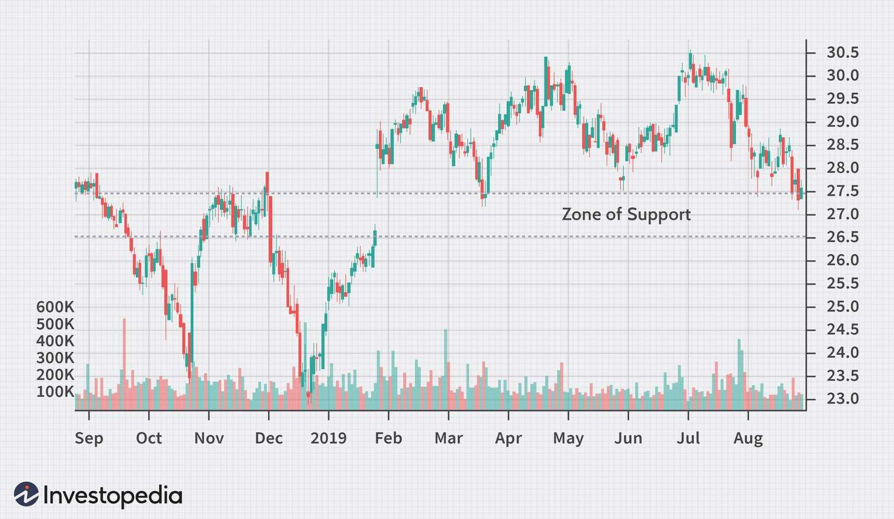

## Table of Contents

## What is a Zone of Support?

A Zone of Support is a price range in which a stock or other financial asset tends to stop falling and start rising again. It's like a safety net for the price, where many people think the asset is a good buy and start buying it, pushing the price up. This zone is important for traders and investors because it helps them decide when to buy the asset, hoping to make a profit as the price goes up.

You can find a Zone of Support by looking at past price charts. If you see that the price has stopped falling and started rising at around the same level several times, that level is likely a Zone of Support. It's not a single exact price, but more like a range where the price tends to bounce back. Understanding these zones can help people make better decisions about when to buy or sell, making it a key concept in trading and investing.

## How does a Zone of Support function in trading?

A Zone of Support in trading acts like a floor for the price of a stock or other financial asset. When the price drops to this zone, it often stops falling and starts to go up again. This happens because many traders and investors see the price in this zone as a good buying opportunity. They believe the asset is priced low enough to be a good deal, so they start buying it. This increased buying pushes the price up, creating a kind of invisible support that prevents the price from falling further.

Traders use Zones of Support to make decisions about when to buy an asset. By looking at past price charts, they can see where the price has bounced back before. If the price reaches this zone again, traders might decide it's a good time to buy, hoping to sell later at a higher price. This strategy relies on the idea that history might repeat itself, and the price will rise again once it hits the support zone. Understanding and using these zones can help traders make more informed choices and potentially increase their chances of making a profit.

## What are the key characteristics of a Zone of Support?

A Zone of Support is a price range where a stock or other financial asset tends to stop falling and start going up again. It's like a safety net that catches the price when it drops too low. This happens because many people think the price is a good deal at this level, so they start buying the asset. Their buying pushes the price up, creating a kind of invisible support that keeps the price from falling further.

You can spot a Zone of Support by looking at past price charts. If you see that the price has stopped falling and started rising at around the same level several times, that level is likely a Zone of Support. It's not just one exact price, but more like a range where the price tends to bounce back. Traders use these zones to decide when to buy, hoping to sell later at a higher price. Understanding these zones can help traders make better choices and possibly make more money.

## How can a beginner identify a Zone of Support on a chart?

To identify a Zone of Support on a chart, a beginner should start by looking at the price history of the asset. They need to find times when the price was going down but then stopped and started going up again. These points where the price turns around are important. If the price keeps stopping and turning around at about the same level several times, that level is likely a Zone of Support. It's not just one exact price, but more like a range where the price tends to bounce back.

A simple way to spot this zone is to draw horizontal lines on the chart at the levels where the price has turned around before. If these lines show a clear area where the price has bounced back multiple times, that's your Zone of Support. Remember, it's not about finding a single price but a range where the price tends to find support. By understanding these zones, beginners can start making better decisions about when to buy, hoping to sell later at a higher price.

## What is the difference between a Zone of Support and a single support level?

A Zone of Support is a range of prices where a stock or other asset tends to stop falling and start going up again. It's like a safety net that catches the price when it drops too low. Many people think the price is a good deal at this level, so they start buying the asset. Their buying pushes the price up, creating a kind of invisible support that keeps the price from falling further. A Zone of Support is not just one exact price but a range where the price tends to bounce back.

A single support level, on the other hand, is a specific price point where the asset's price has historically stopped falling and started to rise. It's like a single line on a chart where the price has turned around before. Traders might use this single price to decide when to buy, hoping the price will go up again. The key difference is that a Zone of Support gives a broader range for the price to find support, while a single support level is more precise but might not always hold as effectively as a zone.

## How does volume affect the strength of a Zone of Support?

Volume is like the number of people buying and selling a stock. When a lot of people are trading, it's called high volume. If a Zone of Support has high volume when the price reaches it, it means many people think the price is a good deal and are buying it. This makes the Zone of Support stronger because more people are helping to push the price up. It's like having more people holding up a heavy object; it's less likely to fall.

On the other hand, if the volume is low when the price hits the Zone of Support, it means fewer people are interested in buying at that price. This can make the Zone of Support weaker because there aren't enough people to push the price up. It's like having fewer people holding up a heavy object; it might not be enough to keep it from falling. So, high volume can make a Zone of Support stronger, while low volume can make it weaker.

## What are common mistakes traders make when using Zones of Support?

One common mistake traders make when using Zones of Support is relying too much on past data without considering current market conditions. Just because a price bounced back from a certain level before doesn't mean it will happen again. Market conditions can change, and what was a strong Zone of Support in the past might not be as strong now. Traders need to look at other factors like news, economic reports, and overall market trends to make better decisions.

Another mistake is not paying attention to volume. Volume shows how many people are buying and selling. If a Zone of Support has low volume, it might not be strong enough to hold the price up. Traders sometimes forget to check the volume and end up buying at a support level that doesn't have enough people to push the price back up. This can lead to losses if the price keeps falling instead of bouncing back.

Lastly, some traders get too focused on exact prices within a Zone of Support. They might think a single price within the zone is the key, but it's really about the range. If traders only buy at one specific price and miss the broader zone, they might miss out on good opportunities or buy at the wrong time. It's important to see the Zone of Support as a range, not just one number.

## How can historical data be used to validate a Zone of Support?

Historical data is like a record of what happened to the price of a stock or other asset in the past. To validate a Zone of Support, you can look at this data to see if the price has stopped falling and started going up at around the same level before. If you see that the price has bounced back from a certain range multiple times, it suggests that this range is a strong Zone of Support. It's like checking if a safety net has caught the price before; if it has, you can trust it more to do so again.

However, it's important to remember that just because something happened in the past doesn't mean it will happen again. Market conditions can change, and what was a strong Zone of Support before might not be as strong now. So, while historical data can help validate a Zone of Support, traders should also look at other things like current news, economic reports, and overall market trends. This way, they can make better decisions about whether the Zone of Support is still reliable.

## What advanced techniques can be used to enhance the accuracy of identifying Zones of Support?

One advanced technique to enhance the accuracy of identifying Zones of Support is to use multiple time frames. Instead of just looking at one chart, traders can look at charts with different time scales, like daily, weekly, and monthly charts. If a Zone of Support shows up on multiple time frames, it's more likely to be a strong and reliable zone. This method helps traders see the bigger picture and increases their confidence in the support level they've identified.

Another technique is to combine technical indicators with price action. Traders can use tools like moving averages, the Relative Strength Index (RSI), or the Fibonacci retracement levels to confirm a Zone of Support. For example, if the price hits a support zone and the RSI also shows that the asset is oversold, it adds more evidence that the zone is strong. By using these indicators alongside the price action, traders can get a clearer picture of where the price might bounce back and make more accurate predictions.

## How do Zones of Support interact with other technical indicators?

Zones of Support work well with other technical indicators to help traders make better decisions. For example, if the price of a stock reaches a Zone of Support and the Relative Strength Index (RSI) shows that the stock is oversold, it adds more evidence that the zone is strong. The RSI measures how fast the price is moving and can tell traders if a stock is being bought or sold too much. When the RSI and the Zone of Support agree, it gives traders more confidence that the price will bounce back from that level.

Another way Zones of Support interact with technical indicators is through moving averages. A moving average is a line on a chart that shows the average price of a stock over a certain time. If the price hits a Zone of Support and is also near a moving average, it can make the support zone even stronger. Traders might see this as a good time to buy, hoping the price will go up again. By using these indicators together, traders can get a clearer picture of where the price might find support and make more accurate predictions.

## What role do Zones of Support play in different market conditions?

Zones of Support are important in all kinds of market conditions, but they work a bit differently depending on whether the market is going up, going down, or staying the same. In a bull market, where prices are generally going up, Zones of Support can act as good places to buy. Traders might see the price dip to a support zone and think it's a good time to buy, expecting the price to keep going up. The support zones can be strong because many people are buying, pushing the price back up quickly.

In a bear market, where prices are generally going down, Zones of Support can still be useful, but they might not hold as well. The price might hit a support zone, but if not enough people are buying, it could keep falling. Traders need to be careful and look at other signs, like volume, to see if the support zone is strong enough. In a sideways market, where prices are not going up or down much, Zones of Support can help traders find good times to buy and sell within a range. They can use these zones to make small profits by buying low and selling high within the same range.

## How can algorithmic trading strategies incorporate Zones of Support?

Algorithmic trading strategies can use Zones of Support to decide when to buy or sell a stock. These strategies are like computer programs that follow rules to trade automatically. If the program sees the price of a stock going down to a Zone of Support, it might decide to buy the stock. The program knows that many people think the price is a good deal at this level, so it expects the price to go up again. By buying at the support zone, the algorithm hopes to sell the stock later at a higher price and make a profit.

To make these strategies work better, the program can also look at other things like how many people are buying and selling (volume) and other technical indicators. For example, if the price hits a Zone of Support and the volume is high, it means more people are buying, making the support zone stronger. The program can use this information to be more sure about when to buy. By combining Zones of Support with other data, algorithmic trading strategies can make smarter decisions and possibly make more money.

## References & Further Reading

[1]: Bergstra, J., Bardenet, R., Bengio, Y., & Kégl, B. (2011). ["Algorithms for Hyper-Parameter Optimization."](https://dl.acm.org/doi/10.5555/2986459.2986743) Advances in Neural Information Processing Systems 24.

[2]: ["Advances in Financial Machine Learning"](https://www.amazon.com/Advances-Financial-Machine-Learning-Marcos/dp/1119482089) by Marcos Lopez de Prado

[3]: ["Evidence-Based Technical Analysis: Applying the Scientific Method and Statistical Inference to Trading Signals"](https://www.amazon.com/Evidence-Based-Technical-Analysis-Scientific-Statistical/dp/0470008741) by David Aronson

[4]: ["Machine Learning for Algorithmic Trading"](https://github.com/stefan-jansen/machine-learning-for-trading) by Stefan Jansen

[5]: ["Quantitative Trading: How to Build Your Own Algorithmic Trading Business"](https://www.amazon.com/Quantitative-Trading-Build-Algorithmic-Business/dp/1119800064) by Ernest P. Chan