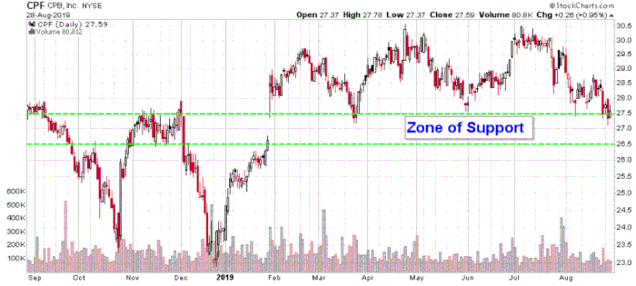

In today's fast-paced financial markets, algorithmic trading has emerged as a pivotal tool for traders seeking a competitive advantage. Central to the success of algorithmic trading is the effective identification and utilization of support and resistance zones. These zones are critical price levels where significant buying or selling can occur, influencing market trends.

This article investigates the concept of support zone functionality within algorithmic trading and delineates how traders can employ these insights for superior decision-making. The primary aim is to offer a thorough understanding of how support zones operate, their importance in trading algorithms, and the tools available for automating this process.



Algorithmic trading, commonly referred to as algo trading, relies on computer algorithms to execute trades based on predetermined criteria. In this context, recognizing support zones is essential for optimizing trade entry and exit points. By understanding where these zones lie, traders can predict potential price movements, enabling strategies that align with market behavior.

Understanding support zones allows traders to anticipate price reversals or continuations, thus strategically setting stop losses and profit targets. Contemporary tools and technologies incorporate these zones, providing dynamic insights that enhance trading strategies. The integration of support zones with algorithmic trading systems helps in constructing more robust trading models, offering an edge in achieving consistent profitability.

By mastering the functionality of support zones, traders can refine their trading tactics, ensuring they are better equipped to navigate the complexities of modern financial markets.

## Table of Contents

## Understanding Support Zones

Support zones, often referred to as areas of support, are essential concepts in technical analysis and trading. These zones represent price levels at which a downward trend may halt or reverse due to an increase in buying interest. At these levels, demand tends to outpace supply, providing the market with a temporary floor and often resulting in price stabilization or upward movement.

In technical analysis, support zones are pivotal for predicting potential price reversals or continuations. Traders who understand how to identify and utilize these zones can anticipate market movements more accurately, allowing for strategic trade entries and exits. There are several common methods for identifying support zones:

1. **Trendlines**: By connecting a series of lower lows on a price chart, traders can visualize potential support levels. A strong trendline can act as a psychological support level, where traders might expect a reversal or consolidation.

2. **Fibonacci Retracement Levels**: These are drawn by calculating the ratio between a peak and a trough on a chart and identifying potential support (or resistance) levels at standard Fibonacci ratios, such as 23.6%, 38.2%, 50%, 61.8%, and 78.6%. These levels are widely used to predict potential areas where price might stall or reverse.

3. **Moving Averages**: Moving averages smooth out price data to identify trends over specific periods. A common method is to use the 50-day or 200-day moving average as dynamic support levels. When the price approaches these moving averages, many traders expect the price to find support and possibly rebound.

Utilizing support zones in trading strategies allows traders to make well-informed decisions, anticipating potential price rebounds or breakdowns. This insight can significantly impact trading outcomes. For instance, by setting stop-loss orders slightly below a support zone, traders can limit potential losses and safeguard their trades against significant downturns.

Furthermore, strategically setting take-profit levels near anticipated support zones can maximize potential gains. This tactic is employed when traders expect a strong bounce off these zones, indicating a potential upward price movement.

In summary, the recognition and strategic utilization of support zones in trading is fundamental for effective risk management and optimization of trading opportunities. Understanding these concepts enables traders to reduce risks while maximizing their profit potential, making support zones a cornerstone in technical analysis and [algorithmic trading](/wiki/algorithmic-trading) approaches.

## Technical Analysis and Support Zones

Technical analysis is fundamental in identifying support zones, utilizing a range of tools such as trendlines, moving averages, and chart patterns to pinpoint these essential areas on price charts. Trendlines help traders to visualize the direction and strength of market trends by connecting a series of price points, which can indicate potential support levels. Moving averages smooth out price data by creating a constantly updated average price, and are used to identify the direction of the current trend, acting as dynamic lines of support or resistance.

Envelope channels, such as Bollinger Bands and Keltner Channels, are widely used to visualize support zones on price charts. Bollinger Bands consist of a middle band (a simple moving average) and two outer bands representing standard deviations above and below the middle band. These bands expand and contract based on market [volatility](/wiki/volatility-trading-strategies), highlighting potential support and resistance levels. Keltner Channels, on the other hand, use the Average True Range (ATR) to set channel distance, providing another method for visualizing price fluctuations and identifying support zones.

Advanced technical analysis software leverages real-time data to incorporate dynamic support and resistance zones. These systems adapt to price fluctuations and market volatility, offering traders up-to-the-minute analysis. By continuously updating support zones, traders can react promptly to market changes, thus gaining a competitive edge. The integration of mathematical tools such as Fibonacci Retracement further aids traders in identifying precise entry and [exit](/wiki/exit-strategy) points within support zones. Fibonacci Retracement involves plotting horizontal lines to indicate areas of potential support based on the Fibonacci sequence, providing a quantitative approach to identifying these zones.

By utilizing software with advanced algorithms and trading platforms, traders can automate and streamline the process of support zone detection. These technologies offer customizable settings to fit various trading styles and preferences, ensuring that traders have the tools necessary to make informed decisions. Automated systems can monitor price movements and execute trades when predefined conditions within support zones are met, enhancing trading efficiency and execution speed. This computational assistance allows traders to focus on strategy refinement, while the software handles the intensive data analysis, ultimately providing an edge in the fast-paced trading environment.

## The Role of AI in Defining Support Zones

Artificial intelligence is significantly enhancing the identification and utilization of support zones in trading, offering higher accuracy and efficiency in analysis. Traditionally, traders relied on various technical indicators to gauge support zones, a process that required considerable manual input and interpretation. AI-powered tools, however, automate this process by analyzing large datasets and applying advanced algorithms to detect patterns and group price movements effectively.

One of the key techniques employed is K-means clustering, a [machine learning](/wiki/machine-learning) algorithm particularly effective at identifying underlying structures in data. This method groups price movements into clusters, which can then be analyzed to pinpoint support and resistance zones. The clustering is performed by minimizing the variance within each cluster, effectively allowing the algorithm to classify data points (in this case, price movements) into distinct categories that represent different market phases.

Furthermore, AI tools adjust their models based on market volatility using indicators like the Average True Range (ATR). The ATR provides a measure of market volatility, which AI tools use to dynamically modify the parameters of the support zones, making them more robust against fluctuations in market conditions. This adaptability ensures that the support zones remain relevant over time, providing traders with reliable data for decision-making.

AI's capability to process large datasets quickly surpasses traditional methods, offering traders a comprehensive and nuanced understanding of market dynamics. With the integration of AI, traders can evaluate historical and real-time data, capturing transient patterns and subtleties often missed by manual analysis.

Additionally, AI-powered systems often come with sophisticated visualization tools, offering clear and interactive representations of support zones. This visual clarity allows traders to grasp complex market movements at a glance, facilitating quicker and more accurate decision-making. Python libraries such as Matplotlib and Seaborn can be employed within these systems to create detailed charts, highlighting support and resistance levels alongside price movements.

Overall, AI's role in identifying support zones is not just about automation but also about enhancing the depth and precision of market analysis. By leveraging AI technologies, traders gain a competitive advantage, making informed decisions supported by comprehensive, data-driven insights.

## Applications of Support Zones in Algo Trading

In algorithmic trading, support zones are essential for creating effective trading strategies by incorporating potential price reversals and breaks. These zones are defined as areas where there is a concentration of buying interest strong enough to halt a price decline, providing traders important insights into market sentiment. Leveraging support zones allows traders to optimize their trading algorithms and make more informed decisions.

Automatic trading systems can be programmed to detect signals within these support zones, enabling them to execute trades that align with predefined strategies and risk management rules. This automation enhances consistency and reduces human error in trade execution. Algorithms typically monitor various technical indicators and market conditions to determine when to enter or exit trades, often relying on support zones as key reference points.

Algo traders utilize support zones for strategically setting entry and exit points. For example, when the price approaches a support zone, traders might program their systems to initiate buy orders, anticipating a price rebound. Conversely, if the price breaks below a support zone, this might trigger sell orders as it could indicate further downward [momentum](/wiki/momentum). These zones serve as cues for traders to either enter long positions, expecting price increases, or short positions, anticipating further declines. 

Moreover, traders can take advantage of [breakout](/wiki/breakout-trading) scenarios centered around support zones to capture significant price movements. A breakout occurs when the price moves through a support or resistance level with increased [volume](/wiki/volume-trading-strategy), suggesting a potential trend continuation. Detecting such events promptly allows traders to capitalize on these opportunities by adjusting their positions quickly.

Algorithmic trading platforms play a crucial role in automating the monitoring and response to support zones. These platforms integrate various market data feeds and analytical tools to continuously track price movements and identify relevant zones. Automation increases trading efficiency, allowing for rapid adjustments to market changes without manual intervention. This capability not only enhances execution speed but also enables traders to maintain a consistent strategy across fluctuating market conditions.

Python, a popular programming language for algorithmic trading due to its simplicity and extensive library support, can be utilized to implement these concepts. Here is a basic example of how Python might be used to react to support zones:

```python
import pandas as pd

def check_support_zone(price, support_zone):
    if price <= support_zone:
        return True  # Signal to buy
    else:
        return False  # Hold or sell

# Example data
prices = pd.Series([100, 98, 97, 96, 95, 94])
support_zone = 95

# Monitoring prices
signals = prices.apply(lambda x: check_support_zone(x, support_zone))
buy_signals = signals[signals == True]

print("Buy signals generated at indices:", buy_signals.index.tolist())
```

In this example, the algorithm checks if the current price falls below the defined support zone and generates buy signals accordingly. Implementing such automated systems allows traders to leverage support zones fully, ensuring they can react promptly and effectively to market dynamics.

## Tools and Software for Support Zone Analysis

Several advanced tools and platforms are available for traders to effectively analyze and incorporate support zones into their trading strategies. One popular platform, AlgoPro, enables traders to visualize support and resistance zones through dynamic indicators that adapt to fluctuating market conditions. By providing these visual tools, AlgoPro allows traders to better identify potential entry and exit points in the market.

Similarly, NinjaTrader offers comprehensive visualization capabilities for support and resistance zones. This platform is known for its customizable charts and indicators, which can be tailored according to individual trading styles and preferences. The customization options allow traders to set parameters that best suit their market analysis approach, enhancing their ability to make informed decisions.

Additionally, these platforms often come equipped with educational resources and robust support from the software providers. This support can range from tutorials and webinars to detailed documentation, all designed to help traders maximize the utility of these tools. By availing themselves of these resources, traders can better understand how to leverage these platforms to their fullest potential.

Incorporating these technologies into trading workflows can significantly enhance market analysis capabilities. Tools like these offer traders a more nuanced understanding of market dynamics, allowing them to confidently execute strategies aligned with their market outlook. The strategic use of support zone analysis tools can thus contribute to more informed and decisive trading outcomes.

## Conclusion

Support zones are crucial for effective algorithmic trading, offering vital insights into market behavior and potential trading opportunities. With the development of AI and advanced algorithmic tools, the process of identifying these zones has become significantly more accessible and precise. AI technologies integrate vast datasets to pinpoint these zones with greater accuracy, assisting traders in making informed decisions rapidly. By incorporating support zone analysis into trading strategies, traders can enhance risk management and optimize their trades to achieve maximum profitability.

The continuous evolution of trading technology promises to further enhance the automation and refinement of trading strategies centered around support zones. Modern platforms enable real-time adjustments to trading strategies as market conditions change, thereby increasing efficiency and execution speed. As these technologies develop, traders can anticipate more sophisticated tools to support their analysis and decision-making processes.

For traders seeking to enhance their comprehension of market dynamics, mastering the use of support zones in algorithmic trading is essential. This skill not only aids in better market prediction but also equips traders with the ability to capitalize on market movements efficiently. As tools continue to evolve, the integration of support zones into trading strategies will increasingly become a standard practice for those aiming to maintain a competitive edge in the fast-paced financial markets.

## References & Further Reading

[1]: Bergstra, J., Bardenet, R., Bengio, Y., & Kégl, B. (2011). ["Algorithms for Hyper-Parameter Optimization."](https://dl.acm.org/doi/10.5555/2986459.2986743) Advances in Neural Information Processing Systems 24.

[2]: ["Advances in Financial Machine Learning"](https://www.amazon.com/Advances-Financial-Machine-Learning-Marcos/dp/1119482089) by Marcos Lopez de Prado

[3]: ["Evidence-Based Technical Analysis: Applying the Scientific Method and Statistical Inference to Trading Signals"](https://www.amazon.com/Evidence-Based-Technical-Analysis-Scientific-Statistical/dp/0470008741) by David Aronson

[4]: ["Machine Learning for Algorithmic Trading"](https://github.com/stefan-jansen/machine-learning-for-trading) by Stefan Jansen

[5]: ["Quantitative Trading: How to Build Your Own Algorithmic Trading Business"](https://www.amazon.com/Quantitative-Trading-Build-Algorithmic-Business/dp/1119800064) by Ernest P. Chan