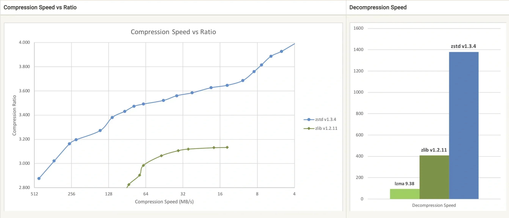

## Table of Contents

## What are Zstd and Zlib?

Zstd, short for Zstandard, is a modern data compression algorithm created by Facebook. It's designed to work quickly and provide good compression. Zstd is used in many places, like storing data, sending data over the internet, and even in some file systems. It's known for being fast and giving users the option to choose between speed and how small they want the data to be compressed.

Zlib is an older compression library that was created in the early 1990s. It uses the DEFLATE algorithm to compress data. Zlib is widely used in many software programs, including web browsers and file archivers like zip files. It's very reliable and has been around for a long time, which means it's supported by a lot of different systems. However, it's not as fast or as efficient at compressing data as some newer algorithms like Zstd.

## What are the main differences between Zstd and Zlib?

Zstd and Zlib are both used to make files smaller, but they work differently. Zstd is a newer way to compress data that was made by Facebook. It is fast and lets you choose if you want the file to be smaller or if you want it to be compressed quickly. Zstd is used in many new places like file systems and sending data over the internet. On the other hand, Zlib is an older way to compress data that has been around since the early 1990s. It uses the DEFLATE method to make files smaller and is found in many programs like web browsers and zip files. Zlib is very reliable because it has been used for a long time.

The main difference between Zstd and Zlib is how fast they work and how small they can make files. Zstd can compress and decompress data faster than Zlib, and it can also make files smaller if you are okay with it taking a bit longer. This makes Zstd a good choice for new projects that need to work quickly or need to save a lot of space. Zlib, however, is not as fast or as good at making files small, but it is supported by a lot of different systems because it has been around for so long. So, if you need something that will work with many different programs, Zlib might be a better choice.

## How do Zstd and Zlib handle compression?

Zstd, or Zstandard, is a new way to make files smaller that was made by Facebook. It works fast and gives you choices about how you want your files to be compressed. You can choose if you want the file to be made smaller quickly or if you want it to be as small as possible, even if it takes a bit longer. Zstd is used in many new places, like file systems and sending data over the internet. It's good at making files smaller and doing it quickly.

Zlib is an older way to compress files that has been around since the early 1990s. It uses something called the DEFLATE method to make files smaller. Zlib is used in many programs, like web browsers and zip files. It's very reliable because it's been around for a long time, but it's not as fast or as good at making files small as Zstd. Zlib is supported by a lot of different systems, so it's good if you need something that will work with many different programs.

## What are the typical use cases for Zstd and Zlib?

Zstd, or Zstandard, is often used when people want to make files smaller quickly. It's great for things like file systems and sending data over the internet. For example, if you have a website and you want to make the pages load faster, you can use Zstd to compress the files before sending them to people's computers. Zstd is also good if you need to choose between making the file smaller and doing it quickly. It's a modern way to compress files that works well in new projects.

Zlib is used a lot in older programs and systems. It's good for things like web browsers and zip files. If you have a program that needs to work with many different systems, Zlib is a good choice because it has been around for a long time and many programs support it. Zlib might not be as fast or as good at making files small as Zstd, but it's very reliable and works well with many different kinds of software.

## How do the compression speeds of Zstd and Zlib compare?

Zstd, which stands for Zstandard, is a newer way to compress files that was made by Facebook. It's known for being very fast. When you use Zstd, you can choose if you want the file to be compressed quickly or if you want it to be as small as possible. This makes Zstd great for situations where you need to make files smaller in a hurry, like when you're sending data over the internet or working with file systems.

Zlib is an older method of compression that has been around since the early 1990s. It uses the DEFLATE method to make files smaller. Zlib is not as fast as Zstd when it comes to compressing files. It takes a bit longer to do the job, but it's very reliable because it's been used for so long. Zlib is good for programs that need to work with many different systems, even if it's not the fastest way to compress files.

In summary, Zstd is faster at compressing files than Zlib. If you need to make files smaller quickly, Zstd is the better choice. But if you need something that will work with a lot of different programs and systems, Zlib might be a better option, even though it's slower.

## What are the differences in compression ratios between Zstd and Zlib?

Zstd, which is short for Zstandard, is a newer way to make files smaller. It's made by Facebook and it's really good at squeezing files down to a smaller size. With Zstd, you can choose if you want the file to be really small or if you want it to be compressed quickly. This means Zstd can make files smaller than Zlib if you're okay with it taking a bit longer. It's great for things like storing data or sending it over the internet because it can make files a lot smaller.

Zlib is an older way to compress files that has been around since the early 1990s. It uses the DEFLATE method to make files smaller. Zlib is good at what it does, but it doesn't make files as small as Zstd can. It's reliable and works with a lot of different programs, like web browsers and zip files. But if you need to make files as small as possible, Zstd will usually do a better job than Zlib.

## How do Zstd and Zlib affect CPU usage during compression and decompression?

Zstd, or Zstandard, is a new way to make files smaller that was made by Facebook. It's fast and can use less CPU power than Zlib when you're making files smaller. You can choose if you want the file to be compressed quickly or if you want it to be as small as possible. This means Zstd can be easier on your computer's CPU if you're okay with it taking a bit longer to compress the file. When you're making the file bigger again, Zstd is also fast and uses less CPU power than Zlib, which is good if you're working with a lot of files or if your computer isn't very powerful.

Zlib is an older way to compress files that has been around since the early 1990s. It uses the DEFLATE method to make files smaller. When you're using Zlib to compress a file, it can use more CPU power than Zstd, especially if you want the file to be as small as possible. This means your computer might work harder and take longer to finish the job. When you're making the file bigger again with Zlib, it also uses more CPU power than Zstd, so it might take longer and make your computer work harder.

## What are the file format differences between Zstd and Zlib?

Zstd, short for Zstandard, uses its own file format called .zst. This format is made to work well with the Zstd way of making files smaller. When you use Zstd, you can see that the file ends with .zst, which tells you it's been compressed using Zstd. This format is new and works well with new programs and systems that want to make files smaller quickly.

Zlib, on the other hand, uses a file format called .gz, which stands for gzip. This format has been around for a long time and is used by many different programs. When you see a file that ends with .gz, it means it was compressed using Zlib. This format is good because it works with a lot of different systems, but it's not as new or fast as the .zst format used by Zstd.

## How do Zstd and Zlib handle data integrity and error checking?

Zstd, or Zstandard, has built-in ways to check if the data is correct and not damaged. It uses something called a checksum to make sure the data is the same before and after it's compressed. This helps catch any mistakes that might happen during the compression or when the file is being sent over the internet. If there's a problem, Zstd can tell you about it so you know the data might not be right.

Zlib also has ways to check for errors and make sure the data is okay. It uses a checksum too, to see if the data has changed in a way it shouldn't have. Zlib's method is a bit older but still works well to find out if there's been a problem with the data. Like Zstd, if Zlib finds an error, it can let you know so you can fix it or get the right data again.

## What are the licensing differences between Zstd and Zlib?

Zstd, which is short for Zstandard, uses a license called BSD. This means you can use Zstd in your own projects, even if they are for making money, without having to pay anything. The BSD license is pretty relaxed, so it's easy to use Zstd in a lot of different kinds of software. This makes Zstd a good choice if you want to use it in your own work without worrying about complicated rules.

Zlib, on the other hand, uses a license called the Zlib License. This license is also very simple and lets you use Zlib in your projects, including ones that make money, without any fees. The Zlib License is known for being one of the most straightforward licenses out there, which is why it's used in so many different programs and systems. Both licenses are good for people who want to use these tools freely in their own work.

## How do Zstd and Zlib integrate with different programming languages and environments?

Zstd, or Zstandard, is made to work well with many different programming languages and environments. It has libraries that you can use in languages like C, C++, Java, Python, and many others. This makes it easy to add Zstd to your projects, no matter what language you're using. Zstd also works well with new systems and tools, so if you're working on something modern, Zstd is a good choice. It's easy to use and fits well with a lot of different kinds of software.

Zlib, on the other hand, has been around for a long time and is supported by many different programming languages and environments too. You can use Zlib with languages like C, C++, Java, Python, and more. Because Zlib is older, it's found in a lot of different programs and systems, so it's easy to use it if you need something that works with a wide range of software. Zlib is reliable and works well with many different kinds of projects, especially if you're working with older systems or need something that's been tested a lot.

## What advanced features does Zstd offer that Zlib does not?

Zstd, which is short for Zstandard, has some special features that Zlib does not have. One of these is something called "dictionary compression." This lets you use a special set of data to make files even smaller. It's good for when you're working with a lot of similar files, like in a database or on a website. Another cool thing about Zstd is that it can work with multiple CPU cores at the same time. This means it can compress and decompress files faster if your computer has more than one core. Zstd also has a feature called "streaming compression," which lets you compress data as it's being made, without having to wait for the whole file to be ready.

Zlib is an older way to compress files and it doesn't have these new features. It doesn't support dictionary compression, so it can't use special data to make files smaller. Zlib also can't use multiple CPU cores at the same time, which means it might take longer to compress or decompress files on modern computers. And while Zlib can compress data in chunks, it doesn't have the same kind of streaming compression that Zstd does. This means Zlib might not be as good for real-time data processing or when you're working with data that's constantly changing.

## What are the performance metrics in terms of compression ratio and speed?

Compression ratio, compression speed, and decompression speed are integral to evaluating data compression algorithms, particularly in trading environments where large datasets are prevalent. These metrics help determine how efficiently data can be reduced in size, how quickly this reduction can take place, and how effectively the original data can be restored.

Zlib has historically been favored in industries requiring data compression due to its balanced performance. It achieves a satisfactory compression ratio, making it a reliable choice for storage and transfer of data across networks where bandwidth might be a constraint. However, with the increasing [volume](/wiki/volume-trading-strategy) of data generated in [algorithmic trading](/wiki/algorithmic-trading), the need for higher speeds and efficiency has become paramount.

Zstandard (zstd), a newer technology, showcases advancements over traditional methods like zlib. It is designed to provide faster compression and decompression without compromising on the compression ratio. This is particularly beneficial for large datasets encountered in algorithmic trading, where both rapid processing and data integrity are critical.

### Compression Ratio

The compression ratio is calculated as the size of the original data divided by the size of the compressed data. A higher compression ratio indicates better data size reduction but may come at the cost of processing speed.

$$
\text{Compression Ratio} = \frac{\text{Original Data Size}}{\text{Compressed Data Size}}
$$

In trading environments, a high compression ratio is desirable to minimize storage requirements and optimize network bandwidth. Zstd delivers comparable, if not superior, compression ratios to zlib, while also enhancing speed, making it suitable for extensive datasets.

### Compression Speed

Compression speed is the rate at which data is compressed and is typically measured in bytes per second. Zstd offers significant improvements in this area compared to zlib, accommodating the need for faster data processing in high-frequency trading systems. The technology underpinning zstd allows it to maintain high throughput, essential for real-time applications.

```python
import zlib
import zstandard as zstd
import time

# Example to compare compression speed
data = b"Example market data" * 1000

# Measuring zlib compression speed
start = time.time()
zlib_result = zlib.compress(data)
zlib_time = time.time() - start

# Measuring zstd compression speed
start = time.time()
zstd_result = zstd.ZstdCompressor().compress(data)
zstd_time = time.time() - start

print(f"Zlib Compression Time: {zlib_time}")
print(f"Zstd Compression Time: {zstd_time}")
```

### Decompression Speed

Decompression speed, similar to compression speed, is vital for quick retrieval of data, especially when executing trades that rely on preciseness and timing. Zstd's ability to decompress swiftly adds a layer of efficiency that is particularly indispensable in time-sensitive trading operations. Its decompression speed often surpasses that of zlib, hence boosting overall performance in environments characterized by rapid data exchange.

In summary, while zlib remains a dependable choice with balanced trade-offs between compression ratio and speeds, zstd emerges advantageous in scenarios involving large data volumes, requiring greater speed without significantly sacrificing compression efficiency. These attributes of zstd align well with the dynamic and demanding needs of algorithmic trading.

## References & Further Reading

[1]: Collet, Y., & Turner, C. (2016). ["Zstandard - Fast real-time compression algorithm"](https://docs.racket-lang.org/zstd/index.html). Facebook.

[2]: Salomon, D. (2007). ["Data Compression: The Complete Reference"](https://link.springer.com/book/10.1007/978-1-84628-603-2). Springer.

[3]: Deutsch, P. (1996). ["DEFLATE Compressed Data Format Specification version 1.3"](https://www.rfc-editor.org/rfc/rfc1951). IETF.

[4]: Gustafson, E. (2019). ["A Deep Dive into Data Compression with Zstandard"](https://en.wikipedia.org/wiki/Megan_Gustafson). LinkedIn Engineering Blog.

[5]: Haifeng, W. (2018). ["Python for Finance: Analyze Big Financial Data"](https://books.google.com/books/about/Python_for_Finance.html?id=E93SBQAAQBAJ) by Yves Hilpisch.