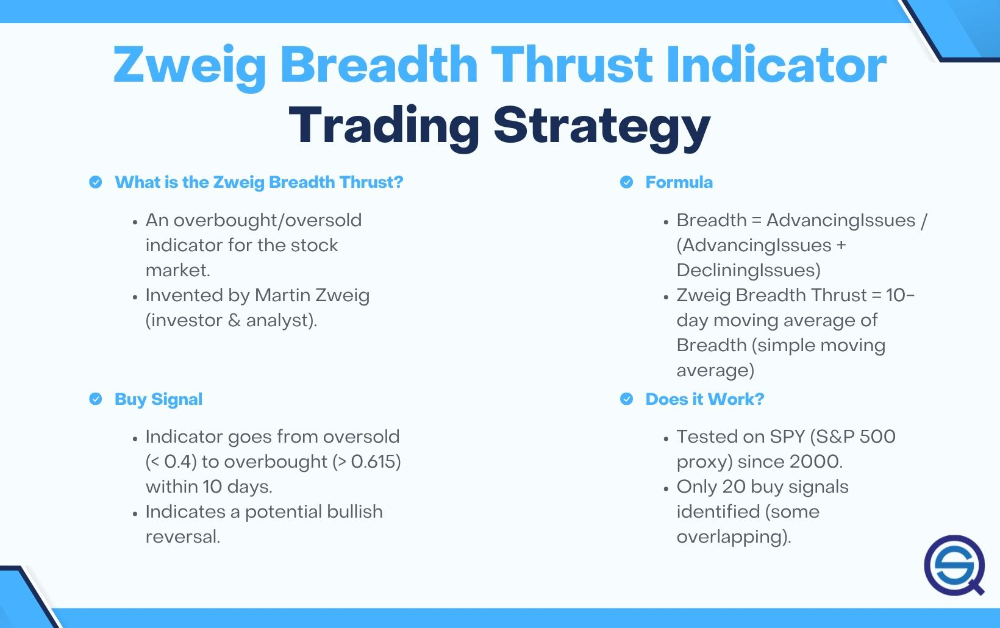

## Table of Contents

## What is the Zweig Breadth Thrust Indicator?

The Zweig Breadth Thrust Indicator is a tool used in the stock market to help investors understand when the market might be about to make a big move. It was created by Martin Zweig, who was a well-known investor. The indicator looks at how many stocks are going up compared to how many are going down over a short period of time. If a lot of stocks start going up quickly, it might mean the market is getting ready for a strong upward trend.

The way the Zweig Breadth Thrust Indicator works is by using a special formula. It takes the number of advancing stocks (stocks that are going up) and divides it by the total number of stocks that either went up or down. This gives a ratio. Then, it looks at this ratio over 10 days and calculates a 10-day moving average. If this average jumps from below 40% to above 61.5% within 10 days, it signals a Breadth Thrust, suggesting that the market might be starting a new bull market. This can be a helpful sign for investors to pay attention to.

## Who developed the Zweig Breadth Thrust Indicator?

The Zweig Breadth Thrust Indicator was developed by Martin Zweig. He was a famous investor and financial analyst who wanted to find a way to predict when the stock market might start a big upward trend.

Martin Zweig created this indicator to look at how many stocks are going up compared to how many are going down over a short time. He thought that if a lot of stocks started going up quickly, it could mean the market was getting ready for a strong upward move. This idea helped investors know when to pay more attention to the market.

## How is the Zweig Breadth Thrust Indicator calculated?

The Zweig Breadth Thrust Indicator is calculated by first finding the number of stocks that are going up, called advancing stocks, and dividing this number by the total number of stocks that either went up or down. This gives you a ratio that shows what percentage of stocks are advancing. This calculation is done every day.

Next, you take the daily ratios from the last 10 days and calculate their average, which is called a 10-day moving average. If this 10-day moving average jumps from below 40% to above 61.5% within 10 days, it signals a Breadth Thrust. This means the market might be starting a new bull market, which is a time when stock prices generally go up.

## What does a Breadth Thrust signal indicate about the market?

A Breadth Thrust signal indicates that the market might be about to start a strong upward trend. It shows that a lot of stocks are starting to go up quickly, which can mean the market is getting ready for a bull market. A bull market is a time when stock prices generally go up, and investors often see this as a good time to buy stocks.

The signal happens when the 10-day moving average of the ratio of advancing stocks to total stocks that either went up or down jumps from below 40% to above 61.5% within 10 days. This big jump suggests that the market is gaining a lot of strength and that many stocks are participating in the upward movement. Investors watch for this signal because it can help them decide when to buy stocks to take advantage of the expected rise in the market.

## How can the Zweig Breadth Thrust Indicator be used in trading strategies?

The Zweig Breadth Thrust Indicator can be a helpful tool for traders looking to time their entry into the market. When the indicator signals a Breadth Thrust, it suggests that the market is likely to start a strong upward trend. Traders might see this as a good time to buy stocks or increase their investments. They could look at the signal as a sign to enter the market, hoping to benefit from the expected rise in stock prices. This can help traders make decisions about when to buy, aiming to get in at the start of a bull market.

However, it's important for traders to use the Zweig Breadth Thrust Indicator along with other tools and analysis. No single indicator should be used alone to make trading decisions. Traders might combine the Breadth Thrust signal with other market indicators, like moving averages or relative strength index (RSI), to get a fuller picture of the market's direction. Also, understanding the broader economic conditions and news events can help traders make more informed choices. By using the Zweig Breadth Thrust Indicator as part of a bigger strategy, traders can better navigate the ups and downs of the stock market.

## What are the key thresholds for the Zweig Breadth Thrust Indicator?

The Zweig Breadth Thrust Indicator has two important thresholds that traders watch closely. The first threshold is when the 10-day moving average of the advancing stocks ratio drops below 40%. This means that less than 40% of the stocks are going up compared to those that are going up or down. When the indicator falls below this level, it shows that the market might be weak.

The second key threshold is when this same 10-day moving average jumps above 61.5% within 10 days after being below 40%. This big jump means that suddenly more than 61.5% of the stocks are going up. When the indicator goes from below 40% to above 61.5% in a short time, it signals a Breadth Thrust. This tells traders that the market might be getting ready for a strong upward move, which could be a good time to buy stocks.

## Can you explain a real-life example where the Zweig Breadth Thrust Indicator signaled a market change?

A real-life example where the Zweig Breadth Thrust Indicator signaled a market change was in October 2004. At that time, the stock market had been going through a period of uncertainty and weakness. The 10-day moving average of the advancing stocks ratio dropped below 40%, showing that fewer stocks were going up. Then, suddenly, within 10 days, this average jumped above 61.5%. This big jump signaled a Breadth Thrust, suggesting that the market was about to start a strong upward trend.

Following this signal, the stock market did indeed start to rise. Investors who paid attention to the Zweig Breadth Thrust Indicator and bought stocks after the signal could have benefited from the upward movement in the market. This example shows how the indicator can help traders know when a big change in the market might be coming, giving them a chance to make smart investment decisions.

## How does the Zweig Breadth Thrust Indicator perform compared to other market indicators?

The Zweig Breadth Thrust Indicator is unique because it focuses on the number of stocks going up compared to those going down over a short time. This makes it different from other indicators like the Relative Strength Index (RSI) or Moving Averages, which look at price movements or momentum. The Zweig Breadth Thrust Indicator is good at spotting when the market might start a big upward trend, which can be helpful for investors looking to buy stocks at the right time. However, it's not perfect and should be used with other tools to get a better picture of the market.

Compared to other indicators, the Zweig Breadth Thrust Indicator can sometimes give signals before other indicators do. For example, it might signal a market change before a moving average crossover happens. But, it can also give false signals, where the market doesn't move up as expected. That's why it's important to use it along with other indicators like the RSI or the MACD (Moving Average Convergence Divergence) to confirm what the market might do next. By combining different tools, traders can make better decisions and reduce the risk of being wrong about the market's direction.

## What are the limitations and potential pitfalls of using the Zweig Breadth Thrust Indicator?

The Zweig Breadth Thrust Indicator can be helpful, but it has some limitations. One big problem is that it can give false signals. Sometimes, it might say the market is about to go up, but then the market doesn't move as expected. This can make traders buy stocks at the wrong time, leading to losses. Also, the indicator looks at a short period of time, just 10 days, which might not show the whole picture of what's happening in the market. If traders rely only on this indicator, they might miss important information that could affect their decisions.

Another issue is that the Zweig Breadth Thrust Indicator works best when used with other tools. By itself, it might not be enough to make good trading choices. Traders need to use it along with other indicators like the RSI or moving averages to get a better idea of where the market is heading. If they don't, they might make decisions based on incomplete information. Also, the indicator doesn't tell traders when to sell, only when it might be a good time to buy. This means traders need other ways to figure out when to get out of the market, which can be tricky.

## How can the Zweig Breadth Thrust Indicator be combined with other technical indicators for better results?

The Zweig Breadth Thrust Indicator works well when you use it with other technical indicators. One good way to do this is to combine it with the Relative Strength Index (RSI). The RSI helps you see if stocks are overbought or oversold. If the Zweig Breadth Thrust Indicator signals a strong upward move and the RSI is not in overbought territory, it might be a safer time to buy stocks. This combination can help you make better choices because you're looking at both the market's strength and whether stocks are at a good price.

Another useful indicator to use with the Zweig Breadth Thrust Indicator is the Moving Average Convergence Divergence (MACD). The MACD helps you see the momentum of the market. If the Zweig Breadth Thrust Indicator shows a Breadth Thrust and the MACD also shows a bullish signal, like when the MACD line crosses above the signal line, it can confirm that the market might be starting a strong upward trend. Using these indicators together can give you a clearer picture of what might happen next in the market, helping you make smarter trading decisions.

Lastly, you can also use moving averages with the Zweig Breadth Thrust Indicator. For example, if the indicator signals a Breadth Thrust and the stock's price is also above its 50-day or 200-day moving average, it might be a stronger sign that the market is moving up. By looking at these different indicators together, you can get a more complete view of the market's direction and reduce the risk of making a wrong move based on just one signal.

## What historical data supports the effectiveness of the Zweig Breadth Thrust Indicator?

Historical data shows that the Zweig Breadth Thrust Indicator has been pretty good at spotting when the market might start a big upward move. For example, in October 2004, the indicator signaled a Breadth Thrust. After that, the stock market did go up a lot. Another time was in March 2009, right after the financial crisis. The indicator gave a signal, and then the market started a long bull run. These examples show that when the indicator signals a Breadth Thrust, it can be a good time for investors to buy stocks.

However, the indicator doesn't always get it right. There have been times when it gave a signal, but the market didn't go up like expected. For instance, in January 2010, the indicator signaled a Breadth Thrust, but the market didn't have a strong upward trend after that. This shows that while the Zweig Breadth Thrust Indicator can be helpful, it's not perfect. That's why it's important for investors to use it with other tools and information to make the best decisions.

## Are there any advanced techniques or modifications to the traditional Zweig Breadth Thrust Indicator strategy?

Some traders have come up with advanced ways to use the Zweig Breadth Thrust Indicator. One idea is to look at how long the Breadth Thrust lasts. If the signal stays strong for more than the usual 10 days, it might mean the market's upward trend will be even stronger and last longer. Another idea is to change the time frame a bit. Instead of just using 10 days, some traders try using 14 or 20 days to see if it gives better signals. This can help them catch bigger trends in the market.

Another advanced technique is to use the Zweig Breadth Thrust Indicator with volume data. If a Breadth Thrust happens and there's also a big increase in trading volume, it might be a stronger sign that the market is really starting to move up. Traders can also mix the indicator with other market signals, like looking at how different sectors of the market are doing. If many sectors are going up along with the Breadth Thrust, it might mean the whole market is getting ready for a big move. By trying these new ways, traders can get a better idea of when to buy stocks and make smarter choices.

## What is Understanding Market Breadth?

Market breadth indicators serve as vital tools for traders, providing insights into the overall health and direction of the market. These indicators assess the number of stocks contributing to market movements, offering a nuanced view of market strength or weakness. The underlying principle is that a healthy market uptrend is characterized by a substantial number of stocks advancing, whereas a decline suggests a widespread participation in selling.

One primary advantage of market breadth indicators is their ability to signal potential reversals. During bullish phases, if most stocks rise, it confirms the market's uptrend. Conversely, if fewer stocks participate, it might indicate a potential reversal or weakening of the trend. This approach helps traders to distinguish between robust rallies or corrections and those that are unsustainable or could lead to a reversal.

Market breadth indicators are crucial for forecasting market conditions and timing trades effectively. They enable traders to look beyond major indices and understand the broader market environment. This insight is invaluable for making informed trading decisions, as it aids in identifying underlying trends that may not be immediately apparent by simply observing market indices. Breadth indicators, such as the Advance-Decline Line, McClellan Oscillator, and New High-New Low Index, are commonly used to provide this deeper analysis.

By offering a composite view of stock participation, traders can anticipate shifts in market sentiment, improving their strategic responses. Employing these indicators as part of a comprehensive trading strategy can enhance a trader’s ability to capitalize on market trends and avoid potential pitfalls. This makes mastering the interpretation and application of market breadth indicators an essential skill in the trading community.

 to Zweig Breadth Ratio

The Zweig Breadth Ratio was developed by Martin Zweig, a renowned financial analyst recognized for his market timing expertise. The indicator serves as an overbought/oversold signal and offers insights into market trends by analyzing the balance between advancing and declining stocks within a given market or index.

The Zweig Breadth Ratio's primary function is to oscillate between two states, indicating whether the market is predominantly bullish or bearish. It assesses the market's underlying strength by examining the activity of stocks that are advancing compared to those declining. This ratio provides a snapshot of market sentiment, helping traders gauge the likelihood of forthcoming market movements.

Understanding the Zweig Breadth Ratio begins with recognizing its core components: the number of advancing and declining stocks. These figures are typically sourced from large exchanges like the New York Stock Exchange (NYSE). The ratio itself is calculated by taking the number of advancing issues and dividing it by the sum of advancing and declining issues. This calculation allows traders to visualize the proportion of stocks gaining versus those losing in the market—a critical insight for predicting bullish or bearish trends.

$$
\text{Zweig Breadth Ratio} = \frac{\text{Advancing Issues}}{\text{Advancing Issues} + \text{Declining Issues}}
$$

The Zweig Breadth Ratio offers a methodical way to interpret market breadth data, thereby equipping traders with a tool for historically informed trading decisions. This indicator, rooted in Zweig's academic and practical financial expertise, plays a significant role in evaluating market sentiment and guiding investment strategy decisions.

## How do you calculate the Zweig Breadth Ratio?

To calculate the Zweig Breadth Ratio, traders require daily data on advancing and declining issues, typically sourced from the New York Stock Exchange (NYSE). The initial step involves determining the market breadth, which is calculated using the formula:

$$
\text{Market Breadth} = \frac{\text{Advancing Issues}}{\text{Advancing Issues} + \text{Declining Issues}}
$$

The Zweig Breadth Ratio itself is calculated as a 10-day moving average of this market breadth measure. The moving average smooths out short-term fluctuations to provide a clearer, long-term perspective of the market conditions. This averaging process helps traders identify transitions in the market from oversold to overbought conditions, typically within a 10-day observation window.

A simplified Python code snippet to calculate the Zweig Breadth Ratio might look like this:

```python
import numpy as np
import pandas as pd

def calculate_zweig_breadth_ratio(data):
    # Data should include two columns: 'Advancing_Issues' and 'Declining_Issues'
    data['Market_Breadth'] = data['Advancing_Issues'] / (data['Advancing_Issues'] + data['Declining_Issues'])
    data['Zweig_Breadth_Ratio'] = data['Market_Breadth'].rolling(window=10).mean()
    return data['Zweig_Breadth_Ratio']

# Example usage
# data = pd.DataFrame({'Advancing_Issues': [...], 'Declining_Issues': [...]})
# zweig_breadth_ratio = calculate_zweig_breadth_ratio(data)
```

This code assumes the availability of advancing and declining issue data over the desired period. The rolling function with a window of 10 applies the moving average calculation. Tracking changes in the Zweig Breadth Ratio can illuminate shifts between market conditions, assisting traders in identifying periods when the market is moving from a generally oversold status to one of being overbought.

## References & Further Reading

[1]: Zweig, M. (1986). ["Winning on Wall Street."](https://www.amazon.com/Martin-Zweigs-Winning-Wall-Street/dp/0446512346) Warner Books Inc.

[2]: Pardo, R. (2008). ["The Evaluation and Optimization of Trading Strategies."](https://onlinelibrary.wiley.com/doi/book/10.1002/9781119196969) Wiley.

[3]: Kaufman, P. J. (2013). ["Technical Analysis: A New Dimension."](https://assets.cambridge.org/97811071/88488/frontmatter/9781107188488_frontmatter.pdf) Wiley.

[4]: Murphy, J. J. (1999). ["Technical Analysis of the Financial Markets: A Comprehensive Guide to Trading Methods and Applications."](https://www.amazon.com/Technical-Analysis-Financial-Markets-Comprehensive/dp/0735200661) New York Institute of Finance.

[5]: Schwager, J. D. (2012). ["Market Wizards, Updated: Interviews with Top Traders."](https://www.amazon.com/Market-Wizards-Updated-Interviews-Traders/dp/1118273052) Wiley.

[6]: Pring, M. J. (2002). ["Technical Analysis Explained, Fifth Edition: The Successful Investor's Guide to Spotting Investment Trends and Turning Points."](https://www.amazon.com/Technical-Analysis-Explained-Fifth-Successful/dp/0071825177) McGraw-Hill Education.