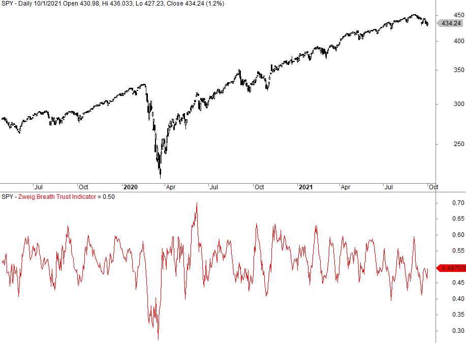

In the complex world of algorithmic trading, understanding the underlying market sentiment is crucial for success. The Zweig Breadth Ratio is an indicator employed to gauge market breadth, thus assisting traders in predicting bullish or bearish conditions. This article investigates into the significance of the Zweig Breadth Ratio in algorithmic trading, examining its calculation, application, and effectiveness. By analyzing the mechanics of this indicator, traders can develop more reliable strategies to enhance their trading performance. 

The Zweig Breadth Ratio, named after the respected financial analyst Martin Zweig, serves as an overbought/oversold indicator. It oscillates based on the relative activity of advancing and declining stocks within a market. Such oscillations are central to identifying potential shifts in market sentiment, a capability that is invaluable for traders seeking timely entry or exit points in their trading activities. 



Through understanding and implementing the Zweig Breadth Ratio, algorithmic traders can potentially improve their market analysis, allowing for more informed trading decisions. This article seeks to equip traders with the necessary insights to leverage this indicator, ultimately aiding in the development of robust trading strategies that account for underlying market conditions.

## Table of Contents

## Understanding Market Breadth

Market breadth indicators serve as vital tools for traders, providing insights into the overall health and direction of the market. These indicators assess the number of stocks contributing to market movements, offering a nuanced view of market strength or weakness. The underlying principle is that a healthy market uptrend is characterized by a substantial number of stocks advancing, whereas a decline suggests a widespread participation in selling.

One primary advantage of market breadth indicators is their ability to signal potential reversals. During bullish phases, if most stocks rise, it confirms the market's uptrend. Conversely, if fewer stocks participate, it might indicate a potential reversal or weakening of the trend. This approach helps traders to distinguish between robust rallies or corrections and those that are unsustainable or could lead to a reversal.

Market breadth indicators are crucial for forecasting market conditions and timing trades effectively. They enable traders to look beyond major indices and understand the broader market environment. This insight is invaluable for making informed trading decisions, as it aids in identifying underlying trends that may not be immediately apparent by simply observing market indices. Breadth indicators, such as the Advance-Decline Line, McClellan Oscillator, and New High-New Low Index, are commonly used to provide this deeper analysis.

By offering a composite view of stock participation, traders can anticipate shifts in market sentiment, improving their strategic responses. Employing these indicators as part of a comprehensive trading strategy can enhance a trader’s ability to capitalize on market trends and avoid potential pitfalls. This makes mastering the interpretation and application of market breadth indicators an essential skill in the trading community.

 to Zweig Breadth Ratio

The Zweig Breadth Ratio was developed by Martin Zweig, a renowned financial analyst recognized for his market timing expertise. The indicator serves as an overbought/oversold signal and offers insights into market trends by analyzing the balance between advancing and declining stocks within a given market or index.

The Zweig Breadth Ratio's primary function is to oscillate between two states, indicating whether the market is predominantly bullish or bearish. It assesses the market's underlying strength by examining the activity of stocks that are advancing compared to those declining. This ratio provides a snapshot of market sentiment, helping traders gauge the likelihood of forthcoming market movements.

Understanding the Zweig Breadth Ratio begins with recognizing its core components: the number of advancing and declining stocks. These figures are typically sourced from large exchanges like the New York Stock Exchange (NYSE). The ratio itself is calculated by taking the number of advancing issues and dividing it by the sum of advancing and declining issues. This calculation allows traders to visualize the proportion of stocks gaining versus those losing in the market—a critical insight for predicting bullish or bearish trends.

$$
\text{Zweig Breadth Ratio} = \frac{\text{Advancing Issues}}{\text{Advancing Issues} + \text{Declining Issues}}
$$

The Zweig Breadth Ratio offers a methodical way to interpret market breadth data, thereby equipping traders with a tool for historically informed trading decisions. This indicator, rooted in Zweig's academic and practical financial expertise, plays a significant role in evaluating market sentiment and guiding investment strategy decisions.

## Calculating the Zweig Breadth Ratio

To calculate the Zweig Breadth Ratio, traders require daily data on advancing and declining issues, typically sourced from the New York Stock Exchange (NYSE). The initial step involves determining the market breadth, which is calculated using the formula:

$$
\text{Market Breadth} = \frac{\text{Advancing Issues}}{\text{Advancing Issues} + \text{Declining Issues}}
$$

The Zweig Breadth Ratio itself is calculated as a 10-day moving average of this market breadth measure. The moving average smooths out short-term fluctuations to provide a clearer, long-term perspective of the market conditions. This averaging process helps traders identify transitions in the market from oversold to overbought conditions, typically within a 10-day observation window.

A simplified Python code snippet to calculate the Zweig Breadth Ratio might look like this:

```python
import numpy as np
import pandas as pd

def calculate_zweig_breadth_ratio(data):
    # Data should include two columns: 'Advancing_Issues' and 'Declining_Issues'
    data['Market_Breadth'] = data['Advancing_Issues'] / (data['Advancing_Issues'] + data['Declining_Issues'])
    data['Zweig_Breadth_Ratio'] = data['Market_Breadth'].rolling(window=10).mean()
    return data['Zweig_Breadth_Ratio']

# Example usage
# data = pd.DataFrame({'Advancing_Issues': [...], 'Declining_Issues': [...]})
# zweig_breadth_ratio = calculate_zweig_breadth_ratio(data)
```

This code assumes the availability of advancing and declining issue data over the desired period. The rolling function with a window of 10 applies the moving average calculation. Tracking changes in the Zweig Breadth Ratio can illuminate shifts between market conditions, assisting traders in identifying periods when the market is moving from a generally oversold status to one of being overbought.

## Applications in Algorithmic Trading

In [algorithmic trading](/wiki/algorithmic-trading), the Zweig Breadth Ratio serves as a powerful tool for identifying potential entry and [exit](/wiki/exit-strategy) points by analyzing market sentiment. This ratio is particularly useful given its ability to highlight shifts between oversold and overbought conditions, thus providing traders with actionable signals.

A buy signal is typically generated when the Zweig Breadth Ratio transitions rapidly from an oversold condition (below 0.4) to an overbought condition (above 0.615). This quick change signals a potential upward shift in market sentiment, suggesting that a bullish reversal may be underway. Traders can utilize this information to make informed decisions regarding the timing of their trades.

One of the key benefits of the Zweig Breadth Ratio in algorithmic trading is its integration capability into trading algorithms. By programming this indicator into trading strategies, traders can automate their response to changes in the ratio. For instance, the following Python pseudocode demonstrates how a simple algorithm might be structured to react to Zweig Breadth Ratio signals:

```python
def calculate_zweig_breadth_ratio(advancing_issues, declining_issues):
    market_breadth = advancing_issues / (advancing_issues + declining_issues)
    return market_breadth

def trading_signal(zweig_values):
    for ratio in zweig_values:
        if ratio < 0.4:  # Oversold condition
            print("Prepare to Buy")
        elif ratio > 0.615:  # Overbought condition
            print("Consider Selling")

# Example usage with historical data
advancing_stocks = [300, 320, 350, ...]  # Hypothetical data
declining_stocks = [200, 150, 100, ...]  # Hypothetical data

zweig_values = [calculate_zweig_breadth_ratio(a, d) for a, d in zip(advancing_stocks, declining_stocks)]
trading_signal(zweig_values)
```

By incorporating the Zweig Breadth Ratio into a broader trading strategy, the effectiveness of market timing can be significantly enhanced. The ratio provides a specific quantitative basis for examining the health of the market, which, when combined with other technical indicators and data points, allows for a more holistic assessment of market conditions. This blend of multiple indicators reduces the risk associated with relying on a single source of data and leads to more robust trading strategies.

In conclusion, the Zweig Breadth Ratio offers valuable insights for algorithmic traders seeking leverage market sentiment shifts. Successfully integrating this indicator into trading strategies can improve market timing and enhance overall trading decision-making.

## Backtesting the Zweig Breadth Ratio

Backtesting is an essential step in evaluating the effectiveness of trading strategies that utilize the Zweig Breadth Ratio. The process involves applying historical market data to test how well the indicator would have performed in past market conditions, providing a proxy for future performance potential. The primary goal is to assess the profitability and reliability of signals generated by the Zweig Breadth Ratio.

Historically, the Zweig Breadth Ratio's signals, though relatively infrequent, have shown to be profitable. Its ability to identify significant market reversals as an overbought or oversold indicator makes it valuable. However, the low frequency of signals can be a limitation for traders seeking more trading opportunities.

To increase trade frequency and diversify potential returns, traders often combine the Zweig Breadth Ratio with other technical indicators. This multifactor approach can smooth the [volatility](/wiki/volatility-trading-strategies) of returns and enhance the robustness of the trading signal. For instance, combining it with trend-following indicators like moving averages or [momentum](/wiki/momentum) indicators such as the Relative Strength Index (RSI) can sharpen entry and exit points.

The success of [backtesting](/wiki/backtesting) largely relies on the accuracy and relevance of the historical data used. When backtesting, traders should use a substantial dataset that captures various market conditions over time to ensure the strategy can adapt to different market environments. Below is a simplified Python example demonstrating how the Zweig Breadth Ratio might be backtested using historical stock data:

```python
import pandas as pd

# Load historical data
data = pd.read_csv('market_data.csv')   # Replace with your data source
data['Zweig_BR'] = data['Advancing_Issues'] / (data['Advancing_Issues'] + data['Declining_Issues'])

# Calculate 10-day moving average of Zweig Breadth Ratio
data['Zweig_BR_MA'] = data['Zweig_BR'].rolling(window=10).mean()

# Define buy/sell signals
buy_signal = (data['Zweig_BR_MA'].shift(1) < 0.4) & (data['Zweig_BR_MA'] > 0.4)
sell_signal = (data['Zweig_BR_MA'].shift(1) > 0.615) & (data['Zweig_BR_MA'] < 0.615)

# Implement the strategy
data['Position'] = 0  # Neutral at start
data.loc[buy_signal, 'Position'] = 1  # Buy
data.loc[sell_signal, 'Position'] = -1  # Sell

# Calculate strategy returns
data['Market_Returns'] = data['Close'].pct_change()
data['Strategy_Returns'] = data['Market_Returns'] * data['Position'].shift(1)

# Calculate cumulative returns
strategy_cumulative_returns = (1 + data['Strategy_Returns'].dropna()).cumprod()

print(strategy_cumulative_returns)
```

Backtesting results should be carefully interpreted, considering factors like market conditions, transaction costs, slippage, and market [liquidity](/wiki/liquidity-risk-premium). Despite their historical reliability, the signals' performance in future markets cannot be guaranteed and should be used in conjunction with comprehensive risk management strategies. Through backtesting, traders can better understand the conditions under which the Zweig Breadth Ratio performs optimally, allowing for more informed trading decisions.

## Challenges and Limitations

Despite its potential, the Zweig Breadth Ratio is not without flaws. This market breadth indicator, while providing valuable signals for trading decisions, has its limitations that traders should be aware of to avoid pitfalls.

One significant challenge is the occurrence of false positives, which can lead to premature or erroneous trading actions. The indicator is sensitive to fluctuations in advancing and declining issues, and during market volatility, this sensitivity may result in signals that do not accurately reflect the overall market sentiment. For instance, in rapidly changing market conditions, a temporary spike in advancing stocks might suggest a bullish reversal that fails to materialize, leading traders to make unprofitable decisions.

Periods of market change can also present scenarios where the Zweig Breadth Ratio does not trigger signals at all. During such times, the indicator may remain stagnant, failing to capture pivotal changes in market sentiment. This is particularly problematic in markets experiencing low [volume](/wiki/volume-trading-strategy) or narrow trading ranges, where the movement of advancing and declining issues is insufficient to cause significant shifts in the ratio.

To mitigate these challenges, traders are advised not to rely solely on the Zweig Breadth Ratio. Instead, incorporating additional data points and indicators can enhance the robustness of their trading strategies. This might include using other technical indicators that provide complementary insights, such as the Relative Strength Index (RSI) for momentum or moving averages for trend confirmation. Additionally, [fundamental analysis](/wiki/fundamental-analysis) can be employed alongside technical indicators to provide a more comprehensive view of the market's potential direction.

Here is a basic Python example demonstrating how one might combine the Zweig Breadth Ratio with a simple moving average strategy:

```python
import pandas as pd

# Sample data for advancing and declining issues
data = {'advancing_issues': [100, 120, 130, 115, 145],
        'declining_issues': [90, 110, 95, 85, 75]}

df = pd.DataFrame(data)

# Calculate Market Breadth
df['market_breadth'] = df['advancing_issues'] / (df['advancing_issues'] + df['declining_issues'])

# Calculate Zweig Breadth Ratio as 10-day moving average of market breadth (example for illustration with 5-day)
df['zweig_breadth_ratio'] = df['market_breadth'].rolling(window=10).mean().fillna(method='bfill')

# Sample strategy: combine with a simple moving average
df['sma'] = df['market_breadth'].rolling(window=3).mean()

# Generate signals
df['signal'] = (df['zweig_breadth_ratio'] > df['sma']).astype(int)

print(df)
```

In summary, while the Zweig Breadth Ratio is a potentially powerful tool, its effectiveness can be limited by false signals and inactivity during certain market conditions. Integrating this indicator with other market analyses enables traders to make more informed decisions and enhances the overall reliability of their trading strategies.

## Conclusion

The Zweig Breadth Ratio emerges as a significant tool for algorithmic traders aiming to optimize their market strategies. By signaling potential bullish reversals, it offers traders timely opportunities to benefit from market dynamics. This indicator is particularly useful for identifying shifts from oversold to overbought conditions, providing actionable insights into market sentiment.

However, the deployment of the Zweig Breadth Ratio should be accompanied by a comprehensive approach. Traders need to integrate it with other analytical frameworks and conduct thorough backtesting to verify its effectiveness across different market conditions. This ensures a more resilient trading strategy, mitigating the risks of false signals and enhancing predictive accuracy.

Successful implementation of the Zweig Breadth Ratio can substantially upgrade a trader’s ability to interpret market movements, making it an invaluable addition to trading models. By systematically understanding and applying this indicator, traders stand to improve their market evaluations and decision-making processes, leading to potential increases in trading efficacy and profitability.

## References & Further Reading

[1]: Zweig, M. (1986). ["Winning on Wall Street."](https://www.amazon.com/Martin-Zweigs-Winning-Wall-Street/dp/0446512346) Warner Books Inc.

[2]: Pardo, R. (2008). ["The Evaluation and Optimization of Trading Strategies."](https://onlinelibrary.wiley.com/doi/book/10.1002/9781119196969) Wiley.

[3]: Kaufman, P. J. (2013). ["Technical Analysis: A New Dimension."](https://assets.cambridge.org/97811071/88488/frontmatter/9781107188488_frontmatter.pdf) Wiley.

[4]: Murphy, J. J. (1999). ["Technical Analysis of the Financial Markets: A Comprehensive Guide to Trading Methods and Applications."](https://www.amazon.com/Technical-Analysis-Financial-Markets-Comprehensive/dp/0735200661) New York Institute of Finance.

[5]: Schwager, J. D. (2012). ["Market Wizards, Updated: Interviews with Top Traders."](https://www.amazon.com/Market-Wizards-Updated-Interviews-Traders/dp/1118273052) Wiley.

[6]: Pring, M. J. (2002). ["Technical Analysis Explained, Fifth Edition: The Successful Investor's Guide to Spotting Investment Trends and Turning Points."](https://www.amazon.com/Technical-Analysis-Explained-Fifth-Successful/dp/0071825177) McGraw-Hill Education.